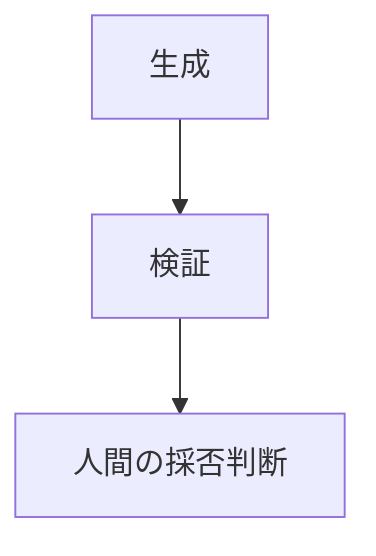

# Authoring Guide

このRepositoryはKnowledge / Publishing as Codeの母艦です。本文の正本は標準Markdownです。
既存Zennの文章を統合・要約・リライトする場合は、移行作業と分離してレビューしてください。

## 新規ページ

`src/content/{section}/{semantic-slug}.md`を追加します。通常ページはMDXを使いません。
英小文字・数字・ハイフンのsemantic slugを使い、公開後はURLを安易に変更しません。
ファイルの相対パスがURLになります。例：`foundations/acceptance-boundary.md` → `/ai-design-foundations/foundations/acceptance-boundary/`。

```yaml
---
title: "採否判断の境界"
summary: "このページが扱う範囲を簡潔に記述する。"
kind: principle
section: foundations
layer: ai-design
design_topic: applicability
status: draft
order: 10
tags:
  - Applied AI
  - HITL
published_at: "2026-09-21"
updated_at: "2026-09-21"
---
```

タイトルは共通レイアウトがH1として表示します。本文の見出しは`##`から始めます。
新規記事に出典や日付を捏造しません。公開日・更新日は不明なら省略できます。
`summary`は必須です。本文で実際に扱う内容を1〜2文で要約し、タイトルから推測しません。すべての一覧・章目次・前後リンク・検索結果はこの値だけを概要として表示します。本文を変更したら概要も確認してください。

## Layer / Topic / Source

layerは知識の役割、sectionは既存のテーマとURL用分類、source.typeは出典です。これらを混同しません。

| layer | 役割 |
|---|---|
| ai-design | 現在の設計知識の正本 |
| ai-mathematics | AIの振る舞いを説明する数学・モデル基礎 |
| practice | 組織・業務・開発への適用 |
| case | 実務事例 |
| publication | 独立した記事・Book・Essay |
| project | プロジェクトの記録 |
| reference | 用語・参照資料 |

AI Designはdesign_topicも必須です。applicability / responsibility-control / architecture / knowledge-context / evaluation-hitl / software-engineering / lifecycle-operationsから選びます。
既存URLはlayerに合わせて移動しません。旧foundationsの文書も同じURLを維持します。新規本文の物理配置と公開URLは編集時に決め、公開後は維持します。

記事一覧は出版物の横断ビューです。Zenn由来のLLM確率モデル記事のように、layerがai-mathematicsでも出版元情報を保持したまま掲載できます。出典だけでlayerを自動判定しません。
PublicationのTypeはBook、kindがessayならEssay、それ以外はArticle。sourceの元typeは保持し、章はBookの目次から辿ります。未確認の公開日は捏造せず、判明している月と未確認の旨を表示します。

AI Designの正本一覧にはZennを混在させません。Related Publicationsはsrc/lib/navigation.tsの明示的な文書ID対応表で管理します。Case Studiesも同ファイルでBook・注目章・関連原則を接続し、本文は複製しません。

## Section / kind / status

| section              | 内容                                      |
| -------------------- | ----------------------------------------- |
| foundations          | 変わりにくい設計原則                      |
| architecture         | 全体構成・権限・Workflow・Lifecycle       |
| knowledge-context    | RAG・Context・Evidence・情報更新          |
| evaluation-hitl      | 評価・レビュー・承認・判断条件            |
| software-engineering | AIを用いたソフトウェア開発・Orchestration |
| practices            | 教育・導入・横展開・適用判断              |
| cases                | 原則を適用した実務事例                    |
| essays               | 市場・キャリア・技術に関する論考          |

`kind`: `principle`, `architecture`, `guide`, `case`, `essay`。
`status`: `draft`（非公開）、`evolving`（更新中）、`stable`（安定）、`archived`（過去資料）。
移行時は著者による安定性の判定を推測せず`evolving`にしています。
Draftはページ生成・ナビゲーション・検索対象から除外しますが、公開GitHubリポジトリのソース自体は閲覧可能です。
機密情報の保存場所として使わないでください。

## 意味構造のDirective

通常の文章・リスト・表・コード・画像は標準Markdownで書きます。
意味を明示する必要がある箇所だけ、以下の7種類を使います。
HTML代わりの独自言語として増やしません。未定義のcontainer directiveはビルドエラーです。

```markdown
:::principle{title="設計原則"}
AIが生成できることと、業務で採用してよいことは別である。
:::

:::decision{title="設計判断"}
AI出力は中間成果物として扱う。
:::

:::risk{title="リスク"}
誤生成だけでなく誤実行まで考慮する。
:::

:::responsibility{title="責任境界"}

- AI：候補生成
- 人間：採否判断
- 既存システム：確定処理
  :::

:::evidence{title="根拠"}
判断に使用した情報や評価結果。
:::

:::case{title="実務事例"}
実際に適用した事例。
:::

:::note{title="補足"}
補足情報。
:::
```

Directiveは段落間の独立ブロックとして使います。`title`は省略できます。
`remark-directive`がASTを解析し、対応するAstro Componentで`section`、`figure`、`aside`として出力します。
通常のコロン記号は独自インライン記法として扱いません。

## Mermaid / コード / 数式

Mermaidは通常のコードフェンスで記述します。

````markdown

````

npmのMermaidをbundleします。CDNは使いません。図の下の開閉領域からソースを確認できます。
JavaScript無効時や描画エラー時はソースを表示します。コードはShikiでハイライトします。
数式は`$...$`と`$$...$$`に対応し、KaTeXのフォント・CSSもbundleします。
`<br/>`はそのまま使えます。スクリプトやiframeをMarkdownへ追加しないでください。

## 画像・リンク

新規画像は`public/assets/`へ配置し、本文では``と記述します。
共通Markdown処理がPagesのbaseを付加します。Zenn移行画像は`public/assets/imported/zenn/`です。
外部画像の代替を勝手に生成しません。

内部リンクは`[表示名](/foundations/acceptance-boundary/)`のようにカテゴリから始まる絶対パスにします。
末尾スラッシュを付け、`.md`へのリンクにしません。baseはHTML変換時に付加されます。
同ページ内は`#見出し-id`。`npm run build`は内部リンク・画像・アンカーを検査します。

## Series / Book

シリーズ概要：`src/content/cases/example-series.md`。
章：`src/content/cases/example-series/chapter-topic.md`。
全ページに`series: example-series`、`series_title: "シリーズ名"`を設定します。
概要は`order: 0`、章は`order: 1`から連番にします。概要には必要なら`cover: /assets/cover.jpg`。
各章で全章目次・現在の章・前後リンクを自動生成します。
移行Bookの順序は元`config.yaml`の`chapters`を正とします。初回移行では変更しません。

## 出典とcanonical

Zenn由来ページは`source`に元slug、Book/Chapter slug、type、topics、公開日、URL、元front matterを保持しています。
`canonical`には元Zenn URLを設定しています。将来の正規URL切替はこの値の変更としてレビューします。
Git-nativeページでは`source`と`canonical`を省略すると、自身のPages URLがcanonicalになります。
元Book・章は公開月がcatalogにある場合のみ保持し、正確な公開日は未確認のままです。

## 検証と公開

```sh
npm ci
npm run check
npm test
npm run build
npm run preview
```

`check`はAstroの型・schemaと移行完全性を検証します。`build`は静的HTMLとPagefind索引を生成し、リンクを検証します。
移行済み本文の編集でハッシュ検証が失敗した場合は、意図した本文変更かレビューし、台帳の変更理由とハッシュも同じコミットで更新してください。失敗を無条件に無効化しません。

`master`へpushするとGitHub Actionsが公開します。default branchを`main`へ変更しません。
Repository Settings → Pages → SourceはGitHub Actionsに設定します。
Zennとの自動双方向同期は行いません。

## 初回移行の再現

`scripts/migrate.mjs`は初回移行専用です。元READMEが現行READMEへ置き換わる前のスナップショットに対して実行するため、通常の編集・buildでは実行しません。
元Zennと公開Wikiのcommit、各ファイルのハッシュ、変換先は`migration/`に記録しています。
catalogは分類根拠、templatesは参考資料として扱い、公開記事として水増ししていません。


## 個人統合サイトの公開方針

サイトブランドは「立林 裕太朗」。Careerと技術知識・公開物を同じサイト内で閲覧できる構成です。
Careerは src/content/career の専用Content Collectionで管理します。職歴・条件の事実変更は依頼に基づいて行います。

sourceとcanonicalの移行元情報は内部資料として保持します。公開ページのcanonicalは自サイトです。
公開UIにはSource表示を追加せず、GitHub・Zenn・旧Careerサイトへのリンクを出しません。
MarkdownBodyが対応する出典URLを内部リンクへ変換し、未対応のリンクはテキストとして残します。
技術本文は保持し、変換は公開時に行います。

Project・Tools・Project Journalは公開しません。開発記録は docs/history に保持します。
移行概要ページは public: false として保存し、一覧・検索・ページ生成から除外します。

## Bookと連載の表示分類

publication_format（article / book / series / essay）で公開形式を指定します。
source.original_typeは元の形式として保持し、サイト上の分類には使用しません。
実務BookはCase Studies、連載は /series/、横断索引は /overview/ から参照します。
