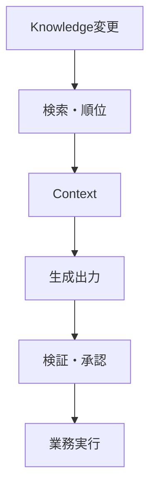
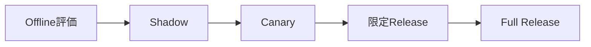

## AIシステムの変更・再評価設計

> 種別：Lifecycle設計 / 変更管理 / 評価設計  
> 適用対象：生成AI、RAG、QAチャット、AIエージェント、コード生成、業務自動化  
> 対象工程：変更 / Test / Release / 監視 / Incident / 廃止  
> 関連ページ：[QAチャット評価設計思想](/evaluation-hitl/qa-evaluation/)、[AI業務システムの参照アーキテクチャ](/architecture/reference-architecture/)、[AI出力の責任境界とHITL](/evaluation-hitl/responsibility-and-hitl/)

### 結論

同じService名、同じ画面、同じAPIであっても、Model、Prompt、Knowledge、検索、Tool、Validator、Workflowのいずれかが変われば、Systemの挙動は変わり得る。

したがってAIシステムの変更管理では、Model Versionだけを記録しても足りない。

> 変更された構成要素、影響を受ける経路、再評価範囲、Release条件、Rollback単位を一つのVersion Bundleとして管理する。

AIシステムは、一度評価して終わる成果物ではない。入力分布、Knowledge、外部System、組織Policyが変わるため、運用中の再評価が設計に含まれる。

---

### 1. System VersionをBundleで表す

処理時点 $t$ のVersionを、説明用に次の組として置く。

$$
v_t
=
(M_t,P_t,K_t,R_t,T_t,V_t,W_t,G_t)
$$

| 記号 | 構成要素 |
|---|---|
| $M$ | Model、Provider、推論設定 |
| $P$ | System Instruction、Prompt Template、Example |
| $K$ | Canonical Knowledge、文書、Data |
| $R$ | Chunking、Embedding、Index、Retriever、Reranker |
| $T$ | Tool、外部API、Permission |
| $V$ | Validator、Judge、Rule、Threshold |
| $W$ | Workflow、Routing、再試行、停止条件 |
| $G$ | Owner、Approval、Policy、Risk区分 |

実際のBundleには、各構成要素の識別子、Hash、Release時刻、Ownerを含める。

一つの要素だけをRollbackしても、互換性が崩れる場合がある。そのためRollbackもBundle単位を基本とする。

---

### 2. 変更の種類

| 変更 | 起こり得る影響 | 代表的な再評価 |
|---|---|---|
| Model・Provider | 推論能力、拒否、形式、Latency、Cost | 全体Regression、境界、Safety、性能 |
| Prompt・Example | Task達成、制約遵守、表現、Tool選択 | Prompt Ablation、代表Task、攻撃入力 |
| Knowledge・Data | 事実、適用範囲、鮮度、削除漏れ | Coverage、正本整合、版・権限 |
| Retrieval | 取得根拠、順位、Context量 | Recall@k、Precision@k、Groundedness |
| Tool・API | 外部作用、失敗形式、権限、互換性 | Contract Test、Dry-run、権限、冪等性 |
| Validator・閾値 | False Accept、False Reject、Coverage | FAR、FRR、Selective Risk |
| Workflow | 誤り伝播、Loop、停止、移管 | 状態遷移、Timeout、Recovery |
| UI・利用者導線 | 入力分布、誤利用、依存度 | Usability、Human Override、Feedback |
| Policy・法令 | 許可範囲、記録、説明、保持 | Governance Review、Access Control |

「文言を少し変えただけ」「文書を追加しただけ」でも、境界入力や検索順位が変わる可能性がある。

---

### 3. 変更の影響範囲をDependency Graphで追う

構成要素をNode、依存関係をEdgeとする有向Graphを置く。

$$
G_d=(V_d,E_d)
$$

変更されたNode集合を $\Delta V$ とすると、再評価候補はその下流到達集合である。

$$
Impact(\Delta V)
=
Reachable_{G_d}(\Delta V)
$$

例：

このGraphは、全挙動を数学的に予測するものではない。Test範囲の抜けを減らすための構成管理Modelである。

---

### 4. 再評価を必須にするTrigger

#### 変更によるTrigger

- Modelまたは生成設定の変更
- Prompt、Example、出力Schemaの変更
- Knowledgeの追加、修正、削除、権限変更
- Retrieval構成、Chunk、Indexの再作成
- Tool、外部API、Permissionの変更
- Validator、Judge、Thresholdの変更
- Workflow、停止、再試行、承認経路の変更

#### 運用によるTrigger

- IncidentまたはNear Miss
- False Accept、False Rejectの増加
- Human Override、差戻し、移管の急増
- 入力Domain・利用者・言語・Trafficの変化
- Retrieval CoverageやGroundednessの低下
- Cost、Latency、Error Rateの閾値超過
- 監査、Policy、法令、契約条件の変更
- 評価Setで扱っていない新しい利用方法

Calendarによる定期評価も必要だが、重大な変更を次回定例まで待たせない。

---

### 5. 評価Setを一枚にしない

再評価Setを目的別に分ける。

| Set | 目的 |
|---|---|
| Baseline | 主要な正常Taskを維持しているか |
| Changed Component | 変更箇所の狙いを達成したか |
| Regression | 変更と無関係に見える既存機能を壊していないか |
| Boundary | 対象内・対象外の境界を維持しているか |
| Adversarial | Prompt Injection、権限逸脱、Data漏えいへ耐えるか |
| Rare / High Impact | 低頻度でも影響が大きい事象を止められるか |
| Operational | Latency、Cost、Timeout、Rate Limit、Recovery |
| Human Factors | Review可能性、Override、移管後の完了 |

評価Caseには、入力と期待出力だけでなく次を持たせる。

- Domain、Risk、利用者区分
- 正解・許容出力・禁止出力
- 必要Evidence
- 回答、拒否、追加質問、移管の期待状態
- 失敗時の影響度
- 最終更新日とOwner

---

### 6. 新旧を同じ入力で比較する

評価入力 $i$ に対する旧Versionの損失を $L_{old,i}$、新Versionを $L_{new,i}$ とする。

$$
d_i
=
L_{new,i}-L_{old,i}
$$

$$
\bar d
=
\frac{1}{n}\sum_{i=1}^{n}d_i
$$

$\bar d<0$なら、定義した損失上は平均的に改善している。

ただし平均だけでReleaseしない。

- Risk別・Domain別に分ける
- 高影響Caseの悪化を平均で相殺しない
- 標本数と信頼区間を示す
- 同じ入力を使ったpaired comparisonを優先する
- Judge Modelだけを正解として扱わない
- 人間評価者間の不一致も記録する

期待損失を次のように置ける。

$$
\mathbb{E}[L]
=
\sum_k P(F_k)I_k
+C_{latency}
+C_{operation}
+C_{review}
$$

重みは普遍値ではない。用途のRisk許容と責任主体が決める。

---

### 7. Release Gate

変更を本番へ出す前に、合否条件を定義する。

例：

- P0の禁止操作は0件
- 高影響Caseの期待損失は悪化しない
- Selective Riskは上限以内
- Coverageの低下は許容範囲以内
- Retrieval Recall@kは下限以上
- Schema・Contract Testは全件Pass
- Costとp95 Latencyは上限以内
- Rollback手順を検証済み
- Decision OwnerがEvidenceを確認済み

平均正答率が上がったことだけをRelease条件にしない。

---

### 8. 段階的にReleaseする

| 段階 | 外部影響 | 主な確認 |
|---|---|---|
| Offline | なし | 評価Set、Regression、Safety |
| Shadow | 既存処理と並行、結果は不採用 | 実入力分布、差分、Latency |
| Canary | 小さい対象へ限定 | Incident、Override、実業務効果 |
| 限定Release | Domain・利用者・権限を限定 | 運用可能性、Support負荷 |
| Full Release | 承認範囲へ展開 | 継続監視、再評価 |

高Riskな変更では、各段階に停止時間と承認者を置く。

---

### 9. 運用監視

#### 入力

- Domain、言語、長さ、利用者区分
- 対象外入力、攻撃的入力
- 訓練・評価時と異なる利用方法

#### RetrievalとContext

- 取得0件率、RecallのProxy、重複
- 古い文書、権限外文書、Version不一致
- Context長、Evidence位置、切捨て

#### 出力とDecision

- 回答、拒否、追加質問、移管の割合
- Groundedness、Validation失敗
- Human修正、差戻し、Override

#### 運用

- Error、Timeout、Latency、Cost
- Tool Call失敗、Rate Limit、二重実行
- Incident、Near Miss、Rollback

Monitoring値が変わったことは、原因を確定したことではない。Traceと変更履歴を使って原因候補を切り分ける。

---

### 10. Rollbackを設計する

Rollback対象はModelだけではない。

- Prompt Template
- Knowledge Snapshot
- Embedding・Index
- ValidatorとThreshold
- Tool Permission
- Workflow Definition
- UI上の利用可能範囲

Rollback可能にするため、次を保持する。

- 直前の安定Bundle
- Data・Schemaの互換性
- 再Indexに必要な正本
- 実行済み外部作用の取消し手順
- Rollback判断者と連絡経路
- 利用者・関係者への通知方針

不可逆操作では、Rollbackより前に二重承認、Preview、対象限定を強化する。

---

### 11. Incidentから評価Setへ戻す

Incident対応を復旧だけで終わらせない。

1. 実行と影響を止める
2. Version BundleとTraceを保全する
3. 原因を入力、Context、Model、Validator、Workflow、権限へ分解する
4. 再現Caseを作る
5. Regression Setへ追加する
6. 修正をAblationで評価する
7. 段階Releaseする
8. Owner、手順、設計境界を更新する

Incident Caseに個人情報や機密が含まれる場合は、再利用用Test Dataへ安全に変換する。

---

### 12. 廃止もLifecycleに含める

Serviceを止めても、Model Endpoint、Index、Credential、Log、Knowledge Copyが残る場合がある。

廃止時に確認する。

- API Key、Service Account、Tool Permissionの失効
- Scheduled Job、Webhook、Agent Loopの停止
- Index、Cache、一時Dataの削除・保持
- Canonical Knowledgeとの同期解除
- Log保持と監査要件
- 後継Systemへの責任移管
- 利用者への通知と代替手段

---

### 13. 変更記録の最小項目

| 項目 | 内容 |
|---|---|
| Change ID | 一意な識別子 |
| 目的 | 何を改善・是正するか |
| Version Bundle | 変更前後の構成要素 |
| Owner / Approver | 実施・評価・承認の責任主体 |
| Impact | 依存経路とRisk |
| Evidence | Offline、Shadow、Canaryの結果 |
| Release Gate | 合否条件と結果 |
| Rollback | 手順、対象Version、実施条件 |
| Monitoring | Release後に見る指標と期間 |
| Decision | 採用、延期、差戻し、廃止 |

---

### 14. 確認チェックリスト

- [ ] Model以外の変更もVersion Bundleへ含めた
- [ ] Dependency Graphで下流影響を確認した
- [ ] Baseline、Regression、Boundary、High Impactを分けた
- [ ] 平均値だけでなくRisk別差分を見た
- [ ] Release Gateを変更前に定義した
- [ ] ShadowまたはCanaryで実入力を確認した
- [ ] Prompt、Knowledge、IndexをRollbackできる
- [ ] Human OverrideとIncidentを評価Setへ戻す
- [ ] 定期評価とEvent Trigger評価を両方持つ
- [ ] 廃止時のCredential、Index、Job、Logを管理する

---

### 事実・説明モデル・設計仮説

#### 一般的なLifecycle原則

- 配備後Monitoring、Change Management、Incident Response、Recovery、DecommissioningをSystem管理へ含める。
- ML SystemではData依存、外部依存、構成要素間の結合がTechnical Debtを生み得る。
- Production ReadinessはModel評価だけでなく、Data、Infrastructure、Monitoring、Processを含む。

#### このページの説明モデル

- Version Bundle $v_t$
- Dependency Graphによる影響集合
- paired difference $d_i$
- Risk加重の期待損失

#### 設計仮説

AIシステムを構成要素BundleとしてVersion管理し、変更を評価Triggerへ直接結び付けると、「いつの挙動を承認したのか」と「どの変更が悪化を生んだのか」を追跡しやすくなる。

---

### 参考資料

- NIST, [Artificial Intelligence Risk Management Framework 1.0](https://doi.org/10.6028/NIST.AI.100-1), 2023
- NIST, [Artificial Intelligence Risk Management Framework: Generative Artificial Intelligence Profile](https://doi.org/10.6028/NIST.AI.600-1), 2024
- NIST AI Resource Center, [AI RMF Core](https://airc.nist.gov/airmf-resources/airmf/5-sec-core/)
- Sculley et al., [Hidden Technical Debt in Machine Learning Systems](https://research.google/pubs/hidden-technical-debt-in-machine-learning-systems/), 2015
- Breck et al., [The ML Test Score: A Rubric for ML Production Readiness and Technical Debt Reduction](https://research.google/pubs/the-ml-test-score-a-rubric-for-ml-production-readiness-and-technical-debt-reduction/), 2017
- NIST, [Secure Software Development Framework](https://csrc.nist.gov/projects/ssdf)
