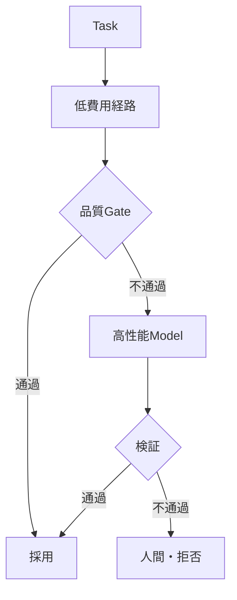

## AIコスト・Latency・モデルルーティング設計

> 種別：モデル選択 / Routing設計 / 経済性評価
> 適用対象：生成AI、QAチャット、AIエージェント、コード生成、複数Model構成
> 対象工程：Task分類 / Model選択 / 実行 / Fallback / Cost監視 / 再評価
> 関連ページ：[複数AIの役割分担と工程設計](/software-engineering/multi-ai-orchestration/)、[AI適用可否と委任レベルの設計](/foundations/applicability-and-delegation/)、[AIシステムのObservabilityとSLO設計](https://github.com/nullcontroller/ai-design-foundations/wiki/AI%E3%82%B7%E3%82%B9%E3%83%86%E3%83%A0%E3%81%AEObservability%E3%81%A8SLO%E8%A8%AD%E8%A8%88)

### 結論

すべてのTaskを最も高性能なModelへ送る構成が、品質、費用、Latency、Riskの全体最適になるとは限らない。

一方で、安価なModelへ機械的に振り分けても、再試行、人間修正、事故対応が増えれば総費用は上がる。

モデルルーティングでは、API単価ではなく、検証済みの業務成果を一件得る総費用を比較する。

> Modelを選ぶのではなく、Task、Context、制約、検証器、Riskに合う処理経路を選ぶ。

---

### Routing対象はModelだけではない

Taskは次へRoutingできる。

- 通常プログラム
- 検索のみ
- Rule Engine
- 小型Model
- 高性能Model
- 複数Model Cascade
- 人間
- 処理拒否・後回し

生成AIを使わない経路も正式な候補にする。

---

### 単価と総費用を分ける

Task $x$ を経路 $r$ で処理する総費用を次のように分解する。

$$
C_{total}(x,r)
=
C_{input}
+C_{output}
+C_{retrieval}
+C_{tool}
+C_{retry}
+C_{verification}
+C_{human}
+C_{recovery}
$$

API利用料が低くても、誤り、再試行、Review、復旧が増えれば $C_{total}$ は高くなる。

比較単位は「一回のModel Call」ではなく「検証済み成果物一件」とする。

$$
CostPerVerifiedSuccess
=
\frac{TotalCost}{N_{verified\ success}}
$$

---

### 品質・費用・Latency・Riskを同時に扱う

経路 $r$ の損失を説明モデルとして次のように置く。

$$
J(r)
=
\lambda_q Loss_{quality}(r)
+\lambda_c Cost(r)
+\lambda_l Latency(r)
+\lambda_r Risk(r)
+\lambda_h HumanLoad(r)
$$

$\lambda$ は用途ごとの重みである。

高影響TaskではRiskと品質を重くする。大量の低Risk TaskではCostとLatencyの比重が上がる。

単一の重みを組織全体へ適用しない。

---

### Taskを分類する

Routing前に、Task Featureを明示する。

```text
task_type
domain
risk_tier
required_context
input_size
output_contract
tool_required
latency_slo
verification_method
privacy_class
language
```

Model自身にすべてのRouting判断を任せると、誤分類、Cost増大、権限逸脱の経路になる。

決定可能な条件はRuleで判定し、不確実な部分だけをClassifierやRouterへ任せる。

---

### Routing Pattern

#### Rule-based Routing

```text
Error Code検索 → Keyword Search
定型分類 → 小型Model
契約判断 → 人間
低Risk要約 → 標準Model
難解な設計比較 → 高性能Model
```

説明しやすく、監査しやすい。Task境界が明確な場合に向く。

#### Learned Router

入力や過去のPreference Dataから、強いModelが必要かを推定する。

$$
r(x)
=
\arg\min_{m\in\mathcal{M}}
\mathbb{E}[J(m)\mid x]
$$

Router自身にも誤りとDriftがあるため、評価、版管理、Fallbackが必要になる。

#### Cascade

安価な経路から開始し、条件を満たさない場合だけ強い経路へEscalateする。



品質Gateが弱いと、誤答を安価に大量採用する構成になる。

#### Parallel Ensemble

複数Modelを並列実行し、比較または統合する。

品質が上がるとは限らず、CostとLatencyは増える。誤りが相関する場合、多数決も保証にならない。

---

### Confidenceを誤用しない

Modelが「自信があります」と出力することは、正解確率の校正ではない。

Token Probability、Self-rating、外部Judge Score、Retrieval Scoreは異なる量である。

Routing Gateには、Taskごとに検証したSignalを使う。

- Schema適合
- 必須Evidenceの有無
- Retrieval Coverage
- Unit Test
- Rule Check
- Domain Classifier
- 過去Dataset上の校正済みScore

一つのScoreを全Taskの正解確率として扱わない。

---

### Fallbackを設計する

Fallbackは単に別Modelへ再送することではない。

| Failure | Fallback例 |
|---|---|
| Timeout | 小型Model、短いContext、非同期化 |
| Rate Limit | Queue、別Provider、後回し |
| Schema Error | 再生成、構造化Decoder、手動処理 |
| Evidence不足 | 再検索、追加質問、拒否 |
| Policy拒否 | 人間移管、処理中止 |
| High Risk | 承認付き経路へ移動 |
| Provider障害 | 互換経路、機能縮退 |

Fallback先へ権限、Data、Promptをそのまま渡してよいとは限らない。ProviderごとのData PolicyとSecurity Boundaryを確認する。

---

### Latencyを分解する

End-to-End Latencyを次へ分ける。

$$
T_{e2e}
=
T_{queue}
+T_{retrieval}
+T_{model}
+T_{tool}
+T_{validation}
+T_{human}
$$

平均Latencyだけでは、利用者体験とTimeout Riskを隠す。

- Time to First Token
- p50 / p95 / p99
- Retrieval Latency
- Tool Latency
- Retry回数
- Human Approval待ち時間

を分けて測る。

Streamingは体感待ち時間を下げても、完了時間や総費用を必ず下げるわけではない。

---

### Cacheを設計する

CacheはCostとLatencyを下げるが、正しさと権限の問題を増やす。

Cache Keyへ必要に応じて次を含める。

```text
normalized_input
user_scope
knowledge_version
prompt_version
model_version
policy_version
locale
effective_date
```

次を定義する。

- TTL
- 失効Trigger
- ACL変更時の破棄
- 個人情報・機密Dataの保存可否
- Negative Cache
- Cache Hit時のEvidence再確認

旧Knowledgeの高品質回答を再利用しても、現在の正解とは限らない。

---

### BudgetとRate Limit

Model Call、Token、Tool Call、Loopへ上限を置く。

```text
max_input_tokens
max_output_tokens
max_model_calls
max_tool_calls
max_retries
max_elapsed_time
max_cost_per_task
max_cost_per_user
```

Agentが自分で予算を解除できないよう、実行基盤で強制する。

Budget超過時の終了状態を定義する。

- 部分結果を返す
- 追加承認を求める
- 安価な経路へ縮退する
- 人間へ移管する
- 処理を停止する

---

### Router評価

Routerを含むSystemでは、Model単体だけでなくRouting判断を評価する。

| 指標 | 意味 |
|---|---|
| Routing Accuracy | 適切な経路を選べた割合 |
| Strong Model Rate | 高費用Modelへ送った割合 |
| Escalation Rate | Cascadeで上位経路へ進んだ割合 |
| Cost per Success | 検証済み成功一件の費用 |
| Quality at Budget | 予算内での品質 |
| Cost at Quality | 品質閾値を満たす費用 |
| p95 Latency | Tail Latency |
| Fallback Success | Fallbackで回復した割合 |
| Router Regret | 最適経路との差 |

Router Regretを説明モデルとして次のように置ける。

$$
Regret(x)
=
J(r(x))-\min_{m\in\mathcal{M}}J(m)
$$

実際には各Taskの真の最適経路は事後にも不明な場合があるため、代表Dataset上の比較として用いる。

---

### Shadow評価

Routing変更を直ちに本番採用しない。

1. 現在経路を正式結果として維持
2. 新RouterをShadow実行
3. 同じTaskで品質、Cost、Latencyを比較
4. Domain別に誤Routingを分析
5. Canaryで一部Trafficへ適用
6. SLO違反時に旧経路へ戻す

Model価格、能力、Rate Limit、利用者分布が変わればRouterを再評価する。

---

### 設計Checklist

- [ ] 非AI経路と人間経路を候補に含めた
- [ ] Model Callではなく検証済み成功を比較単位にした
- [ ] Task FeatureとRisk Tierを定義した
- [ ] 品質、Cost、Latency、Risk、人間負荷を測った
- [ ] RuleとLearned Routerの責務を分けた
- [ ] Cascadeの品質Gateを評価した
- [ ] Confidence SignalをTask別に検証した
- [ ] Fallback先の権限とData Policyを確認した
- [ ] p95・p99と工程別Latencyを測った
- [ ] Cacheへ版・権限・失効条件を持たせた
- [ ] Token、Loop、Tool、費用上限を強制した
- [ ] Shadow、Canary、Rollbackを用意した

---

### このページの定義

モデルルーティングとは、入力を安価なModelへ振り分けることではない。

> Task、Context、Risk、検証可能性、SLOに応じて、非AI処理、人間、小型Model、高性能Model、Cascadeを含む処理経路を選択し、検証済み成果一件当たりの総損失を最小化する設計である。

---

### 参考資料

- Ong et al., [RouteLLM: Learning to Route LLMs with Preference Data](https://arxiv.org/abs/2406.18665), 2024
- Chen, Zaharia, and Zou, [FrugalGPT: How to Use Large Language Models While Reducing Cost and Improving Performance](https://arxiv.org/abs/2305.05176), 2023
- Liang et al., [Holistic Evaluation of Language Models](https://arxiv.org/abs/2211.09110), 2022
- NIST, [Artificial Intelligence Risk Management Framework: Generative Artificial Intelligence Profile](https://www.nist.gov/publications/artificial-intelligence-risk-management-framework-generative-artificial-intelligence), 2024
