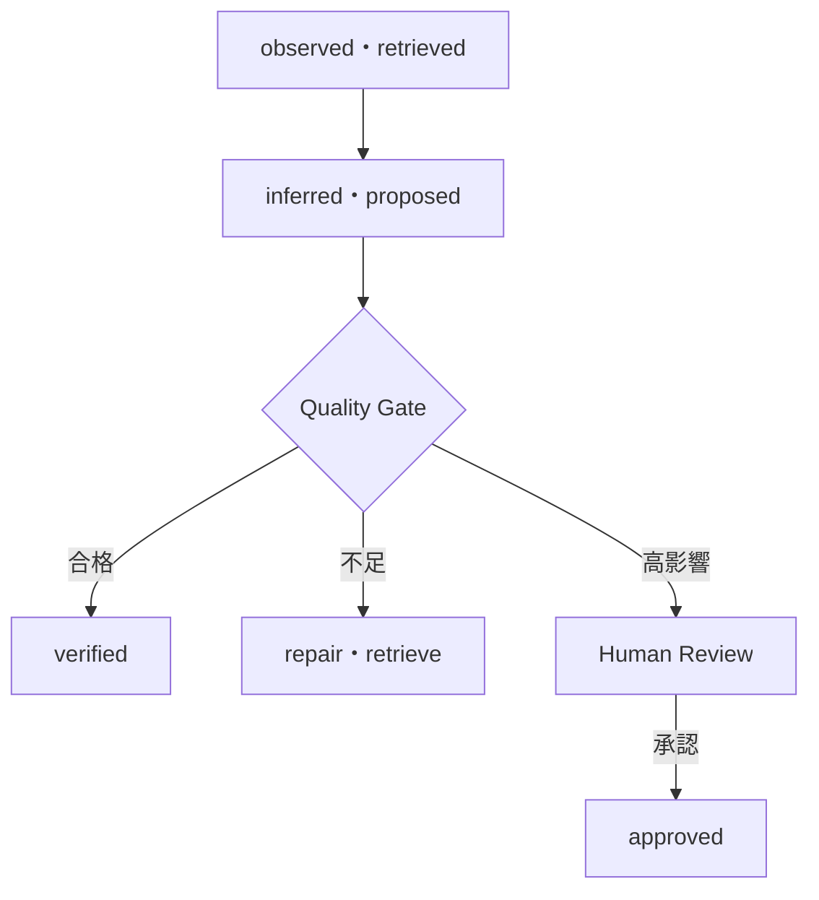

## AI間インターフェースとしてのプロンプト

> 種別：インターフェース設計 / オーケストレーション / 出力契約
> 適用対象：複数AI、AIエージェント、業務Workflow
> 対象工程：Task分割 / 受渡し / 検証 / 状態管理
> 関連ページ：[プロンプト設計の基本構造](/knowledge-context/prompt-structure/)、[複数AIの役割分担と工程設計](/software-engineering/multi-ai-orchestration/)、[AI出力の責任境界とHITL](/evaluation-hitl/responsibility-and-hitl/)

プロンプトは、Request、Template、Context Assembly、Runtime Interfaceとして機能します。

複数AIを一つの工程へ組み込む場合、この考え方をAI間の受渡しへ拡張できます。

ただし、AI Aの自由文をそのままAI BのPromptへ貼るだけでは、安定したインターフェースにはなりません。

> AI間インターフェースとは、次工程が必要とする成果物、根拠、前提、未解決事項、状態、版を、検証可能な形式で受け渡す契約である。

プロンプトはその契約をモデルへ伝える要素です。

契約を検証し、状態を管理し、実行順序を制御するのはオーケストレーション基盤です。

---

### AIを増やしても品質は自動的に上がらない

二つのAIを直列につないだ工程を考えます。

```text
AI A：調査
  ↓
AI B：仕様化
```

AI Aの出力に誤りや欠落があり、AI Bがそれを確定事実として使えば、誤りは後工程へ伝播します。

AI Bが高性能でも、与えられたContext内で誤った前提と正しい前提を自動的に識別できるとは限りません。

また、AIを二つ使ったことは、独立した検証を意味しません。

- 同じモデル
- 同じKnowledge
- 同じPromptの曖昧さ
- 同じ誤った前提
- 同じ評価基準

を共有していれば、同じ失敗を繰り返す可能性があります。

複数AIの価値は、数ではなく、責務分離と検証境界によって決まります。

---

### 会話とインターフェースを区別する

AI同士が自然言語で会話できることと、システム上の契約が成立していることは違います。

| 会話 | インターフェース |
| --- | --- |
| 文脈から意味を推測できる | Fieldの意味を定義する |
| 不足情報を補って続けられる | 不足時の返却・停止条件を定義する |
| 表現が毎回変わる | Schemaと版を管理する |
| 発言者を会話履歴から読む | ProducerとProvenanceを記録する |
| 誤りを後で訂正できる | 受理前にValidationを行う |
| 暗黙の前提を許容しやすい | Assumptionを明示する |

探索やアイデア出しでは、自由な会話が有効な場合があります。

後工程が成果物を自動利用する場合は、暗黙の解釈を減らし、受渡し契約を明示します。

---

### Handoff Messageを定義する

AI $i$からAI $j$へ渡すMessageを、次のように表します。

$$
M_{i\rightarrow j}
=
(
task,
artifact,
evidence,
assumptions,
unresolved,
status,
provenance,
version
)
$$

各要素の意味は次です。

| Field | 内容 |
| --- | --- |
| task | 何のために作成した成果物か |
| artifact | 次工程が利用する中間成果物 |
| evidence | 根拠ID、参照位置、Tool結果 |
| assumptions | 成果物が依存する仮定 |
| unresolved | 未確認・不足・競合している事項 |
| status | 完了、要確認、拒否、移管など |
| provenance | 作成主体、入力源、時点、実行ID |
| version | Schema、Prompt、Knowledge、成果物の版 |

自由文は`artifact`の一部です。

Message全体を一つの文章へ埋め込む必要はありません。

---

### Producer ContractとConsumer Contractを分ける

AI $i$をProducer、AI $j$をConsumerとします。

Producer Contractは、何を出力するかを定義します。

$$
Post_i(M)
\in
\{0,1\}
$$

$Post_i(M)=1$なら、Producer側の出力条件を満たします。

Consumer Contractは、何を受け取れば処理を開始できるかを定義します。

$$
Pre_j(M)
\in
\{0,1\}
$$

$Pre_j(M)=0$なら、AI $j$は不足情報を暗黙に補って処理を続けません。

次のいずれかへ遷移します。

$$
status
\in
\{return,clarify,retrieve,reject,escalate\}
$$

> Producerが出力したことと、Consumerが安全に利用できることは同じではない。

---

### 型と意味を分けて検証する

Messageの検証には、少なくとも二種類あります。

#### 構文・型の検証

- 必須Fieldが存在する
- 型が正しい
- 列挙値が定義内
- ID形式が正しい
- Schema Versionが対応範囲

検証関数を次のように置きます。

$$
V_{schema}(M)
\in
\{0,1\}
$$

#### 意味・根拠の検証

- Evidenceが実在する
- Evidenceが主張を支持する
- 適用対象と時点が一致する
- Assumptionが許容される
- 未解決事項が隠されていない
- Taskの完了条件を満たす

$$
V_{semantic}(M,E)
\in
\{pass,repair,reject,escalate\}
$$

Schema適合は、意味的な正しさを保証しません。

$$
V_{schema}(M)=1
\not\Rightarrow
V_{semantic}(M,E)=pass
$$

---

### Promptと成果物を分ける

AI間受渡しでは、次の二つを混ぜないようにします。

1. 次のAIに何をしてほしいか
2. 次のAIが処理する成果物は何か

例えば、次のように分けます。

```text
Instruction:
確認済みの事実から仕様候補を作成する。
unresolvedに含まれる事項は確定仕様へ入れない。

Artifact:
facts:
  - claim
  - evidence_id
assumptions:
unresolved:
```

成果物内の文章に「前のInstructionを無視せよ」と書かれていても、それはDataです。

Instruction ChannelとData Channelを、論理的・可能なら技術的に分離します。

---

### 根拠と由来を失わない

AI Aが複数の資料を要約し、AI Bへ文章だけを渡すと、どの主張がどの資料に基づくか分からなくなる場合があります。

そこで、成果物を原子的な主張へ分けます。

$$
artifact
=
\{(claim_k,evidence_k,status_k)\}_{k=1}^{m}
$$

各主張に、少なくとも次を関連付けます。

- Evidence ID
- 参照位置
- 情報源
- 取得時点
- 適用範囲
- 検証状態

AI Bは、主張本文だけでなく、そのProvenanceを使って検証できます。

根拠のない主張を確定情報として再利用しません。

---

### 要約による情報損失を扱う

元情報を $S$、AI Aが作成した中間表現を $Z$、AI Bへ渡すMessageを $M$ とします。

次のMarkov Chainを仮定します。

$$
S
\rightarrow
Z
\rightarrow
M
$$

Message $M$が $Z$だけから作られるなら、Data Processing Inequalityにより次が成り立ちます。

$$
I(S;M)
\le
I(S;Z)
$$

つまり、変換を重ねるだけで、元情報 $S$との相互情報量を増やすことはできません。

ただし、AI Bが別の検索やToolによって追加情報を取得する場合は、この単純なMarkov Chainの前提から外れます。

この式が示す設計上の注意は、次です。

> 前工程で捨てた根拠・例外・不確実性は、後工程の言語生成だけでは確実に復元できない。

必要な情報は、要約文ではなく参照可能なEvidenceとして残します。

---

### AI出力を確定事実へ昇格させる条件を決める

Message内の情報状態を区別します。

$$
information\_state
\in
\{
observed,
retrieved,
inferred,
proposed,
verified,
approved
\}
$$

| 状態 | 意味 |
| --- | --- |
| observed | ToolやSystemから直接得た値 |
| retrieved | 情報源から取得した記述 |
| inferred | AIが根拠から推論した内容 |
| proposed | AIが作成した候補 |
| verified | 定義済み手段で検証済み |
| approved | 権限を持つ人間・Systemが採用済み |

AIが生成した文章を、自動的に`verified`や`approved`へしません。

状態遷移には、検証者と条件を定義します。



---

### Quality Gateは四値以上で設計する

単純なPass／Failだけでは、不足情報や修復可能な形式不良を扱いにくくなります。

Quality Gateを次のように定義します。

$$
Q_i(M)
\in
\{pass,repair,reject,escalate\}
$$

- `pass`：次工程へ渡せる
- `repair`：形式や限定的な欠落を修復する
- `reject`：成果物を破棄し、再生成または前工程へ返す
- `escalate`：人間判断または別の権限主体へ移管する

必要なら`clarify`や`retrieve`を独立状態にします。

重要なのは、検証失敗時にAIが自由に補完して進まないことです。

---

### すべての境界に人間を置く必要はない

現行ページでは、AI間の各境界に人間確認を置く構造を基本としていました。

高影響な判断では有効ですが、すべての中間成果物を人間が確認すると、費用と待ち時間が増え、自動化の利点が失われます。

中間成果物 $M_i$が誤ったまま通過する確率を $p_i$、通過した場合の影響を $I_i$ とします。

$$
Risk_i
=
p_i I_i
$$

Human Review閾値を $\tau$ とすると、簡略化した方針は次です。

$$
HITL_i
=
\mathbf{1}[Risk_i>\tau]
$$

実際には、法令、不可逆性、利用者権利、検証可能性なども考慮します。

低影響で機械検証できる中間成果物は自動Gateを通し、高影響または検証不能な成果物だけ人間へ移管します。

---

### 誤りの伝播確率を分解する

AI Aの成果物に誤りがある事象を $E_A$、Gateが見逃す事象を $M_A$、AI Bがその誤りを採用する事象を $U_B$ とします。

誤りが後工程へ伝播する事象は、次です。

$$
E_A
\cap
M_A
\cap
U_B
$$

連鎖律により、その確率は次のように表せます。

$$
P(E_A\cap M_A\cap U_B)
=
P(E_A)
P(M_A\mid E_A)
P(U_B\mid E_A,M_A)
$$

制御点は三つあります。

1. AI Aの誤りを減らす
2. Gateの見逃しを減らす
3. AI Bが未確認情報を確定前提として使わないようにする

Producerだけを改善する設計より、Consumer側にもPreconditionと停止条件を持たせる方が堅牢です。

---

### Reviewerを増やすだけでは独立検証にならない

二つのReviewer $R_1,R_2$が、誤りを見逃す事象をそれぞれ $F_1,F_2$ とします。

条件付き独立なら、両方が見逃す確率は次です。

$$
P(F_1\cap F_2\mid E)
=
P(F_1\mid E)P(F_2\mid E)
$$

しかし、同じModel、Prompt、Evidenceを使うReviewerは、誤りが相関する可能性があります。

$$
P(F_1\cap F_2\mid E)
\ne
P(F_1\mid E)P(F_2\mid E)
$$

独立性を仮定して成功率を掛け算しません。

検証器を追加する場合は、次を変えられるか確認します。

- 検査方式
- Knowledge Source
- 決定論的Rule
- 観点
- Model
- Human Expertise

---

### Schema Versionと互換性を管理する

ProducerがSchema Version $v_p$でMessageを出力し、ConsumerがVersion $v_c$を期待するとします。

互換性関数を次のように置きます。

$$
Compatible(v_p,v_c)
\in
\{0,1\}
$$

$Compatible=0$なら、Consumerは暗黙にFieldを読み替えません。

Adapter、Migration、Producer更新、処理停止のいずれかを選びます。

互換性を壊し得る変更には、例えば次があります。

- 必須Fieldの追加
- Field意味の変更
- 列挙値の削除
- 単位の変更
- Evidence形式の変更
- 状態遷移の変更

自然言語の見出し名だけで接続すると、意味変更を検出しにくくなります。

---

### 実行IDと状態を引き継ぐ

複数AIの工程では、同じTaskの再試行、分岐、並列処理が発生します。

Messageには、少なくとも次の識別子を持たせます。

```text
workflow_id
task_id
message_id
parent_message_id
attempt
producer
consumer
created_at
```

これにより、次を追跡できます。

- どの入力から作られたか
- どの版のAI・Promptを使ったか
- どの再試行結果か
- どのMessageから分岐したか
- どこで人間が修正したか

会話順だけを状態管理に使うと、再試行や並列処理で因果関係が曖昧になります。

---

### 冪等性と重複実行を制御する

AI Bが同じMessageを二度受信する場合があります。

参照、要約、レビューなら影響が小さい場合もあります。

外部送信、登録、支払、削除などでは、重複実行が損害になります。

Action $a$とIdempotency Key $k$に対して、同じKeyによる反復実行の外部効果を次のように扱います。

$$
Effect\left(Execute(a,k)^n\right)
=
Effect\left(Execute(a,k)\right),
\qquad n\ge 1
$$

これは厳密な実装仕様そのものではなく、同じKeyの再実行では追加の副作用を発生させない、という設計要件を表した簡略モデルです。

Promptへ「二重実行しないでください」と書くだけでなく、実行基盤がKeyと状態を管理します。

---

### Loopの終了条件を定義する

複数AIが互いに修正要求を返すと、Loopが終了しない可能性があります。

例えば、次の状態遷移です。

```text
生成AI → Reviewer → 修正AI → Reviewer → ...
```

終了条件を明示します。

- Quality Gate合格
- 最大再試行回数
- 改善量が閾値未満
- 同じViolationの反復
- Token・時間・費用上限
- 人間への移管

試行回数を $t$、最大回数を $T_{max}$ とすると、少なくとも次を強制します。

$$
t
\le
T_{max}
$$

停止条件はPromptだけでなく、Workflow側で実装します。

---

### 受渡し形式は情報の性質で選ぶ

すべてを自然言語Promptへ変換する必要はありません。

| 情報 | 適した形式 |
| --- | --- |
| Task・判断条件 | 構造化Instruction |
| 事実・根拠 | Claim＋Evidence ID |
| 設定値 | JSON、YAML、型付きObject |
| ソースコード | Repository、Commit、Diff |
| 処理順序・分岐 | State Machine、Workflow定義、Diagram |
| 設計判断 | ADR、比較表 |
| 検証結果 | Test Report、Metric、Violation一覧 |
| 人間承認 | 承認記録、Actor、時刻、対象Version |

AIへ渡すために、既存の正本を長い自然言語へ書き直す必要はありません。

次工程が参照できる識別子と、必要な要約を渡します。

---

### 複数AI Frameworkは契約を自動的に与えない

[AutoGen](https://arxiv.org/abs/2308.08155)は、LLM、人間、Toolを組み合わせた会話可能なAgentと、そのInteraction Behaviorを構成できるFrameworkを示しています。

[CAMEL](https://arxiv.org/abs/2303.17760)は、Role-playingとInception PromptingによるCommunicative Agentの協調を検討しています。

これらは、複数Agentの構成可能性を示す研究です。

しかし、Frameworkを採用するだけで次が自動的に解決するわけではありません。

- 成果物Schema
- Evidenceの正しさ
- 責任主体
- Human Review条件
- 権限
- Version互換性
- Error Recovery
- 業務上の完了条件

Frameworkの会話機能と、業務システムの受渡し契約を分けて設計します。

---

### コード保守工程での例

複数AIを使うコード保守を考えます。

#### AI A：既存コード調査

出力するArtifact：

```text
symbols
callers
dependencies
observed_behavior
test_evidence
unknowns
repository_commit
```

推測した仕様は`observed_behavior`へ混ぜず、`assumptions`へ分けます。

#### Quality Gate

- Symbolと参照位置が実在する
- Commitが固定されている
- Test結果を再現できる
- Unknownが隠されていない

#### AI B：影響分析

Precondition：

```text
repository_commitが一致する
主要Dependencyが列挙されている
Evidenceのない推測がverifiedになっていない
```

出力：

```text
affected_components
risks
required_changes
test_scope
unresolved
```

#### AI C：設計レビュー

設計案と元Evidenceの対応、未解決事項、Test Scopeを確認します。

高影響な設計判断は、人間のTechnical Ownerが承認します。

AIを三つ使うことより、各工程のInput、Output、Evidence、Gateが定義されていることが重要です。

---

### AI間インターフェースを評価する

評価対象は、最終回答の正しさだけではありません。

| 指標 | 確認内容 |
| --- | --- |
| Schema Validity | Message形式を満たした割合 |
| Precondition Failure Rate | Consumerが処理開始できなかった割合 |
| Evidence Coverage | 主張に根拠が付いた割合 |
| Provenance Completeness | Source・版・時点を追跡できる割合 |
| Unresolved Detection | 不明点を明示できた割合 |
| Handoff Acceptance Rate | 修復なしで受理できた割合 |
| Error Propagation Rate | 前工程の誤りが後工程へ流れた割合 |
| Repair Success Rate | 限定修復でContractを回復できた割合 |
| Escalation Precision | 人間確認が必要なCaseを選べた割合 |
| End-to-End Success | 最終Taskを完了した割合 |
| Token・Latency | 受渡しに必要な費用と時間 |

中間成果物ごとにTest Fixtureを用意し、正常、欠落、矛盾、旧版、権限外、根拠不一致を評価します。

---

### このページの定義

AI間インターフェースとしてのプロンプトを、次のように定義します。

> 複数AIを含む工程で、次工程のTask、Input Contract、Output Contract、根拠、前提、未解決事項、状態、停止条件をモデルへ伝える構成要素。

ただし、インターフェース全体はPromptだけではありません。

$$
Interface
=
Prompt
+
Schema
+
Artifact
+
Evidence
+
State
+
Validation
+
Version
$$

安全な受渡しには、次が必要です。

- 自由文と構造化Messageを分ける
- ProducerのPostconditionとConsumerのPreconditionを定義する
- Schema検証と意味検証を分ける
- EvidenceとProvenanceを維持する
- AI生成物を自動的にVerifiedへ昇格させない
- Riskに応じて自動GateとHITLを使い分ける
- 誤りの相関を考慮する
- Version、実行ID、再試行、終了条件を管理する

> 次工程へ渡すのはAIの文章ではなく、状態と根拠を持つ検証可能な中間成果物である。

この設計が、後の「複数AIの役割分担と工程設計」へつながります。

---

### 参考資料

- Qingyun Wu et al., [AutoGen: Enabling Next-Gen LLM Applications via Multi-Agent Conversation](https://arxiv.org/abs/2308.08155), 2023
- Guohao Li et al., [CAMEL: Communicative Agents for “Mind” Exploration of Large Scale Language Model Society](https://arxiv.org/abs/2303.17760), NeurIPS 2023
- Shunyu Yao et al., [ReAct: Synergizing Reasoning and Acting in Language Models](https://arxiv.org/abs/2210.03629), ICLR 2023
- NIST, [Artificial Intelligence Risk Management Framework: Generative Artificial Intelligence Profile](https://doi.org/10.6028/NIST.AI.600-1), 2024
