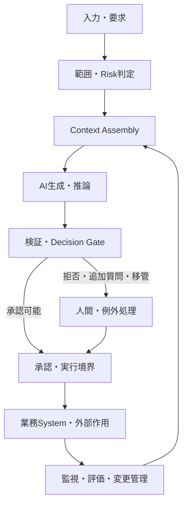

## AI業務システムの参照アーキテクチャ

> 種別：参照アーキテクチャ / 設計原則 / 実務上の仮説  
> 適用対象：生成AI、RAG、QAチャット、AIエージェント、コード生成、業務自動化  
> 対象工程：入力 / Context構築 / 生成 / 検証 / 承認 / 実行 / 監視  
> 関連ページ：[Instruction・Knowledge・Evidenceの責務分離](/knowledge-context/instruction-knowledge-evidence/)、[複数AIの役割分担と工程設計](/software-engineering/multi-ai-orchestration/)、[AI出力の責任境界とHITL](/evaluation-hitl/responsibility-and-hitl/)

### 結論

AI業務システムは、モデルへ入力を渡して回答を受け取るだけの構成ではない。

少なくとも、次を分離する。

- 入力と範囲判定
- ContextとEvidenceの構築
- 候補生成
- 形式・根拠・Policyの検証
- 採用・承認
- 外部Systemへの実行
- 実行後の監視と改善

中心原則は次である。

> 生成できること、受理できること、実行してよいことを、別の境界で判定する。

このページは特定Cloud、Framework、Model製品の構成図ではない。AI適用判断からLifecycle / Operationsまでの設計原則を、一つの業務Systemへ接続するための論理Architectureである。

---

### 1. 全体構造

この図のLoopは、AIが自己判断で改善・本番反映することを意味しない。監視結果を、責任主体がKnowledge、Prompt、Model、閾値、Workflowの変更判断へ戻す経路である。

---

### 2. Systemを構成要素の組として表す

AI業務システムを、説明用に次の組として置く。

$$
\mathcal{S}
=
(X,C,M,V,G,A,E,O)
$$

| 記号 | 構成要素 | 主な責務 |
|---|---|---|
| $X$ | Input Boundary | 入力受付、認証、分類、対象範囲の確定 |
| $C$ | Context Assembly | Instruction、Knowledge、Evidence、状態の構成 |
| $M$ | Model Runtime | 分類、生成、推奨、Tool Call候補の作成 |
| $V$ | Validator | Schema、根拠、Policy、整合性の検証 |
| $G$ | Decision Gate | 受理、拒否、追加質問、移管の判定 |
| $A$ | Approval Boundary | 権限者による採用・実行許可 |
| $E$ | Execution Boundary | 許可された外部作用の実行と制限 |
| $O$ | Observation | Log、Trace、評価、Incident、変更管理 |

一つの製品が複数の役割を実装してもよい。ただし、論理上の責務と権限は分ける。

---

### 3. Planeで責務を分ける

| Plane | 含むもの | 守る対象 |
|---|---|---|
| Data / Knowledge Plane | 正本、文書、Vector Index、Metadata、履歴 | 版、由来、鮮度、Access Control |
| Model Plane | Model、Prompt、Sampling、Tool選択候補 | 入出力契約、Model Version |
| Control Plane | Routing、Workflow、再試行、停止、Budget | 状態遷移、上限、冪等性 |
| Assurance Plane | Test、Validator、Judge、Human Review | 検証独立性、閾値、Evidence |
| Execution Plane | API、DB、Repository、通知、業務処理 | 認可、可逆性、対象、影響範囲 |
| Governance Plane | Owner、Approval、Audit、Incident、Change | Accountability、記録、再評価 |

Model Planeの品質が高くても、Execution Planeの権限が過大なら安全ではない。

逆に、Model出力が不完全でも、Assurance PlaneとExecution Boundaryが適切なら、誤りを候補段階へ閉じ込められる。

---

### 4. Input Boundary

入力時点で、次を確定する。

- 誰が要求したか
- 何を対象とするか
- どのDomain・Version・時点か
- AIが回答・処理してよい範囲か
- 誤った場合の影響は何か
- 機密・個人情報・外部Contentを含むか

入力をそのままInstructionへ連結しない。

外部ContentはDataとして扱い、PolicyやSystem Instructionを上書きする権限を持たせない。

---

### 5. Context Assembly

一回の処理 $k$ に渡すContextを、次のように分ける。

$$
C_k
=
I\oplus X_k\oplus Z_k\oplus T_k\oplus H_k
$$

- $I$：固定Instruction、Role、出力契約
- $X_k$：今回の入力
- $Z_k$：検索されたEvidence
- $T_k$：Tool結果と現在状態
- $H_k$：選別・要約された履歴

Context Assemblyの責務は、情報を最大量入れることではない。

1. 正本から現在Versionを取得する
2. 対象と権限で絞る
3. 入力に関連するEvidenceを検索する
4. 由来、時点、適用範囲を付ける
5. InstructionとDataを識別可能にする
6. Context Budget内で優先順位を付ける

RAGの検索結果はEvidence候補であり、正答そのものではない。

---

### 6. Model Runtime

Modelの責務は、許可されたContextから候補を生成することである。

$$
P(Y\mid X,C,I,M,D)
$$

Model Runtimeへ持たせるもの：

- 分類・要約・生成・推奨
- 不足情報の指摘
- Tool Call候補と引数候補
- Evidence ID付き主張候補
- 定義済みSchemaの成果物候補

Model Runtimeだけへ持たせないもの：

- 認可の最終判定
- 金額・件数の強制上限
- 本番反映の最終承認
- Audit Logの改変権限
- Incident時の停止判断の全権

---

### 7. ValidatorとDecision Gate

検証を一つの「AI評価」にまとめない。

| 検証層 | 確認内容 | 代表的な実装 |
|---|---|---|
| Syntax | 構文として読めるか | Parser |
| Schema | 型、必須Field、形式 | JSON Schema、型検査 |
| Reference | ID、対象、Versionが存在するか | DB照合、Repository検索 |
| Grounding | 主張がEvidenceで支持されるか | Claim分解、根拠照合 |
| Policy | 許可範囲、機密、禁止操作 | Rule Engine、Policy Check |
| Behavioral | Task、境界、拒否が期待どおりか | 評価Set、Regression Test |
| Business | 業務上採用できるか | Human Review、権限者承認 |

Decision Gateは、二値の合否だけでなく次の終了状態を持つ。

$$
g(Y)
\in
\{answer,clarify,reject,escalate,approve\_candidate\}
$$

- `answer`：低影響で、必要な検証を通過
- `clarify`：入力不足のため追加質問
- `reject`：対象外または禁止
- `escalate`：人間判断が必要
- `approve_candidate`：権限者の承認待ち

---

### 8. Approval BoundaryとExecution Boundary

Approvalは内容の確認、Executionは外部作用である。両者を分ける。

Execution Boundaryで最低限確認する。

- 実行主体の認証
- 対象Resource
- 許可されたOperation
- 金額、件数、時間、範囲の上限
- 二重実行を防ぐ冪等性
- Dry-runまたはPreview
- 取消し・Rollback可能性
- 実行結果の記録

ModelがTool Callを生成したことは、Tool実行の許可を意味しない。

---

### 9. 誤りを影響へ変えない

誤り事象を $F$、未検出を $\neg D$、実行を $E$、復旧不能を $\neg R$ とする。

$$
P(F\cap\neg D\cap E\cap\neg R)
=
P(F)
P(\neg D\mid F)
P(E\mid F,\neg D)
P(\neg R\mid F,\neg D,E)
$$

実務上の制御点は四つある。

1. 誤りを生成しにくくする
2. 誤りを検出する
3. 未検出出力を実行させない
4. 実行後に影響を検知し復旧する

Model精度だけを改善しても、残り三点がなければSystem Riskは十分に下がらない。

---

### 10. Riskに応じた最小構成

| Risk | 自動化範囲 | 必須境界 |
|---|---|---|
| 低 | 下書き、検索補助、可逆な個人作業 | 出典表示、利用者確認、Log |
| 中 | 社内QA、分類、変更候補 | 範囲判定、根拠検証、拒否・移管、監視 |
| 高 | 顧客影響、権限変更、金銭、契約、本番変更 | 独立検証、権限者承認、最小権限、段階実行、Rollback |

Riskが高いほどAIを使えない、という意味ではない。自動確定・自動実行できる条件が狭くなる。

---

### 11. 三つの適用例

#### QAチャット

`質問 → 範囲判定 → 検索 → 回答候補 → 根拠検証 → 回答／追加質問／拒否／移管`

自動回答率だけでなく、Coverage、Selective Risk、検索失敗、移管後の解決を測る。

#### コード保守

`変更要求 → Repository調査 → 影響候補 → 人間の方針判断 → 差分生成 → Build・Test → Review → Release承認`

AIへ書込み権限を与えても、本番Release権限まで与える必要はない。

#### 複数AI

各AIを人格ではなく、Task、Context、Tool、Permission、Artifact、Verifierの組として定義する。

未検証の自然言語をそのまま次のAIへ渡さず、Schema、Evidence、状態を持つArtifactへ変換する。

---

### 12. Observationと運用

次を一つのTraceとして追跡できるようにする。

- Request ID、利用者、時刻
- Model、Prompt、Knowledge、Index、ValidatorのVersion
- 取得したEvidenceと検索Score
- Model入出力とTool Call候補
- Validation結果と拒否理由
- 人間の修正・承認・差戻し
- 実行対象、実行結果、Rollback
- 利用者FeedbackとIncident

すべての生Dataを無期限保存するという意味ではない。機密性、最小化、保持期間、Access Controlを同時に設計する。

---

### 13. 参照アーキテクチャの確認項目

- [ ] 生成、受理、承認、実行を分離した
- [ ] Instruction、Knowledge、Evidence、状態を識別できる
- [ ] 外部Contentを命令として無条件に扱わない
- [ ] Model外のValidatorとExecution Boundaryがある
- [ ] 回答、追加質問、拒否、移管を正式な終了状態にした
- [ ] Toolごとの権限、対象、上限、冪等性を定義した
- [ ] ProvenanceとVersionをTraceできる
- [ ] 監視、停止、復旧、再評価のOwnerがいる
- [ ] Risk別にHuman Reviewと自動化範囲を変えた

---

### 事実・説明モデル・設計仮説

#### 一般的なSystem設計として扱うもの

- 最小権限、認証・認可、監査、変更管理、段階Release、Rollback
- Software Componentを責務と境界で分離する考え方
- AI RiskをModelだけでなくSystem Lifecycleで管理すること

#### このページの説明モデル

- $\mathcal{S}=(X,C,M,V,G,A,E,O)$
- 誤り、未検出、実行、復旧不能の確率分解
- 六つのPlane

#### 設計仮説

AI固有の不確実性をModel内部だけで解消しようとせず、検証、権限、実行、監視の境界へ分散すると、誤りを業務影響へ変える経路を制御しやすくなる。

---

### 参考資料

- NIST, [Artificial Intelligence Risk Management Framework 1.0](https://doi.org/10.6028/NIST.AI.100-1), 2023
- NIST, [Artificial Intelligence Risk Management Framework: Generative Artificial Intelligence Profile](https://doi.org/10.6028/NIST.AI.600-1), 2024
- NIST, [Secure Software Development Framework](https://csrc.nist.gov/projects/ssdf)
- Lewis et al., [Retrieval-Augmented Generation for Knowledge-Intensive NLP Tasks](https://arxiv.org/abs/2005.11401), 2020
