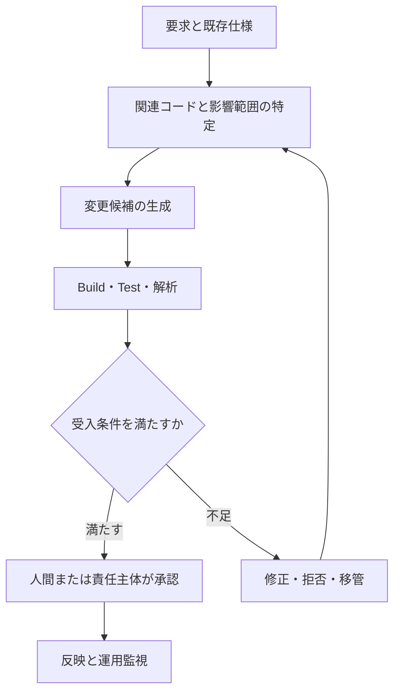

## コード生成AIの評価と採用設計

> 種別：一般理論・簡略モデル・設計仮説  
> 適用対象：コード補完、関数生成、修正Patch、Repository単位の保守、Coding Agent  
> 対象工程：要求整理、Context構成、生成、検証、Review、採用、運用  
> 関連ページ：生成AIの条件付き確率モデル基礎、ハルシネーションの多層制御設計、AI間インターフェースとしてのプロンプト

---

### このページの主張

コード生成AIが返すものは、完成品として保証されたProgramではありません。

要求、既存コード、実行環境、Instructionなどを条件として生成された、変更候補です。

したがって、コード生成の設計対象はPromptだけではありません。

$$
Code\ Generation\ System
=
Candidate\ Generation
+
Verification
+
Selection
+
Execution\ Control
$$

生成性能が高くても、検証と採用の境界が弱ければ、誤った変更が本番環境へ流れます。

反対に、候補に誤りが含まれても、Compiler、Test、Static Analysis、Review、権限制御によって採用を止められれば、業務上の損失を抑えられます。

> コード生成の品質は、AIが正解を書く確率だけでなく、誤った候補を検出し、採用せず、実行させない能力で決まる。

工程全体は次のように捉えます。



このうち、AIがCodeを生成するのは一工程にすぎません。

---

### 生成量を価値指標にしない

生成行数、補完回数、AI利用回数は、作業量の指標にはなっても、業務価値を直接表しません。

大量のCodeを短時間で生成しても、次が増えれば全体価値は下がります。

- 誤った変更対象の選択
- 不要な差分
- Review負荷
- Test不足
- 互換性破壊
- 本番流出欠陥
- 将来の保守費用

コード生成工程の価値単位は、生成されたCodeではなく、要求と既存Systemへ整合した「検証済み変更」です。

$$
Value
\neq
Generated\ Lines
$$

概念的には次のように考えます。

$$
Net\ Value
=
Benefit(Verified\ Change)
-
Generation\ Cost
-
Verification\ Cost
-
Expected\ Defect\ Loss
-
Future\ Maintenance\ Cost
$$

これは会計上の公式ではなく、生成速度だけを最適化しないための損失モデルです。

コード生成AIの主要な価値は、必ずしもCodeを新規作成することではありません。

| 工程 | AIが作る候補 | 人間・Systemが確認するもの |
|---|---|---|
| 既存Code理解 | 構造、責務、処理経路の説明 | Codeとの対応、抜け、誤読 |
| 影響分析 | 変更候補File、呼出元・呼出先 | 影響範囲、暗黙の依存 |
| 実装設計 | 複数の変更案とTrade-off | 要求適合、互換性、運用影響 |
| Code生成 | Patch、Test候補 | Build、Test、解析、差分 |
| Review支援 | Risk、未確認事項、確認観点 | 最終判断、例外承認、責任 |

既存Codeの理解支援は、根拠となるCodeを利用者が確認しやすいため、自然言語だけの回答より検証可能性が高い場合があります。

しかし、影響先の見落とし、動的Dispatch、設定・Data・運用手順への依存などは残ります。

したがって「Codeを参照しているからハルシネーションは起きない」ではなく、次のように表現する方が正確です。

> 根拠Codeへ照合できるため誤りを検出しやすいが、取得漏れと解釈誤りは依然として検証対象である。

---

### 「確率最適化」という表現の限界

コード生成を「制約付き確率最適化」と説明すると、AIが正解条件を明示的に解き、最適なProgramを選んでいるように見える場合があります。

しかし、通常の自己回帰型言語モデルが推論時に直接計算しているのは、次Tokenの条件付き分布です。

要求を $R$、既存Codebaseを $B$、実行環境を $E$、Instructionを $I$、Modelを $M$、Decoding設定を $D$、生成Codeを $Y=(y_1,\ldots,y_T)$とします。

$$
P(Y\mid R,B,E,I,M,D)
=
\prod_{t=1}^{T}
P(y_t\mid y_{<t},R,B,E,I,M,D)
$$

ここで高い確率を持つCodeが、要求に対する正解である保証はありません。

Modelが学習した分布上で自然であることと、今回のSystemで正しいことは別だからです。

このサイトでは、コード生成を次の概念モデルとして扱います。

> 条件付き分布から変更候補を生成し、外部検証器によって受入可能集合へ絞り込む工程。

これは設計関係を理解するための簡略モデルであり、個別製品やModelの内部実装を断定するものではありません。

---

### 正しいCodeは一つの条件では決まらない

構文が正しいだけでは、業務上正しいCodeとはいえません。

受入可能なCodeの集合を $\mathcal{A}$とします。

$$
\mathcal{A}
=
\mathcal{S}_{parse}
\cap
\mathcal{S}_{compile}
\cap
\mathcal{S}_{test}
\cap
\mathcal{S}_{spec}
\cap
\mathcal{S}_{security}
\cap
\mathcal{S}_{compatibility}
\cap
\mathcal{S}_{maintainability}
$$

各集合は次を表します。

| 集合 | 確認する内容 |
|---|---|
| $\mathcal{S}_{parse}$ | 構文として解釈できる |
| $\mathcal{S}_{compile}$ | 対象環境でBuildできる |
| $\mathcal{S}_{test}$ | 定義済みTestを通過する |
| $\mathcal{S}_{spec}$ | 明示・暗黙の要求を満たす |
| $\mathcal{S}_{security}$ | 許容できない脆弱性を持たない |
| $\mathcal{S}_{compatibility}$ | API、Data、旧版との互換条件を満たす |
| $\mathcal{S}_{maintainability}$ | 組織の設計・保守基準を満たす |

理想的には、生成候補 $Y$について次を最大化したいと考えられます。

$$
P(Y\in\mathcal{A}\mid R,B,E,I,M,D)
$$

ただし、$\mathcal{A}$を完全に観測することは通常できません。

仕様の不足、未作成のTest、未知の利用環境、将来の変更、Review判断などが含まれるためです。

また、保守性のように完全な二値へ落とし込めない条件もあります。

したがって、実務では観測可能な検証結果から、受入可能性を推定します。

---

### Promptは制約を強制する機構ではない

Promptへ次のように書くことは有効です。

- 変更対象を限定する
- Public APIを変更しない
- 新しい外部Libraryを追加しない
- 既存のCoding規約へ従う
- 指定したTestを追加する
- 不明な点は推測せず報告する

これらは生成分布を変えます。

$$
P(Y\mid R,B,E,I)
\neq
P(Y\mid R,B,E,I')
$$

しかし、自然言語のInstructionだけでは、禁止された候補の確率を厳密に0へできるとは限りません。

例えば「指定File以外を変更しない」と書いても、AgentにRepository全体への書込み権限があれば、実行上は変更できてしまいます。

強い制約は、決定論的な仕組みでも実装します。

| 制約 | Promptによる方向付け | Systemによる強制 |
|---|---|---|
| 変更可能File | 対象Fileを指示 | Sandbox、Path Allowlist |
| 外部通信 | 通信禁止を指示 | Network権限を遮断 |
| Dependency追加 | 追加禁止を指示 | Lockfile差分、Policy Check |
| 機密情報 | 入力禁止を説明 | Secret Scan、Access Control |
| 本番反映 | 実行しないよう指示 | Approval Gate、Deploy権限分離 |

> Promptは候補の方向を変える。権限と検証は、候補が越えられる境界を変える。

---

### ContextはRepositoryの量ではなく必要条件で設計する

Code生成の条件には、利用可能なContextが含まれます。

しかし、Repository全体を無差別に渡せば十分とは限りません。

必要なContextを次のように分けます。

| Context | 例 |
|---|---|
| 要求 | 変更理由、完了条件、対象外 |
| 構造 | Module境界、依存関係、Call Graph |
| 局所Code | 変更対象、呼出元、呼出先 |
| 契約 | Interface、Schema、Protocol、例外 |
| 実行環境 | OS、Runtime、Compiler、Build Option |
| 品質基準 | Test、Lint、Security Rule、Review基準 |
| 変更履歴 | 過去の判断、互換性理由、既知の制約 |

候補Fileや関連箇所の検索結果を $Z$とすると、Repository単位の生成は概念的に次の二段階へ分けられます。

$$
P(Y\mid R,B)
=
\sum_Z
P(Z\mid R,B)
P(Y\mid R,B,Z)
$$

この式は、関連箇所の選択を誤ると、その後の生成が正しくても変更全体が失敗し得ることを示します。

実務では、少なくとも次を分けて評価します。

- 変更対象Fileを特定できたか
- 影響する呼出元・呼出先を取得できたか
- 暗黙の互換条件を取得できたか
- 取得したContextに基づいて正しく変更できたか

[SWE-bench](https://arxiv.org/abs/2310.06770)が扱う実RepositoryのIssue解決では、複数Fileや複数の構造をまたぐ変更が必要になります。短い関数生成の成績を、そのままRepository保守能力とみなすことはできません。

---

### 生成と検証を別の責務へ分ける

生成器と検証器は目的が異なります。

#### 生成器

- 変更候補を作る
- 複数案を提示する
- 仮定と不明点を示す
- Test候補を作る

#### 検証器

- 構文を解析する
- Buildする
- Testを実行する
- Static Analysisを行う
- 差分範囲を検査する
- Security Policyへ照合する

#### 人間または承認主体

- 仕様が正しいか判断する
- 暗黙要求と業務影響を確認する
- 例外を承認する
- 本番反映の責任を持つ

AIが生成したTestで、同じAIのCodeだけを検証すると、生成側と検証側が同じ誤解を共有する場合があります。

したがって、Test Oracleの独立性も設計対象です。

- 既存Regression Test
- 要求から独立して作成した受入Test
- Property-based Test
- Mutation Testing
- Static Analyzer
- Security Scanner
- 人間による仕様確認

検証器を増やすことではなく、異なる失敗を検出できることが重要です。

---

### Test通過は正しさの証明ではない

実際に要求を満たす事象を $Q$、観測したTestをすべて通過する事象を $T$とします。

Bayesの定理により、Test通過後に実際に正しい確率は次です。

$$
P(Q\mid T)
=
\frac{
P(T\mid Q)P(Q)
}{
P(T\mid Q)P(Q)
+
P(T\mid \neg Q)P(\neg Q)
}
$$

不正なCodeでもTestを通る可能性、すなわち

$$
P(T\mid \neg Q)>0
$$

かつ、事前に正解・不正解の両方が起こり得る

$$
0<P(Q)<1
$$

と仮定すれば、次が成り立ちます。

$$
P(Q\mid T)<1
$$

Testが見ていない入力、状態、並行処理、性能、Security、互換性では、欠陥が残り得ます。

したがって「Testが通ったから正しい」ではなく、次を確認します。

- Testが要求のどの部分を観測しているか
- 正しくない実装を拒否できるか
- 境界値と異常系を含むか
- Test自身が誤った仕様を固定していないか
- 実行環境が本番条件を再現しているか

このBayes式は概念整理です。実際の確率を利用するには、過去の変更と欠陥実績から校正する必要があります。

---

### 複数候補生成とpass@k

Code生成研究では、複数候補のうち少なくとも一つが正解する能力を`pass@k`で表すことがあります。

$n$個の候補を生成し、そのうち $c$個が正解、そこから $k$個を選ぶとします。ただし、$1\le k\le n$とします。

少なくとも一つの正解を含む確率の推定には、次の形が使われます。

$$
pass@k
=
1-
\frac{
\binom{n-c}{k}
}{
\binom{n}{k}
}
$$

[Codexの評価研究](https://arxiv.org/abs/2107.03374)では、HumanEvalとこの指標を用いて、反復Samplingによる候補生成を評価しています。

ただし、`pass@k`は次を意味しません。

- 最初の一案が正しい
- 正解候補を実務上選別できる
- Repository全体へ安全に統合できる
- Securityや保守性を満たす
- 本番障害を起こさない

候補数を増やすと、正解候補を含む可能性は上がります。

同時に、弱い検証器が誤答を受け入れる機会も増えます。

候補ごとのFalse Accept率を $q$とし、独立だと仮定した簡略モデルでは、$k$候補のうち少なくとも一つを誤って受け入れる確率は次です。

$$
P(\text{at least one false accept})
=
1-(1-q)^k
$$

ただし、生成候補と検証結果には相関があるため、この独立仮定を実測値として使ってはいけません。

重要なのは候補数ではなく、正しい候補を選別できるVerifierです。

[AlphaCode](https://arxiv.org/abs/2203.07814)も大規模Samplingだけでなく、ProgramのBehaviorに基づくFilteringを組み合わせています。ただし、競技Programmingの結果を業務System保守へ直接一般化することはできません。

---

### 未検出欠陥が本番へ流れる確率を分解する

生成候補に実質的な欠陥が含まれる事象を $D$とします。

自動検証が見逃す事象を $M_V$、Reviewが見逃す事象を $M_R$、その候補が採用・実行される事象を $A$とします。

Chain Ruleにより、本番へ欠陥が流れる事象は次のように分解できます。

$$
P(D\cap M_V\cap M_R\cap A)
=
P(D)
P(M_V\mid D)
P(M_R\mid D,M_V)
P(A\mid D,M_V,M_R)
$$

制御対象は四つあります。

1. 欠陥を含む候補の生成率を下げる
2. 自動検証の見逃し率を下げる
3. Reviewの見逃し率を下げる
4. 未確認候補の採用・実行を止める

この分解は、Prompt改善だけに依存しない理由を示します。

例えば、本番Deploy権限をAIから分離すれば、最後の条件付き確率を下げられます。

$$
P(A\mid D,M_V,M_R)
\downarrow
$$

ただし、各段階は独立ではありません。

同じ仕様誤解を生成AI、AI Reviewer、人間Reviewerが共有すれば、見逃しは相関します。

工程数を増やしただけで安全になったとは判断できません。

---

### 期待損失で採用判断を設計する

すべてのCode変更を同じ厳しさで扱う必要はありません。

UI文言修正と、認証・暗号・支払・削除処理では、誤りの影響が異なります。

観測Evidenceを $e$、実際の状態を $s$、選択可能なActionを $a$とします。

$$
a^*
=
\arg\min_{a\in\mathcal{D}}
\sum_s
P(s\mid e)L(a,s)
$$

ここで、意思決定集合を次のように置けます。

$$
\mathcal{D}
=
\{
accept,
repair,
reject,
escalate
\}
$$

$L(a,s)$は、Action $a$を選んだときの損失です。

損失には次を含めます。

- 本番障害
- Security事故
- Data破壊
- 互換性破壊
- 復旧時間
- 人間Review費用
- 再生成・再Test費用
- 不要な拒否による開発遅延

高影響領域では、多少のFalse Rejectを許容しても、False Acceptを強く抑える設計が合理的です。

一方、影響の小さい局所変更では、自動検証を通過した候補を人間の簡易Reviewへ流す設計も可能です。

確率と損失は推測値のまま固定せず、変更実績、Review差戻し、本番流出欠陥から更新します。

---

### 変更単位を小さくする理由

変更範囲が大きいほど、確認すべき相互作用は増えます。

$m$個の変更点があり、変更点同士の組合せを単純に数えると、Pairwiseな相互作用候補は次です。

$$
\binom{m}{2}
=
\frac{m(m-1)}{2}
$$

これは欠陥数を予測する式ではありません。

変更点が増えると、検討対象となり得る相互作用が二次的に増えることを示す簡略モデルです。

小さなPatchには次の利点があります。

- 変更目的を一つへ限定しやすい
- 差分Reviewがしやすい
- Testとの対応を追跡しやすい
- 問題発生時に切り戻しやすい
- AIが無関係な設計変更を混ぜにくい

ただし、過度に分割すると、複数Patch間の整合確認が必要になります。

小さければ常に安全なのではなく、独立して検証・Deploy・Rollbackできる単位へ分けます。

---

### Legacy Codeでは暗黙条件を成果物化する

Legacy Systemでは、現在のCodeだけが仕様とは限りません。

次の情報が分散している場合があります。

- 過去の障害回避策
- 特定OSやDeviceだけの例外
- 古いDataとの互換条件
- InstallerやRegistryの副作用
- 他製品が依存する非公開挙動
- 廃止できない運用手順

AIへ「この処理を現代化して」と依頼しても、これらがContextになければ、表面的に自然でBuild可能な変更が、互換性を壊すことがあります。

変更前に、Change Contractを作ります。

| 項目 | 内容 |
|---|---|
| 目的 | 何を改善するか |
| 対象 | 変更してよいModule・File |
| 非対象 | 今回変更しない範囲 |
| 保持条件 | 変えてはいけない外部挙動 |
| 移行条件 | 旧Data・設定・APIの扱い |
| 異常系 | 失敗時の状態と復旧 |
| 観測方法 | Log、Metric、監査情報 |
| 完了条件 | Build、Test、Review、運用確認 |
| Rollback | 元へ戻す方法 |

AIはこのContractに基づいて候補を作ります。

人間は、Contractが業務上正しいかを確認します。

CompilerとTestは、候補が観測可能な条件を満たすか確認します。

責務を一つのPromptへ押し込まず、工程ごとに分けます。

---

### Code生成工程の状態遷移

候補Codeを、いきなり「完成」と「失敗」の二値で扱いません。

$$
state
\in
\{
generated,
parsed,
built,
tested,
reviewed,
approved,
deployed,
rejected
\}
$$

各状態には、遷移条件を定義します。

| 遷移 | 必須条件の例 |
|---|---|
| generated → parsed | 構文解析、Schema確認 |
| parsed → built | 指定環境でBuild成功 |
| built → tested | 必須Test、Static Analysis成功 |
| tested → reviewed | 差分、根拠、残余Riskを提示 |
| reviewed → approved | 責任者の承認、例外記録 |
| approved → deployed | Deploy権限、環境条件、Rollback準備 |

検証結果を単なる会話文ではなく、Evidenceとして引き継ぎます。

```yaml
change_id: CHG-2026-001
artifact:
  commit: abcdef1
  files:
    - src/example.cs
evidence:
  build: passed
  unit_tests: 248/248 passed
  static_analysis: passed
  security_scan: no-high-severity-findings
assumptions:
  - target_os >= specified_version
unresolved:
  - behavior on legacy configuration requires manual confirmation
state: tested
```

この形式は正しさを保証しません。

何が確認済みで、何が未確認かを次工程が再解釈しにくくするためのInterfaceです。

---

### Riskに応じてHuman in the Loopを変える

すべてのAI生成Codeを同じReview工程へ流すと、低Risk変更に過剰な費用を払い、高Risk変更に不足した確認を行う可能性があります。

変更 $i$のRiskを簡略化して次のように置きます。

$$
Risk_i
=
P(D_i\mid e_i)
\times
Impact_i
$$

Risk分類例は次です。

| Risk | 変更例 | Gate例 |
|---|---|---|
| 低 | Comment、局所的Test補助 | 自動検証＋簡易Review |
| 中 | 業務Logic、Public API内部 | 自動検証＋担当者Review |
| 高 | 認証、暗号、権限、Data移行 | 独立Review＋Security確認＋承認 |
| 重大 | 支払、削除、本番操作 | AIの直接実行禁止＋複数承認 |

この表は一般的な固定基準ではありません。

対象Systemの損失、法令、組織責任、Rollback可能性に応じて設計します。

---

### 評価Datasetを実務分布へ合わせる

短い関数生成だけで高得点でも、実務の保守性能は分かりません。

評価Datasetには、実際に発生するTask分布を反映します。

- 新規関数生成
- 既存関数の局所修正
- 複数Fileの影響修正
- API互換性維持
- Data Migration
- 異常系追加
- Security修正
- Build設定変更
- Legacy環境対応
- 仕様不足時の追加質問・停止

さらに、失敗しやすい条件で層別します。

- Contextが十分／不足
- Testが十分／不足
- 変更範囲が局所／横断
- 言語・Framework
- 新規Code／Legacy Code
- 低Risk／高Risk

平均値だけでは、重大領域の弱さが隠れます。

---

### 評価指標

Code生成Systemは工程別に評価します。

#### 生成

- Parse成功率
- Build成功率
- Test通過率
- `pass@1`、`pass@k`
- 要求適合率

#### Context取得

- 対象File特定率
- 影響範囲Recall
- 必要な契約・設定の取得率
- 不要Context率

#### 検証

- 欠陥検出率
- False Accept率
- False Reject率
- Mutation Score
- Security指摘の検出率

#### Review・運用

- Review差戻し率
- Review時間
- AI提案の採用率
- 採用後の修正率
- 本番流出欠陥率
- Rollback率
- 復旧時間

#### 効率

- Task完了時間
- 人間作業時間
- 生成・Test・Review費用
- 一つの採用Patchを得るまでの試行回数

採用率が高いことだけを成功指標にすると、Reviewが甘くなる誘因を作ります。

速度だけを最適化すると、将来の保守費用が隠れます。

品質、Risk、時間、費用を同時に観測します。

---

### よくある誤解

#### Temperatureを下げれば正しいCodeになる

低Temperatureは出力のばらつきを抑えますが、最上位候補が誤っていれば、その誤りを安定して生成する場合があります。

正確性は外部検証で確認します。

#### Buildできれば正しい

Buildは構文、型、Dependencyの一部を確認します。

業務仕様、Security、性能、互換性は別です。

#### Testが通れば正しい

Testが観測していない誤りは残ります。

Test Suiteの検出能力を評価します。

#### 候補を増やせば正解できる

正解候補を含む確率は上がり得ますが、選別できなければ利用できません。

#### AI Reviewerを追加すれば独立検証になる

同じModel、同じContext、同じ仕様誤解を使えば、失敗は相関します。

#### Repository全体を渡せば理解できる

Context量と、必要な契約・影響範囲を取得できることは同じではありません。

#### AIが作ったので責任もAIにある

AIは業務上の責任主体ではありません。

採用条件、承認者、実行権限、事故時の対応主体を組織が定義します。

---

### 実務手順

#### 1. Change Contractを定義する

目的、対象、非対象、保持条件、完了条件、Rollbackを明示します。

#### 2. 必要Contextを特定する

関連Code、呼出関係、Test、仕様、履歴、環境を取得します。

#### 3. AIに候補と仮定を出させる

Codeだけでなく、変更理由、根拠、不明点、追加Testを出力させます。

#### 4. 決定論的検証を実行する

Parse、Build、Test、Lint、Static Analysis、Security Scanを実行します。

#### 5. 仕様と影響をReviewする

観測可能な検証で扱えない暗黙要求、互換性、運用影響を確認します。

#### 6. Riskに応じて承認する

低Riskは軽量化し、高Riskは独立Reviewと権限制御を加えます。

#### 7. Deploy後も観測する

Log、Metric、Error、Rollback、本番流出欠陥を記録します。

#### 8. 評価Datasetへ戻す

失敗例と差戻し理由を、次回評価とContext設計へ反映します。

---

### 事実・簡略モデル・設計仮説の区別

#### 一般理論・確認可能な事実

- 自己回帰型言語モデルは、条件付きToken分布に基づいて系列を生成する
- CompilerやTestは、Codeの異なる性質を検証する
- Test通過だけでは、未観測の要求を満たすことは証明できない
- `pass@k`は、複数候補中に正解を含む能力を表す評価方法である
- 実Repositoryの修正は、短い関数生成より広いContextと工程を必要とする

#### このページの簡略モデル

- 受入可能集合を複数条件の共通部分で表す
- 欠陥の本番流出をChain Ruleで分解する
- Riskを発生確率と影響度の積で表す
- 変更点間の相互作用候補を $\binom{m}{2}$で表す

これらは設計関係を可視化する補助線であり、個別Systemの性能保証ではありません。

#### 設計仮説

- Prompt改善より、生成・検証・採用・実行の責務分離が安定した品質へつながる
- Code量より、Change Contractと必要Contextの品質がRepository保守性能を左右する
- 候補数を増やすより、独立性のあるVerifierを改善する方が実務価値を生む場合がある
- AI生成Codeの自動化範囲は、Model性能だけでなく期待損失で決めるべきである

これらは評価Datasetと運用実績によって検証・更新します。

---

### このページの定義

コード生成AIは、正しいProgramを保証して返す装置ではありません。

要求とContextを条件として、変更候補を生成する確率的Componentです。

$$
Safe\ Code\ Adoption
=
Context
+
Candidate\ Generation
+
Independent\ Evidence
+
Risk\ Based\ Decision
+
Execution\ Control
$$

コード生成における確率設計とは、AIの誤りを0にする設計ではありません。

誤りが生成される可能性を前提に、検出し、拒否し、修正し、必要なら人間へ移管し、未確認の変更を本番へ流さない設計です。

---

### 参考資料

- Mark Chen et al., [Evaluating Large Language Models Trained on Code](https://arxiv.org/abs/2107.03374), 2021
- Yujia Li et al., [Competition-Level Code Generation with AlphaCode](https://arxiv.org/abs/2203.07814), Science, 2022
- Carlos E. Jimenez et al., [SWE-bench: Can Language Models Resolve Real-World GitHub Issues?](https://arxiv.org/abs/2310.06770), ICLR 2024
- NIST, [SP 800-218: Secure Software Development Framework Version 1.1](https://csrc.nist.gov/pubs/sp/800/218/final), 2022
