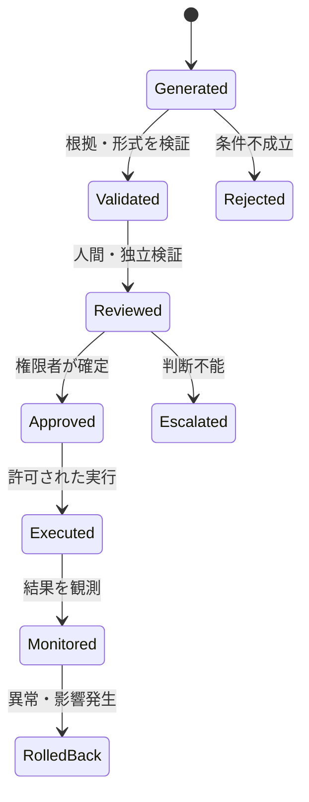
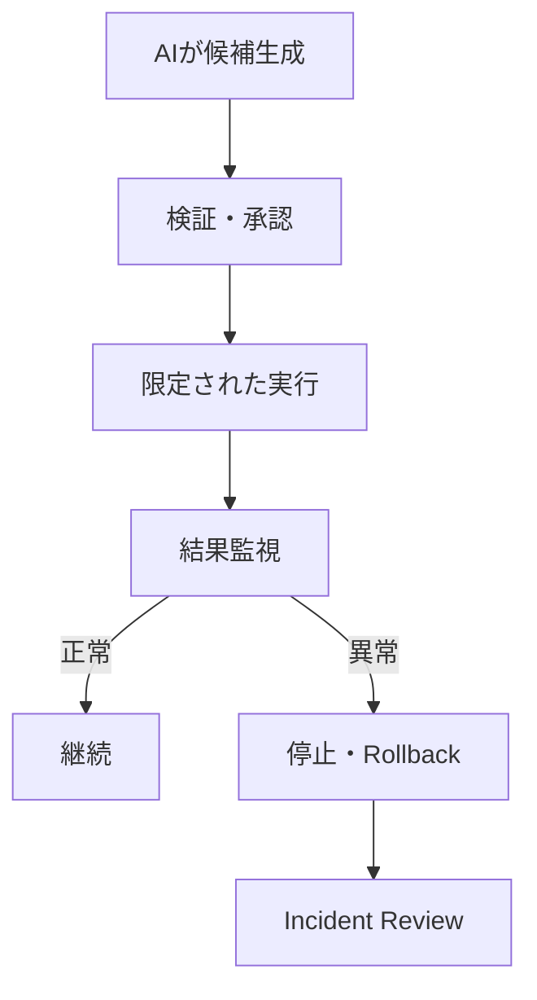
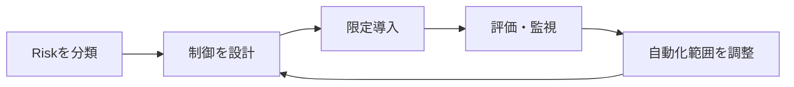

## AI出力の責任境界とHITL

> 種別：設計原則 / 実務上の仮説 / ガバナンス設計  
> 適用対象：生成AI、RAG、QAチャット、AIエージェント、コード生成、業務自動化  
> 対象工程：生成 / 検証 / 採用 / 承認 / 実行 / 監視 / 事故対応  
> 関連ページ：[ハルシネーションの多層制御設計](/foundations/layered-hallucination-controls/)、[QAチャット運用思想](/knowledge-context/qa-operations/)、[AIを開発工程に組み込む](/software-engineering/development-workflow/)、[複数AIの役割分担と工程設計](/software-engineering/multi-ai-orchestration/)

### 結論

AIが出力を生成できることと、その出力を業務上の決定として確定できることは異なる。

AI導入時に必要なのは、「最終的に人が確認する」という曖昧な原則ではない。生成、検証、採用、承認、実行、監視、事故対応の各段階について、権限と責任主体を定義することである。

本ページの中心原則は次である。

$$
Capability
\neq
Authority
\neq
Accountability
$$

- Capability：その処理を技術的に実行できる
- Authority：その処理を実行・確定してよい権限がある
- Accountability：結果を説明し、是正する責任を負う

AIへCapabilityを与えても、AuthorityとAccountabilityが自動的に移るわけではない。

Human in the Loop（HITL）とは、人間を画面の前へ置くことではない。

> AIから人間へ制御・判断・承認を戻す条件と、人間が判断できる情報・能力・時間を設計すること。

---

### 1. AI出力は最初から確定値ではない

AI出力を生成直後から確定情報として保存すると、後工程は「誰かが確認した値」と誤認する可能性がある。

そこで、出力状態を分ける。

$$
s
\in
\{
generated,
evidence\_linked,
validated,
reviewed,
approved,
executed,
monitored
\}
$$

| 状態 | 意味 | 業務上の扱い |
|---|---|---|
| Generated | AIが候補を生成した | 未確認候補 |
| Evidence Linked | 根拠と由来が関連付いた | 検証待ち |
| Validated | 定義した機械検証を通過した | 条件付き利用可能 |
| Reviewed | 人間または独立した検証工程が確認した | Review結果付き |
| Approved | 権限者が業務利用を確定した | 正式利用可能 |
| Executed | 外部または業務システムへ反映した | 結果確認待ち |
| Monitored | 実行後の結果を監視・記録した | 運用中 |

状態遷移は一方向とは限らない。

重要なのは、`Generated`を自動的に`Approved`へ昇格させないことである。

---

### 2. 責任の空白は作業の置換時に生じる

従来、人間が一つの作業の中で暗黙に行っていたものを分解する。

- 情報を集める
- 内容を判断する
- 異常を見つける
- 修正する
- 結果を確定する
- 実行する
- 問題時に説明する

このうち生成や入力だけをAIへ置換すると、暗黙に行われていた確認・判断が工程から消えることがある。

例えば、AIが作成した値と、人間が承認した値が同じFieldへ同じ状態で保存されると、後工程は両者を区別できない。

これを本ページでは「責任の空白」と呼ぶ。

責任境界は、少なくとも次の八点で定義する。

| 設計対象 | 定義すること |
|---|---|
| 自動処理範囲 | AIが処理できる対象・条件・上限 |
| 異常検知 | 何を異常とし、誰が検知するか |
| 人間への移管 | どの条件で、誰へ、何を渡すか |
| 修正権限 | 誰がAI出力を変更できるか |
| 承認権限 | 誰が正式値・決定として確定できるか |
| 実行権限 | 誰または何が外部へ作用できるか |
| 記録・監査 | 入力、根拠、判断、実行結果をどう残すか |
| 最終責任 | 誰が説明、是正、再発防止を担うか |

---

### 3. 責任主体を工程ごとに割り当てる

Workflowを有向グラフ $G=(V,E)$ とする。各状態遷移 $e\in E$ には、責任主体が必要である。

$$
\forall e\in E,
\qquad
Owner(e)\neq\varnothing
$$

責任主体は個人名ではなく、まず組織上のRoleとして定義する。

| Role | 主な責務 |
|---|---|
| AI Producer | 候補・要約・推奨・処理案を生成 |
| System Validator | Schema、権限、整合性、規則を検証 |
| Human Reviewer | 根拠、意味、影響、例外を確認 |
| Decision Owner | 採用方針と許容Riskを決定 |
| Approver | 正式利用・実行を承認 |
| Executor | 許可された処理を実行 |
| Monitor | 実行後の結果・異常を監視 |
| Incident Owner | 停止、復旧、説明、再発防止を統括 |
| Record Owner | 記録の完全性・保持・アクセスを管理 |

一人が複数Roleを兼ねることはできる。ただし、Role自体を省略してはいけない。

高Risk業務では、作成者と承認者、開発者と独立評価者などを分離する。

---

### 4. AIへ移せるものと移せないもの

AIへ委任できる範囲は、技術的可能性だけでは決まらない。

| 対象 | AIへ委任できる可能性 | 残る設計責任 |
|---|---|---|
| 情報検索 | 高い | 情報源、範囲、鮮度、権限 |
| 要約・分類 | 高い | 正解定義、例外、品質基準 |
| 候補生成 | 高い | 採用条件、根拠、禁止範囲 |
| 推奨 | 条件付き | 判断基準、Bias、異議申立て |
| 検証 | 条件付き | 検証器の性能、独立性、限界 |
| 外部実行 | 条件付き | 権限、可逆性、承認、監視 |
| 方針決定 | 限定的 | 目的、価値判断、利害調整 |
| 最終責任 | AIへ帰属させない | 組織・権限者の説明と是正 |

最後の行は、あらゆる法域の法的結論を一律に述べるものではない。本ページのシステム設計原則として、説明・是正・事故対応の責任をAIモデルそのものへ置かず、自然人または法人内のRoleへ割り当てる。

---

### 5. HITLは一種類ではない

Human–AI構成の用語は分野によって揺れがある。本ページでは、運用上の区別として次を用いる。

| 構成 | 人間の位置 | 適用例 |
|---|---|---|
| Human-in-the-Loop | 実行前に人間の判断・承認を必須化 | 本番変更、高影響回答 |
| Human-on-the-Loop | 自動処理を監視し、必要時に介入 | 可逆な連続処理、監視業務 |
| Human-over-the-Loop | 方針、閾値、権限、評価を統治 | 運用設計、定期Review |
| Human-out-of-the-Loop | 個別処理に人間を置かない | 低影響で十分検証可能な処理 |

個別処理へ人間を置かない場合でも、方針、評価、監視、事故対応の責任まで消えるわけではない。

すべての出力を同期的に人間承認させる必要はない。Riskが低く、可逆で、機械検証と監視が十分なら、自動化範囲を広げられる。

---

### 6. 人間を置けば安全になるとは限らない

人間も検証器であり、誤りを見逃す。

AI出力が誤っている事象を $E$、人間が承認する事象を $A$ とする。

人間ReviewのFalse Accept Rateを次で定義する。

$$
FAR
=
P(A\mid E)
$$

正しいAI出力を人間が拒否するFalse Reject Rateは次である。

$$
FRR
=
P(\neg A\mid \neg E)
$$

検出感度と特異度で表すなら、次になる。

$$
Sensitivity
=
P(\neg A\mid E)
=1-FAR
$$

$$
Specificity
=
P(A\mid\neg E)
=1-FRR
$$

HITLの品質は「人間が見た件数」ではなく、誤りをどれだけ差し止め、正しい出力をどれだけ不必要に止めなかったかで測る。

---

### 7. HITLの期待損失を比較する

AI出力の誤り率を $p_e=P(E)$ とする。誤った出力を承認した場合の影響を $I_{FA}$、正しい出力を拒否した場合の影響を $I_{FR}$ とする。

HITL付き工程の期待損失を、簡略化して次のように置く。

$$
L_{HITL}
=
p_e\cdot FAR\cdot I_{FA}
+
(1-p_e)\cdot FRR\cdot I_{FR}
+
C_{auto}
+
C_{review}
+
C_{delay}
$$

人間Reviewを置かず、AI出力をそのまま採用する場合の期待損失を次のように置く。

$$
L_{auto}
=
p_e\cdot I_{FA}
+C_{auto}
$$

他の条件が同じなら、次を満たす領域でHITLを置く合理性がある。

$$
L_{HITL}<L_{auto}
$$

このモデルから、次が分かる。

- 誤りの影響が小さい場合、全件Reviewの費用が上回ることがある
- 人間の$FAR$が高い場合、名目的HITLではRiskがあまり下がらない
- $FRR$が高い場合、正しい出力を止める手戻りが増える
- Review待ち時間が大きい場合、業務価値を失うことがある

実際には、承認後も権限制御、実行検証、Rollback、監視がある。したがって損害発生確率は、より細かく次のように分解できる。

$$
P(Harm)
=
P(E)
P(A\mid E)
P(X\mid E,A)
P(\neg R\mid E,A,X)
$$

- $X$：誤った出力が実行される
- $R$：実行後に検出・回復できる

HITLは多層防御の一層であり、唯一の安全策ではない。

---

### 8. Riskに応じて確認方式を変える

確認強度を、AIの自己申告したConfidenceだけで決めない。

少なくとも次を使う。

- 誤り発生確率
- 誤りの影響度
- 可逆性
- 実行前後の検出可能性
- 対象者・金銭・安全への影響
- 個人情報・機密情報への接触
- 法令・契約・社内規程
- Review可能なEvidenceの有無

| Risk Tier | 特徴 | 人間の関与例 |
|---|---|---|
| Tier 0 | 助言のみ、外部作用なし、容易に破棄可能 | 個別承認なし、標本監査 |
| Tier 1 | 内部下書き、可逆、影響限定 | 利用者が採用時に確認 |
| Tier 2 | 外部提示、本番変更、金銭・権限へ作用 | 実行前承認、Rollback、監視 |
| Tier 3 | 高影響、不可逆、安全・権利・重大損失 | 専門家確認、独立Evidence、複数承認、厳格な停止条件 |

Tierは普遍的分類ではない。組織のRisk許容度と業務特性に応じて定義する。

---

### 9. 確認対象を明示する

「内容を確認してください」という指示では、Reviewの再現性がない。

人間が確認する対象を分ける。

#### 9.1 Evidence

- 根拠が実在するか
- 主張を支持しているか
- 対象版・期間・適用範囲が一致するか

#### 9.2 Assumption

- AIが補った前提は何か
- 許容できる仮定か
- 確認が必要な仮定か

#### 9.3 Impact

- 誰・何へ影響するか
- 変更が伝播する範囲はどこか
- 失敗時に戻せるか

#### 9.4 Policy

- 法令、契約、社内規程、業務ルールを満たすか
- 例外承認が必要か

#### 9.5 Decision

- 候補のうち何を採用するか
- 棄却理由は何か
- 未解決事項を許容するか

#### 9.6 Execution

- 対象、権限、時点、実行内容が承認範囲内か
- Rollbackと監視が利用できるか

---

### 10. Reviewerが判断できる情報を渡す

人間がAIの誤りを判断できない場合、確認画面を置いても実質的な統制にならない。

Review Packetを次の組として扱う。

$$
H
=
(output,evidence,assumptions,uncertainty,impact,alternatives,history)
$$

- output：確認対象の出力
- evidence：根拠と参照位置
- assumptions：AIが置いた前提
- uncertainty：不明点、競合、Coverage不足
- impact：実行時の影響範囲
- alternatives：他の候補と棄却理由
- history：生成、修正、検証、承認の履歴

ReviewerへAIの結論だけを見せない。

また、AIの回答を最初に表示すると、人間の判断がAnchoringを受ける可能性がある。高影響判断では、次の設計を検討する。

- AI提案を見る前に人間が一次判断する
- Evidenceを先に提示する
- 反証候補を提示する
- 承認理由を入力させる
- 「承認」以外に「判断不能」「専門家へ移管」を置く

これらはReview負荷を増やし得るため、評価データで効果と費用を確認する。

---

### 11. Automation Biasを設計対象にする

人間は、自動化された提案を過度に信頼する場合がある。Human–Automation研究では、この問題はAutomation BiasやComplacencyとして扱われてきた。

したがって、HITLを設けたこと自体を安全性のEvidenceにしない。

次を測る。

- AIが誤っているときの承認率
- AIのConfidence表示による承認率の変化
- Review時間と見逃し率の関係
- Reviewerの専門性別の検出率
- 同じ指摘が続いた場合の承認率
- AI不使用時と使用時の判断差

人間が常にAIより正しいわけでも、AIが常に人間より正しいわけでもない。Human–AI System全体で評価する。

$$
Performance_{system}
\neq
\max(Performance_{AI},Performance_{human})
$$

協働方法によって、単独時より改善する場合も悪化する場合もある。

---

### 12. Review処理能力を超えない

AIが大量の候補を生成し、人間のReview能力を超えると、HITLは形式的な承認工程になりやすい。

Risk分類 $k$ の到着件数を単位時間当たり $\lambda_k$、一件の平均Review時間を $t_k$ とする。必要Review工数は次である。

$$
W
=
\sum_k \lambda_k t_k
$$

利用可能な人間Review能力を $H$ とすると、継続運用の必要条件は次である。

$$
W<H
$$

$W\ge H$ の状態では、待ち行列、遅延、確認省略、承認の形骸化が起きる可能性がある。

対策：

- 低Risk処理を自動化または標本監査へ移す
- 機械検証で人間の確認対象を絞る
- 類似案件をまとめてReviewする
- 高Risk案件を優先する
- AI出力数そのものを制限する
- Review人員と専門性を確保する

AIが作れる量ではなく、人間が責任を持って確定できる量を工程の上限にする。

---

### 13. 承認と実行を分離する

人間が承認した後に、AIが承認範囲を超えて実行できる構成では、HITLの意味が失われる。

承認対象を固定する。

$$
Approval
=
Hash(action,target,input,version,scope)
$$

実装上、必ずHashを使うという意味ではない。承認したAction、対象、入力、版、範囲と、実際に実行する内容を同一性確認できるようにする設計モデルである。

実行時には次を検証する。

$$
Execute(x)
\iff
Approved(x)
\land
Authorized(x)
\land
Current(x)
$$

- Approved：承認済み内容と一致
- Authorized：実行主体に権限がある
- Current：対象版や前提が承認時から変わっていない

承認後に対象コード、入力データ、価格、権限などが変わった場合は、再承認する。

---

### 14. 自然言語の禁止を権限制御にしない

「重要な操作は必ず確認してください」というPromptは、承認機構ではない。

高影響Actionには、モデル外の制御を置く。

- Read-only権限
- Sandbox
- Branch保護
- Tool Allowlist
- 対象・金額・件数上限
- 承認待ちでの実行停止
- 短時間の資格情報
- 二者承認
- Rollback
- 監査ログ

AIがActionを提案できても、承認前には実行権限を取得できない構造にする。

OpenAI Agents SDKなどの現在のAgent実装にも、敏感なTool Callの前で実行を中断し、人間の承認または拒否後に状態を再開する構成がある。製品機能の有無にかかわらず、設計上必要なのは「提案」と「実行」の技術的分離である。

---

### 15. 例外・拒否・移管を正式な終了状態にする

AIが回答または実行まで到達しないことを、すべて失敗として扱わない。

$$
status
\in
\{approved,rejected,clarify,abstain,escalated,deferred\}
$$

- approved：条件を満たし承認
- rejected：不適切として棄却
- clarify：追加情報が必要
- abstain：判断根拠が不足
- escalated：上位権限・専門家へ移管
- deferred：条件成立まで保留

回答率や自動化率だけをKPIにすると、不明な案件まで無理に処理する圧力が生じる。

正しい拒否と正しい移管を、成功として評価する。

---

### 16. 実行後の監視と回復まで責任に含める

承認時点では観測できない影響があるため、責任境界は実行で終わらない。

定義するもの：

- 正常・異常の指標
- 監視期間
- 自動停止条件
- Rollback可能範囲
- Incident Owner
- 影響を受けた人への通知
- 原因分析と再発防止
- モデル・Prompt・Knowledge・権限の変更要否

Human-on-the-Loopは、単にDashboardを見ることではない。介入可能な時間、権限、停止手段を持つ必要がある。

---

### 17. 異議申立てと訂正経路を設計する

AI出力が人の権利、評価、取引、利用機会などへ影響する場合、誤りを検出した当事者が訂正を求められる経路が必要になる。

設計対象：

- AI利用の表示
- 判断根拠の説明可能範囲
- 問い合わせ窓口
- 人間による再審査
- 訂正・取消し
- 影響を受けた後工程への反映
- 記録保持

これはすべての低Riskな文章生成に同じ強度で必要という意味ではない。影響を受ける対象とRiskに応じて設計する。

EU AI ActのArticle 14は、その適用範囲にあるHigh-risk AI Systemsについて、人間による監督を可能にする設計を求めている。ただし、具体的な法的義務は対象システム、主体、適用時期、法域によって異なるため、個別に確認する。

---

### 18. 記録は責任追跡のために残す

監査ログは、AIが何を出力したかだけでは不十分である。

記録対象：

- 入力と対象版
- 利用したモデル・設定
- 参照したKnowledgeとEvidence
- AI出力
- 機械検証結果
- 人間に提示したReview Packet
- 承認・拒否・修正・移管
- 判断主体、時刻、理由
- 実行内容と結果
- 監視・Incident・Rollback

追跡関係を次で表す。

$$
Input
\rightarrow
Output
\rightarrow
Evidence
\rightarrow
Review
\rightarrow
Decision
\rightarrow
Execution
\rightarrow
Outcome
$$

ログへ秘密情報や個人情報を無制限に保存してはならない。監査可能性と情報最小化、保持期限、アクセス権を同時に設計する。

---

### 19. 責任分担表を作る

例として、社内QAチャットの責任分担を示す。

| 対象 | AI | 利用者 | Knowledge Owner | System Owner | Decision Owner |
|---|---|---|---|---|---|
| 質問分類 | 候補生成 | 必要時に補足 | 分類基準を提供 | Routingを実装 | 適用範囲を承認 |
| Knowledge検索 | 根拠候補取得 | 根拠を参照 | 内容・版を管理 | 検索基盤を運用 | 利用方針を承認 |
| 回答生成 | 回答案を作成 | 採用可否を判断 | 正本を維持 | 出力制約を実装 | 高影響用途を定義 |
| 回答拒否 | 不足を通知 | 問い合わせ先を選択 | 境界情報を提供 | 停止・移管を実装 | 拒否方針を決定 |
| 誤答対応 | 原因候補を整理 | 誤りを報告 | Knowledgeを訂正 | ログ・モデルを調査 | 再発防止を承認 |

AI列に「責任者」を置かない。AIは処理主体として記録できるが、組織上の説明・承認・是正責任はRoleへ置く。

---

### 20. コード生成における責任境界

コード生成では、AIがPatchを作成した時点を完了にしない。

| 工程 | AIの役割 | 人間・システムの責任 |
|---|---|---|
| 既存調査 | 関連箇所・依存候補を抽出 | 実コードと挙動を確認 |
| 影響分析 | 影響候補・未確認点を整理 | 許容Riskと変更範囲を決定 |
| 実装 | Patch・Test案を生成 | 変更意図を理解し採用判断 |
| 検証 | 指摘候補、失敗分析 | CI、Test、人間Reviewで確認 |
| 承認 | 承認資料を構造化 | 権限者がMerge・Release判断 |
| 運用 | ログ分類・原因候補 | 停止・復旧・再発防止を判断 |

AI生成コードを読まずに承認するなら、HITLは存在していても責任あるReviewにはなっていない。

成果はコード生成量ではなく、設計意図、影響範囲、Test、Review、合意、運用まで確認された変更である。

---

### 21. 評価指標

#### AI出力

- 誤り率
- Evidence Coverage
- 適切な拒否率
- 未解決事項の検出率

#### Human Review

- False Accept Rate
- False Reject Rate
- Risk Tier別のSensitivity・Specificity
- 平均Review時間
- 判断不能・専門家移管率

#### Workflow

- 未承認実行件数
- 承認対象と実行内容の不一致
- 承認待ち時間
- Review能力超過時間
- Rollback成功率

#### Governance

- Owner未定義の状態遷移数
- 監査ログ欠損率
- Incident検出時間
- 是正完了時間
- 異議申立て・訂正の処理結果

総合的な期待損失を次のように置ける。

$$
L_{total}
=
L_{error}
+L_{false\ rejection}
+C_{review}
+C_{delay}
+C_{operation}
+C_{incident}
$$

AI精度だけでなく、人間Review、業務遅延、運用、事故対応まで含める。

---

### 22. ガバナンスを停止理由にしない

ガバナンスの目的は、AI利用を一律に止めることではない。

責任、権限、検証、停止、回復を設計することで、安全に自動化できる範囲を広げる。

低Risk処理まで全件承認にすると、Review能力を消費し、高Risk処理の確認が薄くなる。

反対に、効率を優先して責任境界を省略すると、問題発生時に停止、説明、訂正できない。

必要なのは一律の禁止でも一律の自動化でもなく、RiskとEvidenceに応じた運用範囲の調整である。

---

### 23. よくある失敗

#### 23.1 「最終確認は人間」とだけ書く

誰が、何を、どのEvidenceで、いつ確認するか定義されていない。

#### 23.2 人間を完全な検証器とみなす

False Accept、Automation Bias、専門性不足、時間不足を測っていない。

#### 23.3 AIのConfidenceを承認条件にする

Confidenceの意味・Calibration・Task別性能を評価せず、自信表示を正しさとして扱う。

#### 23.4 承認後の実行内容を固定しない

人間が確認した内容と、実際に実行されるActionが異なる。

#### 23.5 全件Reviewで安全性を演出する

Review能力を超え、承認が形骸化する。

#### 23.6 生成者と承認者を区別しない

高Risk判断で独立した検証・承認が存在しない。

#### 23.7 異議申立てと訂正経路がない

誤りが発見されても、後工程や影響を回復できない。

#### 23.8 事故時だけ責任者を探す

設計時にIncident Ownerと停止権限を定義していない。

---

### 24. 事実・簡略モデル・設計仮説の区別

#### 一般的な事実・標準に基づく部分

- Human–Automationの役割は、情報取得、分析、決定、実行などの機能別に異なる自動化水準を選べる
- NIST AI RMFはHuman–AI構成のRoleと責任、監督、記録、Risk管理を設計対象としている
- 人間は自動化された推奨を過度に信頼し、誤りを見逃す場合がある
- 現在のAgent Frameworkには、敏感なTool Call前で処理を停止し、人間の承認後に再開する実装が存在する
- 一部の法制度では、対象となるHigh-risk AI SystemにHuman Oversightが要求される

#### 本ページで用いた簡略モデル

- $Capability\neq Authority\neq Accountability$
- AI出力の状態遷移
- すべての状態遷移へのOwner割当て
- $FAR$、$FRR$、Sensitivity、Specificity
- $L_{HITL}$と$L_{auto}$の期待損失比較
- 損害発生確率の多段分解
- Review必要工数 $W=\sum_k\lambda_k t_k$
- 承認対象と実行対象の同一性モデル

これらは設計関係を説明するモデルであり、特定業務の安全性や法令適合を保証しない。

#### 本ページの設計仮説

> AI出力を候補・検証済み・承認済み・実行済みへ分け、Riskに応じたHITLと決定論的制御を配置すれば、責任の空白を防ぎながら、低Risk領域の自動化範囲を広げられる。

この仮説は、AI単体だけでなく、人間の見逃し、Review費用、処理能力、実行後の回復まで含めて評価する必要がある。

---

### 25. 最終定義

AI出力の責任境界とHITLを、次のように定義する。

> AIが生成・検証・提案・実行できる範囲と、組織が採用・承認・監視・是正する責任を分離し、各状態遷移に権限とOwnerを割り当てること。Riskが閾値を超える場合、判断可能なEvidenceとともに人間へ制御を戻し、承認範囲内だけを実行し、結果を監視・回復できるようにすること。

HITLは、人間による免責印ではない。

$$
Trustworthy\ Operation
=
Role
+Evidence
+Verification
+Authority
+Monitoring
+Recourse
$$

作業をAIへ移しても、判断、記録、説明、訂正、再発防止が途切れない業務構造を作る。

---

### 参考資料

- [NIST AI Risk Management Framework 1.0](https://www.nist.gov/itl/ai-risk-management-framework)
- [NIST AI RMF Core](https://airc.nist.gov/airmf-resources/airmf/5-sec-core/)
- [NIST AI RMF: Human–AI Interaction](https://airc.nist.gov/airmf-resources/airmf/appendices/app-c-ai-risk-management-and-human-ai-interaction/)
- [NIST AI RMF Playbook: Govern](https://airc.nist.gov/airmf-resources/playbook/govern/)
- [NIST AI RMF Playbook: Map](https://airc.nist.gov/airmf-resources/playbook/map/)
- [Regulation (EU) 2024/1689 — EU AI Act](https://eur-lex.europa.eu/eli/reg/2024/1689/oj/eng)
- [Parasuraman, Sheridan, and Wickens: A Model for Types and Levels of Human Interaction with Automation](https://doi.org/10.1109/3468.844354)
- [Goddard et al.: Automation Bias — A Systematic Review](https://pmc.ncbi.nlm.nih.gov/articles/PMC3240751/)
- [Buçinca et al.: Cognitive Forcing Functions Can Reduce Overreliance on AI](https://arxiv.org/abs/2102.09692)
- [OpenAI Agents SDK: Human-in-the-loop](https://openai.github.io/openai-agents-python/human_in_the_loop/)
