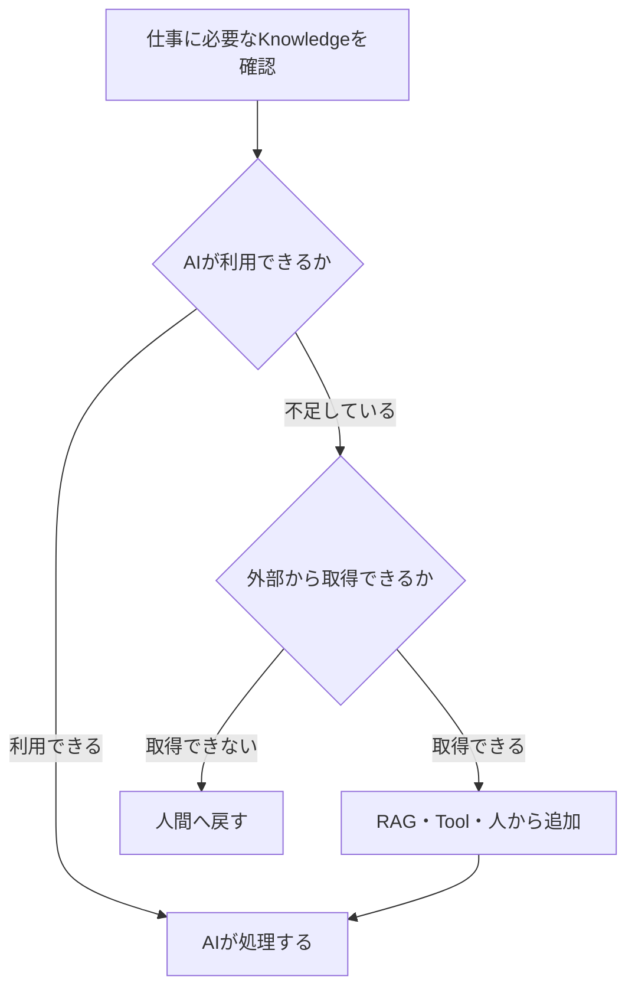

前章では、

> **AIが成果物を速く生成できることと、仕事が速く終わることは同じではない**

という話を書きました。

AIが文章やコードを短時間で作っても、確認、修正、レビュー、合意形成が増えれば、仕事全体の工数は減りません。

では、AIに何を任せればよいのでしょうか。

この問いを考えるとき、私は「AIに聞くこと」と「AIに仕事を任せること」を分ける必要があると思っています。

私は、知らないことをAIへ日常的に聞いています。

しかし、知らない業務を同じようにAIへ任せられるとは考えていません。

両者の違いは、AIの使い方だけではありません。

> **AIが回答するために必要な情報を、既に持っているかどうか。**

ここに大きな違いがあります。

---

### 私は資格勉強でAIを使い続けている

私は現在、資格勉強のために参考書をほとんど買っていません。

分からない言葉が出てきたらAIへ聞きます。

説明を読んでも理解できなければ、別の言い方で説明してもらいます。

選択問題を間違えたら、正解の理由だけでなく、ほかの選択肢がなぜ違うのかも聞きます。

それでも納得できなければ、具体例を出してもらい、自分の理解をAIへ説明して、どこが違うかを確認します。

```text
分からない
↓
AIへ質問する
↓
説明を読む
↓
自分の言葉で確認する
↓
問題を解く
↓
間違えた部分をもう一度聞く
```

この方法で学習を続け、私はDX検定でプロフェッショナルレベルを取得しました。

少なくとも現在の私にとって、資格勉強の中心にあるのは参考書ではなくAIです。

参考書は、書かれている順序と説明を読者側が受け入れる必要があります。

一方、AIには、自分が止まった場所から何度でも聞き直せます。

- もっと簡単に説明してほしい
- この言葉だけが分からない
- 似た概念との違いを知りたい
- 実務の例に置き換えてほしい
- 私の理解のどこが間違っているか確認したい

自分の理解に合わせて説明を変えられることは、AIを使う大きな利点です。

---

### AIへ聞けるのは、AIが一般知識を持っているから

資格試験で扱われる用語や理論の多くは、一般に公開されているKnowledgeです。

AIは学習過程で、技術、経営、法律、プロジェクト管理など、広い分野の情報を取り込んでいます。

そのため、私が初めて学ぶ内容であっても、AI側には回答を作るための一般知識がある場合があります。

```text
私が知らない

しかし

AIは一般知識として知っている

だから質問できる
```

もちろん、AIが常に正しいわけではありません。

選択問題を間違えたり、もっともらしい理由を後付けしたり、指摘すると説明を変えたりすることもあります。

そのため私は、一度の回答をそのまま覚えるのではなく、次の方法を組み合わせています。

- 違う角度から聞き直す
- 具体例へ当てはめる
- 問題を解いて理解を確かめる
- 正答や解説があれば照合する
- 重要な内容は一次情報を確認する

それでも、AIが一般知識を持っているからこそ、私は自分の知識を越えて質問できます。

最初から自分で正誤を完全に判断できる必要はありません。

対話と演習を通じて、理解を作っていけるからです。

---

### 業務では、その会社にしかない情報が必要になる

一方、実際の業務で必要になるのは、一般知識だけではありません。

例えば、既存システムの変更を検討するには、次のような情報が必要になります。

- 現在の仕様
- 実際のソースコード
- 過去の変更経緯
- 製品ごとの違い
- 顧客固有の制約
- 過去に起きた障害
- 変更してはいけない理由
- 誰がどこまで確認するか

これらは、インターネット上の一般知識ではありません。

その会社、その製品、そのプロジェクトの中にしか存在しない情報です。

さらに、必要な情報が一つの場所にまとまっているとは限りません。

仕様書、設計書、ソースコード、障害記録、メール、会議、担当者の記憶などに分散しています。

中には、どの文書にも書かれていないこともあります。

```text
資格勉強
＝ 一般知識をAIから引き出せる

業務
＝ その組織にしかない情報を集めなければならない
```

この違いを無視してAIへ仕事を任せると、AIは一般論や推測によって不足部分を埋めます。

回答は自然な文章になっていても、実際の業務とは合っていない可能性があります。

---

### RAGがあっても、組織のすべてを知っているわけではない

業務固有の情報をAIへ与える方法として、RAGがあります。

仕様書、マニュアル、FAQ、障害記録などを検索し、関連する情報をAIへ渡すことで、一般知識だけでは答えられない質問に対応しやすくなります。

しかし、RAGを導入したからといって、AIが組織のすべてを知ったことにはなりません。

RAGから取得できるのは、原則として検索対象へ登録された情報です。

そもそも文書化されていないことは検索できません。

- なぜこの処理だけ例外になったのか
- 仕様書と実装が違うとき、どちらを正とするのか
- この顧客だけ確認が必要なのはなぜか
- 過去に同じ変更で何が起きたのか
- どの程度の影響なら専門部門へ相談するのか

こうした判断が担当者の経験や記憶にしか存在しなければ、AIからは見えません。

また、文書が存在していても、古い仕様と新しい仕様が混在していたり、複数の資料が矛盾していたりすることがあります。

RAGは関連文書を探すことはできます。

しかし、その情報だけで仕事を完了できるかどうかは別の問題です。

> **RAGが参照できるKnowledgeと、実際に業務で使われているKnowledgeは一致するとは限りません。**

---

### 例えば、既存システムの影響調査を任せる

既存システムへ機能変更を加える場面を考えてみます。

AIには、変更要求、仕様書、ソースコード、過去の障害記録を渡したとします。

AIは、それらの情報から、関連するモジュール、呼出し関係、変更候補を整理できます。

しかし、過去に担当者同士で合意しただけの制約が、どこにも記録されていなかったらどうでしょうか。

あるいは、仕様書では使われていないことになっている機能が、特定顧客だけで今も利用されていたらどうでしょうか。

AIは、存在を知らない情報を調査対象にできません。

その状態で「影響なし」と回答しても、AIに与えた情報の中では正しいのかもしれません。

しかし、業務としては誤りです。

人間が影響調査を行う場合は、資料だけで判断せず、

- 過去の担当者へ確認する
- 顧客別の利用状況を調べる
- 文書と実装の違いを確認する
- 情報が足りなければ結論を保留する

といった行動を取ります。

AIへ影響調査を任せる場合にも、文書を検索させるだけでなく、情報不足を検知し、人間へ確認を戻す仕組みが必要です。

---

### AIに聞くことと、仕事を任せることの違い

AIに質問するとき、私はAIが持つ一般知識を利用しています。

回答に誤りがあっても、聞き直し、問題を解き、必要なら出典を確認しながら理解を作れます。

一方、AIに仕事を任せる場合は、その業務に必要な情報をAIが利用できなければなりません。

さらに、必要な情報が存在しない場合に、推測で処理を続けず、不足を示せる必要があります。

```text
AIに聞く
＝ AIが持つ一般知識から説明を得る

AIに仕事を任せる
＝ 業務固有の情報を集め、判断し、
   不足時には処理を止めるところまで設計する
```

このため、AIに仕事を任せられるかを考えるときは、AIのモデル性能だけでなく、次の点を確認する必要があります。

1. その仕事に必要な情報は何か
2. その情報はどこに存在するか
3. AIが安全に参照できるか
4. 文書化されていない判断は何か
5. 情報不足をどう検知するか
6. どの条件で人間へ確認を戻すか

AIへプロンプトを渡すだけでは、仕事を任せたことにはなりません。

必要なKnowledgeへの経路と、Knowledgeが足りない場合の経路まで作る必要があります。

---

### AIを広く使いながら、業務では境界を作る

私は、AIへ質問する範囲を、自分が既に知っている範囲へ限定していません。

知らないことを聞き、理解を広げられることがAIの価値だからです。

だから、学習や発想ではAIを広く使えばよいと思っています。

一方、業務では、AIが何を知っているのかを確認する必要があります。

一般知識だけで処理できるのか。

社内文書を参照する必要があるのか。

既存システムから現在の状態を取得する必要があるのか。

それとも、担当者の中にしかない判断が必要なのか。

必要な情報がAIから見えないなら、その部分までAIだけに任せることはできません。



> **AIに聞くことと、AIに仕事を任せることは違う。**

AIに聞くときは、AIが既に持つ知識を利用できます。

AIに仕事を任せるときは、その仕事に必要なKnowledgeをAIが利用できる状態から設計しなければなりません。

AIが高性能であることと、組織固有の情報を知っていることは同じではありません。

業務でAIを使う難しさは、AIに回答させることよりも、必要なKnowledgeを特定し、AIへ届け、足りない場合に人間へ戻せるようにすることにあります。

---

### 次章

業務に必要な情報をAIへ与えても、すべての状況へ対応できるわけではありません。

情報が不足している場合、資料が矛盾している場合、影響が大きい場合には、AIが処理を続けない方がよいことがあります。

次章では、

> **「AIに任せない条件」を、なぜ先に決める必要があるのか**

について考えます。
