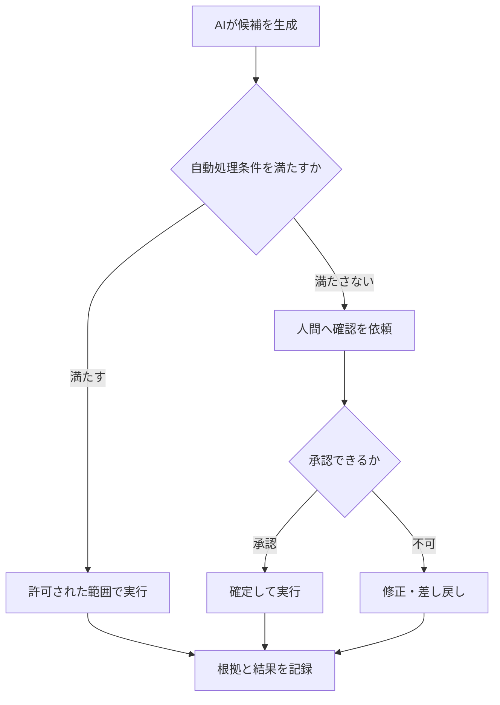
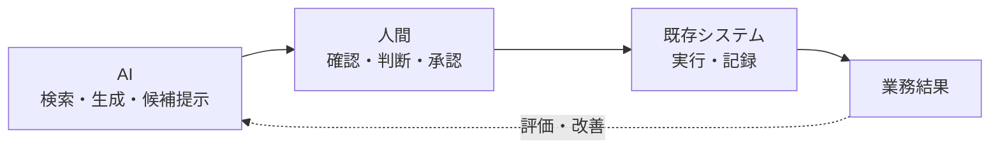

## 第1章　AIに仕事を任せても、責任は消えない

生成AIによって、これまで人間が行っていた作業をAIへ任せられる場面が増えています。

文章生成、情報検索、分類、要約、コード生成。

さらにAIエージェントを利用すれば、APIの実行や既存システムへの入力まで自動化できます。

しかし、ここで一つ考えなければならないことがあります。

> **AIに仕事を任せても、責任までAIへ移るわけではありません。**

AIが処理を実行できることと、その結果について責任を持てることは別です。

そのため、AIを本番業務へ組み込む場合は、何を自動化するかだけでなく、判断、承認、例外処理、監査、最終責任まで含めて設計する必要があります。

### AIが自動化するのは「作業」である

例えば、人間が業務データを確認し、その内容を既存システムへ入力していたとします。

この業務には、単なる入力作業だけでなく、複数の行為が含まれています。

1. 情報を確認する
2. 入力内容を判断する
3. システムへ入力する
4. 処理結果を確認する
5. 異常があれば修正する

AIを導入すれば、このうち情報検索、候補生成、分類、入力などを自動化できます。

正常に動いている間は、人間の作業が減り、処理時間も短くなります。

しかし、AIが誤った内容を入力した瞬間、次の問いが現れます。

- 誰が異常を検知するのか
- 誰が入力内容を確認するのか
- 誰が修正するのか
- 誰が修正結果を承認するのか
- どの条件でAIから人間へ処理を戻すのか
- 最終的な責任を誰が負うのか

AIによって入力作業が消えても、これらの判断と責任は消えません。

### AIへ移せるものと、残る責任を分ける

AIへ任せられる範囲を整理すると、次のようになります。

| 項目 | AIへ任せられる範囲 | 設計上の論点 |
|---|---|---|
| 定型作業 | 広い | 自動化する範囲と実行条件 |
| 情報検索 | 広い | 検索対象、根拠、情報の鮮度 |
| 候補生成 | 広い | 精度、再現性、候補と確定値の区別 |
| 条件に基づく判断 | 限定的 | 判断規則、適用範囲、例外条件 |
| システム操作 | 限定的 | 権限、実行範囲、取消し方法 |
| 例外処理 | 人間との分担が必要 | 移管条件、担当者、復旧手順 |
| 承認 | 原則として権限者が担う | 承認権限、判断根拠、記録 |
| 最終責任 | AIには移せない | 責任主体、説明、監査 |

AIの能力が上がれば、自動化できる作業や判断の範囲は広がるでしょう。

しかし、利用範囲を決め、結果を確定し、問題が起きたときに説明する責任まで自動的にAIへ移るわけではありません。

重要なのは、AIにできるかどうかだけでなく、

> **AIの出力を、誰が、どの条件で、業務上の確定値として扱うのか**

を決めることです。

### 設計されていない自動化は「責任の空白」を作る

従来の業務では、作業、判断、確認、承認が一人の担当者や一つの業務フローの中にまとまっていることがあります。

その状態で作業部分だけをAIへ置き換えると、それまで暗黙に人間が担っていた判断や確認が、業務フローから抜け落ちる可能性があります。

例えば、AIが入力した値が、人間の確認済みデータと同じ見た目で保存されるとします。

後工程の担当者は、その値を「誰かが確認した確定値」だと認識するかもしれません。

実際にはAIが生成した候補値であっても、候補と確定値が区別されていなければ、未確認の判断がそのまま後工程へ伝わります。

これが、責任の空白です。

責任の空白を防ぐには、少なくとも次の6点を決める必要があります。

| 設計対象 | 決めること |
|---|---|
| 自動処理範囲 | AIが実行してよい作業と条件 |
| 異常検知 | 何を異常とし、どう検知するか |
| 人間への移管 | どの条件で、誰へ処理を戻すか |
| 修正・承認権限 | 誰が修正し、誰が確定できるか |
| 記録・監査 | 入力、根拠、判断、実行結果を何として残すか |
| 最終責任 | 問題発生時に誰が説明し、判断するか |

これはAIモデル単体の設計ではありません。

> **AIを含む業務システム全体の設計です。**

### Human in the Loopは「最後に人が見ること」ではない

責任の空白を防ぐ方法の一つが、Human in the Loop（HITL）です。

ただし、「最後に人間が確認する」と決めるだけでは、十分な設計とは言えません。

重要なのは、誰が、何を、どのタイミングで、何を根拠に確認するかです。

例えば、AIの出力を既存システムへ反映する場合、次のような制御が考えられます。

ここでいう自動処理条件は、AIが自分で「自信がある」と判断することだけを意味しません。

対象業務、利用データ、出力形式、評価結果、権限、影響範囲などから、システム側で定義した条件です。

また、人間がAIの誤りを判断できない場合は、単に確認画面を置いても安全にはなりません。

その場合は、判断根拠を表示する、別の情報源で検証する、専門家へ移管する、回答や実行を中止するといった仕組みが必要です。

HITLとは、人間を置くことではありません。

> **AIから人間へ制御と判断を戻す条件を設計することです。**

### AI・人間・既存システムを一つの系として設計する

AIは単体で業務価値を生むわけではありません。

AIが候補を生成し、人間が必要な判断を行い、既存システムが確定した処理を実行し、その結果を次の判断へ戻します。

この中で設計すべきなのは、AIの精度だけではありません。

- AIは何を根拠に出力するのか
- 人間は何を確認するのか
- どこからを確定値として扱うのか
- 既存システムは何を実行し、何を記録するのか
- 問題が起きたとき、どこまで戻せるのか

この一連の流れまで設計して、初めてAIは業務システムの一部になります。

### 作業が消えても、判断と責任を途切れさせない

AIによって置き換えられる作業は、これからさらに増えていくでしょう。

しかし、自動化できる作業が増えることと、責任を持って運用できる業務が増えることは同じではありません。

AIを本番業務へ組み込むときに必要なのは、単に作業を自動化する技術ではありません。

> **作業が消えた後も、判断、承認、記録、責任が途切れない業務構造を作ること。**

これが、AIを業務へ組み込むうえで最初に必要になる設計原則です。

### 次章

責任分界とHITLを設計すれば、安全にAIを利用できる範囲は広がります。

しかし、それだけでAI導入が効率化につながるとは限りません。

確認、修正、形式変換、説明、合意形成が増えれば、AIが生成を高速化しても、仕事全体の工数は増える可能性があります。

次章では、私自身がAIで要件定義を整理した際の失敗を題材に、

> **成果物を速く生成することと、仕事を速く終わらせることはなぜ違うのか**

を考えます。