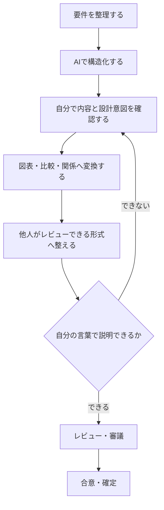

## 第2章　AI導入は効率化とは限らない

前章では、AIへ仕事を任せても責任は消えず、異常検知、承認、Human in the Loop、記録、責任分界まで含めて設計する必要があると説明しました。

では、そこまで設計すれば、AI導入はそのまま効率化につながるのでしょうか。

私は、そうとは限らないと考えています。

AIが一つの作業を高速化しても、確認、修正、説明、合意形成などの負荷が増えれば、業務全体の工数は増えるからです。

私自身、AIを使って成果物を速く作ったつもりが、かえって手戻りを増やしたことがあります。

### AIで要件定義をMarkdownへ整理した

以前、要件定義した内容をAIに整理してもらい、Markdown形式でまとめ、そのまま社内の審議へ持ち込んだことがありました。

AIを利用したことで、文章化そのものは速く進みました。

当時の私は、次のように考えていたのだと思います。

```text
要件を整理する
↓
AIでMarkdown化する
↓
成果物が完成する
```

しかし、審議では「Markdownでは内容を理解しにくい」という指摘を受けました。

さらに、私自身も設計意図や論点を十分に説明できず、結果としてやり直しになりました。

AIを使わなければ問題が起きなかった、とは言い切れません。

ただし、次の二つの工程が不足していたことは確かです。

1. AIが整理した内容を、自分自身が理解する工程
2. 内容を、相手が理解しレビューできる形へ変換する工程

AIは文章を速く生成しました。

しかし、その文章は業務の最終成果物になっていませんでした。

### AIの中間成果物と、業務の最終成果物を分ける

この経験で気付いたのは、AIが扱いやすい形式と、人間が業務で利用しやすい形式は同じとは限らないということです。

```text
AIが扱いやすい形式
≠
自分が理解しやすい形式
≠
他人がレビューしやすい形式
```

Markdownそのものが悪いわけではありません。

私は現在も、AIとの情報交換、要件の整理、設計途中の中間成果物としてMarkdownを利用しています。

問題は、AIとの作業に適した中間成果物を、そのまま審議や合意形成に使える最終成果物だと考えたことです。

組織で利用する成果物には、内容が記載されているだけでなく、次の品質が必要です。

- 作成者が内容と設計意図を説明できる
- 読み手が全体構造と重要な論点を把握できる
- レビュー担当者が確認対象を特定できる
- 未確定事項と確定事項を区別できる
- 判断に必要な比較や根拠が示されている

他人によるレビューや合意形成を前提とするなら、

> **他人が理解し、判断できることも成果物の品質条件です。**

### 生成時間と業務完了時間は違う

要件定義の仕事は、文章を生成すれば完了するわけではありません。

実際には、次の工程があります。

```text
要件を整理する
↓
内容と設計意図を理解する
↓
相手が理解できる形へ変換する
↓
説明する
↓
質疑とレビューに対応する
↓
合意する
```

AIが高速化したのは、この一連の流れの一部だけでした。

例えば、従来60分かかっていた文章作成を、AIが10分に短縮したとします。

しかし、AI導入後に次の工数が発生したとします。

| 工程 | 工数 |
|---|---:|
| AIによる生成 | 10分 |
| 内容確認 | 20分 |
| 修正 | 20分 |
| 説明準備 | 20分 |
| 差し戻し対応 | 30分 |
| 合計 | 100分 |

生成だけを見れば50分の短縮です。

しかし、仕事全体では従来の60分から100分へ増えています。

この例から分かるのは、

> **AIが効率的であることと、AIを組み込んだ業務が効率的であることは別である**

ということです。

### AI導入後の総工数を見る

AI導入では、「この作業を何分短縮できたか」が注目されやすくなります。

しかし、一工程だけの短縮を評価すると、局所最適になる可能性があります。

生成AIを実務で利用する場合、AI処理以外にも次の工程が発生します。

- 内容確認
- 事実確認
- 既存仕様との整合性確認
- 修正
- 表現調整
- 形式変換
- レビュー
- 承認
- 手戻り
- 合意形成

したがって、導入効果を評価する場合は、少なくとも次の範囲を見る必要があります。

```text
AI導入後の総工数
=
AI処理
+ 確認
+ 修正
+ 形式変換
+ 説明
+ レビュー・承認
+ 手戻り
+ 合意形成
```

さらに、工数だけでなく、成果物の品質、誤りの発生、後工程への影響も確認する必要があります。

| 評価対象 | 確認すること |
|---|---|
| 時間 | 最終成果へ到達するまでの総工数 |
| 品質 | 誤り、欠落、不整合が増えていないか |
| レビュー | 確認や説明の負荷が増えていないか |
| 手戻り | 差し戻しや再処理が増えていないか |
| 合意形成 | 意思決定までの時間が短くなったか |
| 運用 | 継続利用に必要な更新・監視コスト |

AI処理の速度ではなく、

> **業務の開始から、利用可能な成果が確定するまでの全体**

を評価する必要があります。

### HITLにもコストがある

前章では、AIの出力を確認し、必要な場合に人間へ制御を戻すHITLの重要性を説明しました。

ただし、HITLにも工数がかかります。

AIが大量に成果物を生成し、そのすべてを人間が最初から精査するのであれば、最初から人間が作業した方が速い場合もあります。

だからといって、確認をなくせばよいわけではありません。

必要なのは、リスクと確認コストに応じてHITLを設計することです。

- どの作業をAIへ任せるか
- 人間は何を確認するか
- どの条件なら確認範囲を限定できるか
- どの条件なら必ず人間へ戻すか
- どの根拠を表示すれば判断しやすくなるか
- 確認結果を次の改善へどう利用するか

高リスクな判断では、確認コストが増えても人間の承認が必要です。

一方、影響が小さく、取消しや再実行が容易な処理では、自動化範囲を広げられる可能性があります。

品質と効率のどちらか一方を最大化するのではなく、

> **業務上のリスクに対して、必要な確認を適切な場所へ配置すること**

が重要です。

### 失敗後に変えた業務プロセス

この失敗以降、私はAIが成果物を生成した時点を、作業の終了条件にしないようにしました。

現在は、次のような流れで考えています。



文章だけでは把握しにくい場合は、必要に応じて次の形式へ変換します。

- システム構成図
- 処理フロー
- Before / After
- 比較表
- 入出力関係
- 責任分界

図表化には二つの目的があります。

一つは、読み手が関係性や差分を理解しやすくすることです。

もう一つは、自分自身の理解を確認することです。

内容を本当に理解できていなければ、要素の関係、処理の順序、責任の境界を図として表現することは困難です。

そのため現在は、

> **自分の言葉で設計意図を説明できるか**

を、成果物がレビュー可能な状態になったかを判断する基準の一つにしています。

### AIを前提に業務プロセスを設計する

当時の私は、既存業務の「文章を作る」という一工程だけをAIで置き換えていました。

しかし、AIを導入すると、文章の作り方だけでなく、その後の工程も変化します。

- どの形式を中間成果物として使うか
- 人間がどこで内容を理解するか
- どの形式ならレビューしやすいか
- 何を図表へ変換するか
- どの条件で成果物を確定するか
- AIの出力を次工程へどう受け渡すか

つまりAI導入とは、既存業務へAIという部品を追加することではありません。

> **AIを含む新しい業務プロセスを設計することです。**

AIへ任せる工程だけを最適化するのではなく、人間の理解、レビュー、承認、合意形成まで含めて再設計する必要があります。

### AIで速く作れても、仕事が速く終わるとは限らない

AIは、文章やコードなどを生成する速度を大きく上げられます。

しかし、実務では生成後にも、理解、変換、確認、説明、レビュー、合意形成があります。

特に、他人によるレビューを前提とする組織では、他人が理解し判断できること自体が成果物の品質条件になります。

AI導入で見るべきなのは、生成速度だけではありません。

> **最終的な成果、合意、意思決定へ到達するまでの総工数が減ったか。**

私自身、AIを使って仕事を速くしたつもりで、かえって手戻りを増やしました。

その経験から、現在は次の点を確認するようにしています。

- AIが短縮した工程はどこか
- 新たに増えた確認や修正は何か
- 中間成果物と最終成果物を区別できているか
- 自分自身が内容を理解しているか
- 他人がレビューできる状態になっているか
- 業務全体として品質と総工数が改善したか

AIを入れれば効率化するのではありません。

> **AIを前提とした業務プロセスを設計して、初めて効率化になる。**

AIの処理速度ではなく、AIを含めた仕事全体が以前より良くなっているか。

それを確認することが、AI導入の効果を正しく評価するために必要だと考えています。

