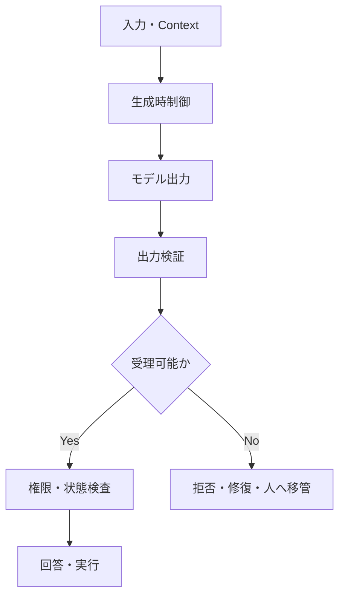

## ガードレールの数学的説明

> 種別：設計原則 / リスク制御 / 決定論的制御
> 適用対象：生成AI、RAG、QAチャット、AIエージェント
> 対象工程：予防 / 検出 / 拒否 / 認可 / 実行
> 関連ページ：[プロンプト設計の基本構造](/knowledge-context/prompt-structure/)、[プロンプト設計の失敗モード](/knowledge-context/prompt-failure-modes/)、[ハルシネーションの多層制御設計](/foundations/layered-hallucination-controls/)

固定条件を一度設計しても、実行時には実行基盤が各ターンのContextへ再構成する必要があります。

では、そのContextへ禁止事項や出力形式を書けば、ガードレールは完成するのでしょうか。

結論から言うと、ガードレールをプロンプト上の制約だけで説明することはできません。

> ガードレールとは、望ましくない出力の生成を抑えるだけでなく、検出し、拒否し、危険な実行へ到達させないための制御系である。

ガードレールには、確率分布を**誘導する制御**もあれば、許可されないTokenや操作を**決定論的に遮断する制御**もあります。

この違いを分けないと、「制約を書いたから安全」「出力空間を狭めたから誤答確率はほぼ0」といった誤った理解につながります。

---

### ガードレールは一つの数学的操作ではない

生成AIシステムのガードレールは、少なくとも次の四層に分かれます。

| 層 | 代表例 | 数学的な位置付け | 保証できること |
| --- | --- | --- | --- |
| Contextによる誘導 | System Instruction、禁止事項、例示 | 条件付き分布を変える | 遵守確率を高めるが、通常は保証しない |
| 生成時制約 | 文法制約、Token Mask、型制約 | 許可Tokenへ分布を再正規化する | 形式化できた構文制約 |
| 出力検証 | Schema検証、根拠照合、分類器 | 出力を受理・拒否・修復・移管する | 検証器が検出できる性質 |
| 実行制御 | 認可、Allowlist、金額上限、人間承認 | 実行可能な操作を遮断する | 実行基盤が強制する権限・状態制約 |

このうち、「出力集合を狭めて再正規化する」という説明が直接当てはまるのは、主に生成時制約です。

プロンプトへ「推測しないでください」と書くことは、同じ操作ではありません。

---

### 生成AIシステムを処理段階へ分ける

入力を $X$、実行時Contextを $C$、モデルの生出力を $Y$ とします。

$$
Y \sim P_\theta(Y\mid X,C)
$$

$P_\theta$は、モデルパラメータ $\theta$ によって定まる条件付き分布です。

しかし、業務システムの最終結果は $Y$ だけではありません。

出力検証器を $V$、実行認可を $G$、最終状態を $O$ とすると、概念的には次のように表せます。

$$
O
=
Execute\bigl(G(V(Y),X,S),S\bigr)
$$

$S$は、利用者権限、対象資源、業務状態、Policy版などの実行時状態です。

この式は実装そのものではなく、責務を分けるための説明モデルです。



ガードレールは、この流れの一か所ではなく、複数箇所へ配置されます。

---

### Contextによる制約は確率的な誘導である

基本Contextを $C$、追加するInstructionやPolicyを $I$ とします。

制約追加前後の出力分布は、次のように区別できます。

$$
P_\theta(Y\mid X,C)
\quad\longrightarrow\quad
P_\theta(Y\mid X,C,I)
$$

$I$によって、望ましい出力の確率が上がり、望ましくない出力の確率が下がる可能性があります。

しかし、一般には次は保証されません。

$$
P_\theta(Y_{bad}\mid X,C,I)=0
$$

自然言語Instructionは、モデルが解釈する入力の一部です。

プログラムの`if`文、型検査、アクセス制御と同じ強制力を持つわけではありません。

さらに、効果は次の条件によって変わります。

- モデルと版
- Instructionの表現
- 競合するInstruction
- 会話履歴の長さと位置
- RAGやツール結果
- Sampling設定
- 入力分布

したがって、プロンプト型ガードレールは、**禁止集合を消去する仕組み**ではなく、**条件付き分布を望ましい方向へ誘導する仕組み**として扱います。

---

### 制約付きデコードでは再正規化を説明できる

生成時刻 $t$ における次Tokenの分布を考えます。

$$
p_t(v)
=
P_\theta(y_t=v\mid X,C,y_{<t})
$$

ここで、現在の生成状態において許可されるToken集合を $A_t$ とします。

許可されないTokenをMaskし、残ったTokenだけで再正規化するなら、制約後の分布 $q_t$ は次のように表せます。

$$
q_t(v)
=
\frac{p_t(v)\mathbf{1}[v\in A_t]}
{\sum_{u\in A_t}p_t(u)}
$$

ただし、分母が0ではなく、$A_t$が正しく計算できることを前提とします。

$v\notin A_t$ なら、次が成立します。

$$
q_t(v)=0
$$

この意味では、禁止されたTokenを生成候補から除外できます。

[PICARD](https://aclanthology.org/2021.emnlp-main.779/)は、SQL生成中にIncremental Parsingを行い、その時点で不適格なTokenを拒否する制約付き自己回帰デコードの例です。

ただし、ここで保証できるのは、形式化された制約に限られます。

例えばJSON SchemaやSQL Grammarへ適合しても、次は別問題です。

- 内容が事実と一致しているか
- 選択した顧客IDが正しいか
- 業務規則上その操作をしてよいか
- 出力が利用者の意図に合っているか
- 根拠資料が最新か

> 構文的に有効であることは、意味的に正しいことを含意しない。

---

### 「悪い出力集合」は通常、完全には定義できない

可能な出力全体を $\mathcal{Y}$、許可したい出力集合を $\mathcal{A}\subseteq\mathcal{Y}$ とします。

理想的には、すべての不許可出力を $\mathcal{Y}\setminus\mathcal{A}$ として列挙し、生成不能にしたくなります。

しかし、自然言語の意味、事実性、有用性、文脈適合性を含む $\mathcal{A}$ を完全に定義することは困難です。

例えば「事実に反しない回答」という条件には、少なくとも次が必要です。

- 正しい参照資料
- 主張と根拠の対応
- 時点と適用範囲
- 暗黙の前提
- 例外条件
- 評価可能な原子的主張

そのため、実務では完全な許可集合ではなく、検査可能な部分集合を定義します。

$$
\mathcal{A}_{checkable}
\subseteq
\mathcal{A}_{intended}
$$

$\mathcal{A}_{checkable}$は、Schema、形式、引用ID、金額範囲、権限、状態遷移など、機械的に検査できる性質です。

ガードレール設計では、**何を形式化できたか**と、**何が依然として意味判断に残るか**を明示します。

---

### 出力検証は分類問題として扱える

出力検証器 $V$ が、生成結果を受理または拒否するとします。

$$
V(X,Y,E)
\in
\{accept,reject,repair,escalate\}
$$

$E$は、根拠、Policy、Schema、現在状態などの検証材料です。

二値化して考えると、検証には次の誤りがあります。

| 実際の状態 | 検証器の判断 | 結果 |
| --- | --- | --- |
| 危険 | 拒否 | True Reject |
| 危険 | 受理 | False Accept |
| 安全 | 受理 | True Accept |
| 安全 | 拒否 | False Reject |

危険出力の事象を $B$、検証器が拒否する事象を $D$ とします。

False Accept Rateは次です。

$$
FAR
=
P(\neg D\mid B)
$$

False Reject Rateは次です。

$$
FRR
=
P(D\mid \neg B)
$$

FARだけを下げるために閾値を厳しくすると、有用な回答まで拒否し、FRRが上がることがあります。

したがって、検証器は「置けば安全になる部品」ではなく、評価データ上で誤り率を測る分類器または規則系です。

---

### 実行制御はモデル出力の外側へ置く

モデルが「この操作を実行してよい」と出力しても、その文章自体を認可として扱ってはいけません。

利用者 $u$、操作 $a$、資源 $r$、現在状態 $s$に対する認可関数を考えます。

$$
G(u,a,r,s)
\in
\{0,1\}
$$

$G=1$の場合だけ実行し、$G=0$なら遮断します。

認可関数は、モデルの自然言語判断とは別の実行基盤で強制します。

例として、次を含みます。

- 利用者が対象資源へアクセスできるか
- 操作がAllowlistに含まれるか
- 金額や件数が上限内か
- 現在の業務状態から遷移可能か
- 人間承認が完了しているか
- 冪等性キーや重複実行防止があるか

ここでは、モデルが危険な操作案を生成しても、実行権限を持たなければ被害を止められます。

> モデルへ禁止を依頼することと、実行基盤が禁止を強制することは違う。

---

### 危険な結果へ到達する確率を分解する

危険な内容が生成された事象を $B$、検出された事象を $D$、実行された事象を $E$ とします。

危険な内容が未検出のまま実行される事象は、次です。

$$
B\cap\neg D\cap E
$$

連鎖律により、その確率は次のように分解できます。

$$
P(B\cap\neg D\cap E)
=
P(B)
P(\neg D\mid B)
P(E\mid B,\neg D)
$$

この式から、三つの制御点が分かります。

1. $P(B)$を下げる：Context、Knowledge、生成時制約
2. $P(\neg D\mid B)$を下げる：Schema検証、根拠照合、分類器、人間確認
3. $P(E\mid B,\neg D)$を下げる：認可、承認、Sandbox、権限・影響範囲の制限

プロンプトだけで $P(B)$を下げる設計より、危険な実行までの複数段階を制御する方が堅牢です。

---

### リスクは確率だけでは決まらない

危険事象の種類を $j$、その影響度を $I_j$ とします。

簡略化した期待損失は、次のように表せます。

$$
\mathbb{E}[L]
=
\sum_j
P(B_j\cap\neg D_j\cap E_j)
I_j
$$

さらに、過剰拒否、待ち時間、人間確認、Token消費などの運用費用もあります。

$$
J
=
\mathbb{E}[L_{harm}]
+
\lambda_1\mathbb{E}[L_{false\ refusal}]
+
\lambda_2 Cost_{review}
+
\lambda_3 Cost_{latency}
$$

$\lambda_i$は、用途ごとの重みです。

高影響な操作では $L_{harm}$を重くし、厳しい認可や人間承認を置きます。

低影響なアイデア生成で同じ制御を置くと、有用性や速度を不必要に損なう可能性があります。

ガードレールの強さは、抽象的な「安全性最大化」ではなく、用途別の期待損失から決めます。

---

### 多層防御でも独立性を仮定しない

二つの検証器があり、それぞれ危険出力を見逃す確率を $m_1,m_2$ とします。

誤りが条件付きで独立なら、両方が見逃す確率は次です。

$$
P(M_1\cap M_2\mid B)
=
m_1m_2
$$

しかし、実際の検証器は同じモデル、同じKnowledge、同じ曖昧なPolicyを使い、同じ入力で失敗することがあります。

この場合、見逃しは相関します。

$$
P(M_1\cap M_2\mid B)
\ne
m_1m_2
$$

例えば、生成器と検証器へ同じLLM、同じContext、同じ誤った根拠を使えば、二段構成に見えても失敗原因は共通です。

多層化では、層の数だけでなく次を確認します。

- 異なる失敗原因を検出できるか
- 決定論的検査を併用できるか
- KnowledgeとPolicyの誤りを共有していないか
- 検証不能時に停止できるか
- 最終実行権限がモデルから分離されているか

---

### 情報量が増えても安全性は証明できない

元の説明では、入力情報量を $I(x)=-\log P(x)$ とし、制約を追加すれば $I(x,C)>I(x)$となるため、出力自由度が減るとしていました。

この推論は成立しません。

まず、自己情報量は事象の起こりにくさを表す量であり、プロンプトの長さや安全条件の強さではありません。

結合事象については次が成り立ちます。

$$
I(x,c)
=
-\log P(x,c)
$$

しかし、$I(x,c)$が大きいことから、回答が正しい、安全、または有用であることは導けません。

確率変数としての条件付きエントロピーには、平均的に次の関係があります。

$$
H(Y\mid X,C)
\le
H(Y\mid X)
$$

これは、追加情報 $C$を条件にすると平均的な不確実性が増えないという性質です。

ただし、次の注意が必要です。

- 個別入力ごとの不確実性が必ず下がるとは限らない
- Contextが誤っていれば、低エントロピーの誤答になり得る
- 出力の揺れが小さいことは、事実性を意味しない
- 長い制約が重要情報を埋没させる場合がある
- 安全性や有用性は、エントロピーだけでは定義できない

> 不確実性の低下と、正しさの向上は同じではない。

---

### QAチャットでの具体例

社内QAチャットを考えます。

利用者が「退職時に持株をどう処理すればよいか」と質問したとします。

#### 1. Contextによる誘導

- 社内資料だけを根拠にする
- 根拠IDを各主張へ付ける
- 資料にない条件は推測しない
- 不足時は追加質問または担当窓口へ移管する

これは、回答分布を望ましい方向へ誘導します。

#### 2. 生成時制約

出力を次のSchemaへ適合させます。

```text
status: answer | clarify | abstain | escalate
claims:
  - text
  - evidence_id
next_action:
```

Schema適合は保証できても、`evidence_id`が主張を本当に支えるかは別に検証します。

#### 3. 出力検証

- Evidence IDが実在するか
- 引用範囲が主張を含むか
- 適用対象者と時点が一致するか
- 原子的主張ごとに根拠があるか
- 金額・期限・手続が資料と一致するか

検証不能なら、回答を受理せず`abstain`または`escalate`へ遷移させます。

#### 4. 実行制御

QAチャットは、利用者の持株売却、口座変更、退職手続を直接実行しません。

実行が必要な場合は、本人認証、権限確認、正式な業務システム、人間承認を通します。

この分離により、説明の誤りがそのまま不可逆な操作へ変わる確率を下げます。

---

### ガードレールを評価する

ガードレールは、実装した事実ではなく、制御結果で評価します。

最低限、次を測ります。

| 指標 | 確認すること |
| --- | --- |
| Violation Rate | 禁止・制約違反が発生した割合 |
| False Accept Rate | 危険出力を受理した割合 |
| False Reject Rate | 安全な出力を拒否した割合 |
| Schema Validity | 形式制約を満たした割合 |
| Groundedness | 主張が提示根拠で支持される割合 |
| Escalation Precision | 移管が必要なケースを適切に選べたか |
| Execution Block Rate | 禁止操作を実行前に遮断できた割合 |
| Coverage | 自動回答・自動処理できた割合 |
| Expected Loss | 誤りの確率と影響を重み付けした損失 |

評価データには、通常ケースだけでなく次を含めます。

- 曖昧な入力
- Instruction同士が競合する入力
- 範囲外質問
- 古いKnowledge
- 根拠が不足する質問
- Schema境界値
- 権限外操作
- 複数ステップでのみ危険になる操作
- 表現を変えた回避入力

[NIST AI 600-1](https://doi.org/10.6028/NIST.AI.600-1)も、生成AIの信頼性を設計、開発、利用、評価を含むリスク管理として扱っています。

一度の成功例ではなく、用途を代表する評価集合と運用ログで継続的に確認します。

---

### ガードレールの責任分界

ガードレールごとに、責任主体を決めます。

| 対象 | 主な責任 |
| --- | --- |
| Policy・禁止事項 | 業務責任者、法務、セキュリティ |
| Prompt・Context Assembly | AI設計者、アプリケーション開発者 |
| 文法・Schema制約 | 開発者 |
| Knowledgeの正本・版 | Knowledge Owner |
| 出力検証 | AI品質責任者、業務責任者 |
| 認可・実行制御 | システムOwner、セキュリティ |
| 人間承認 | 明示された承認者 |
| ログ・監視・改善 | 運用責任者 |

モデルに「安全に判断する役割」を与えただけでは、責任分界になりません。

誰がPolicyを定義し、誰が検証し、誰が実行を許可し、失敗時に誰が停止するかまで決めます。

---

### このページの定義

ガードレールを、次のように定義します。

> ガードレールとは、生成AIを含むシステムにおいて、望ましくない生成を抑制し、出力を検証し、不許可の処理を拒否し、危険な実行への到達確率と影響を下げるための多層制御である。

数学的には、一つの $P(Y\mid X,C)$ を別の分布へ変換する操作だけではありません。

- Contextによる確率的誘導
- 制約付きデコードによる候補Maskと再正規化
- 検証器による受理・拒否・修復・移管
- 認可関数による実行遮断
- 期待損失に基づく制御強度の選択

を組み合わせた制御系です。

ガードレールの目的は、モデルを絶対に誤らせないことではありません。

> 誤り得るモデルを、誤りが危険な結果へ直結しないシステムとして運用すること。

これが、実務におけるガードレール設計です。

---

### 参考資料

- Torsten Scholak, Nathan Schucher, Dzmitry Bahdanau, [PICARD: Parsing Incrementally for Constrained Auto-Regressive Decoding from Language Models](https://aclanthology.org/2021.emnlp-main.779/), EMNLP 2021
- NIST, [Artificial Intelligence Risk Management Framework: Generative Artificial Intelligence Profile](https://doi.org/10.6028/NIST.AI.600-1), NIST AI 600-1, 2024
