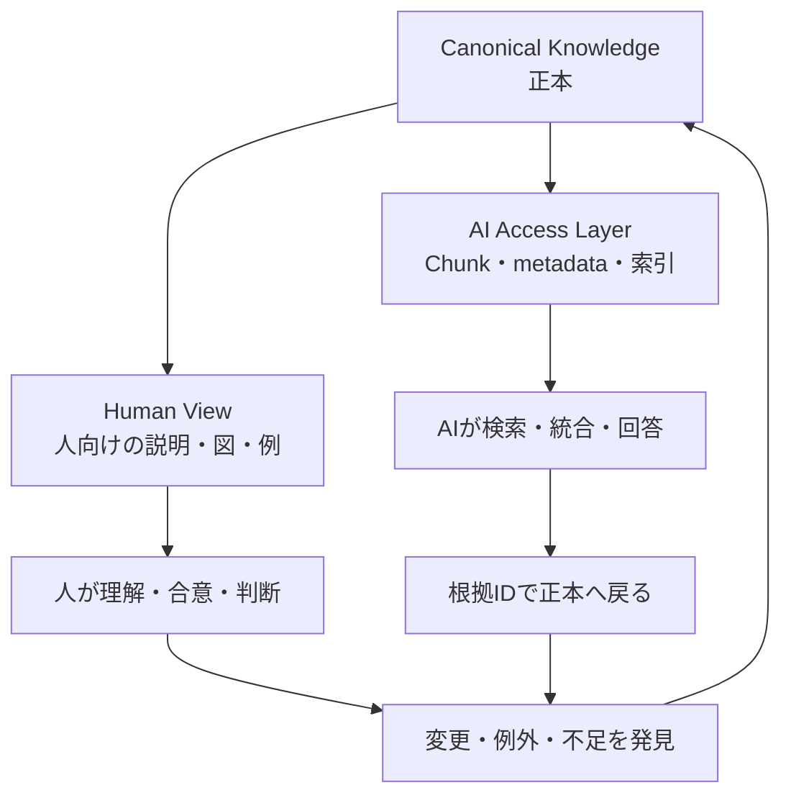
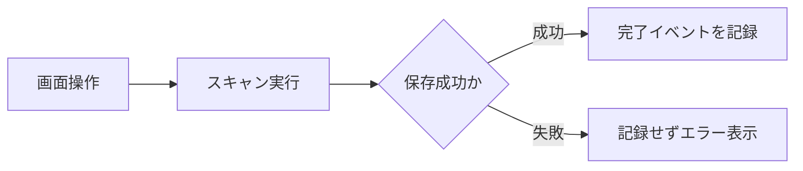

## 人向け資料とAI向け資料の分離設計

> 種別：Knowledge設計 / 情報アーキテクチャ / 運用原則
> 適用対象：RAG、QAチャット、Knowledge Base、社内文書
> 対象工程：Knowledge作成 / 表現変換 / 索引化 / 版管理
> 関連ページ：[Instruction・Knowledge・Evidenceの責務分離](/knowledge-context/instruction-knowledge-evidence/)、[QA行動制約Knowledge](/knowledge-context/qa-behavior-constraints/)、[QAチャット評価設計思想](/evaluation-hitl/qa-evaluation/)

前ページでは、QAチャットの品質を、検索・根拠利用・回答拒否・業務効果へ分けて評価しました。

その評価を行うと、モデルやプロンプトだけでは解決できない問題が見えてきます。

Knowledgeそのものが、AIから利用しにくい状態になっている問題です。

そこで「人向け資料とAI向け資料を分ける」という考え方が出てきます。

ただし、同じ仕様を二つの資料へ別々に書く方法は危険です。

> 分離すべきなのは事実ではない。人が理解するための表現と、AIが検索・判定するための構造である。

正本は一つに保ちます。

その正本から、人向けの表示とAI向けの取得単位を作ります。

---

### 現行の考え方をそのまま使えない理由

「人とAIは読み方が違うため、資料を完全に分ける」という主張には、妥当な部分と、修正が必要な部分があります。

#### 妥当な部分

- 人は全体像、背景、図、具体例から理解しやすい
- RAGは検索単位、見出し、メタデータ、適用条件の影響を受ける
- 人には通じる省略が、AIには必要情報の欠落になることがある
- 一つの表示形式だけで、すべての利用方法を最適化するのは難しい

#### 修正が必要な部分

- AIが文章を必ず「独立した事実の断片」として読むわけではない
- 人だけが文脈を扱い、AIは文脈を扱えないという二分ではない
- 図をAIが一切利用できないとは限らない
- AI向け資料では曖昧さを禁止すればよい、というわけではない
- 同じ事実を二重管理すると、更新漏れと矛盾が増える

Transformerは、Attentionによって入力系列内の関係を計算します。

したがって「AIは文脈を見ない」という説明は技術的に正確ではありません。

問題は、AIが文脈を扱えるかどうかではなく、**必要な文脈が検索され、Contextへ入り、正しく関連付けられるか**です。

---

### AIが読むのは、資料そのものではなく取得されたContextである

RAGでは、利用者の質問に関連する文書や断片を検索し、生成モデルへContextとして渡します。

元のKnowledge全体を $K$、質問を $q$、検索処理を $R$ とすると、生成時にAIが利用できるContextは概念的に次の部分集合です。

$$
C_q = R(q,K), \qquad C_q \subseteq K
$$

回答は、このContextを条件として生成されます。

$$
y \sim P_\theta(y\mid q,C_q)
$$

Knowledgeに正しい記述が存在しても、検索されなければ、その回答時には利用できません。

反対に、古い仕様や別製品の記述が同時に取得されれば、誤った統合が起きる可能性があります。

そのため、AI向けの設計では文章の書き方だけでなく、次が重要になります。

- どの単位で分割するか
- 何を識別子にするか
- 適用範囲をどう付けるか
- どの版を有効とするか
- 何を正本として扱うか
- 根拠へどう戻れるようにするか

「AI向け資料」と呼んでいるものの実体は、AI専用の読み物というより、**検索・選択・検証が可能なKnowledge構造**です。

---

### 二つの資料ではなく、三つの層へ分ける

私は、単純な「人向け／AI向け」の二分より、次の三層で考える方がよいと思っています。

| 層 | 役割 | 例 |
| --- | --- | --- |
| Canonical Knowledge | 正本となる事実・規則・関係 | 仕様、ルール、識別子、版、根拠 |
| Human View | 人が理解・合意・判断する表現 | 解説、背景、図、例、手順書 |
| AI Access Layer | AIが検索・選択・検証する構造 | Chunk、metadata、索引、Knowledge Graph |



人向け資料とAI向け構造は、目的に応じて異なる形を取ります。

しかし、意味の根を同じ正本へ戻します。

> 分離するのは表示責務とアクセス責務であり、事実の所有権ではない。

---

### 同じ事実を二重管理すると何が起きるか

ある仕様上の事実 $f$ について、人向け資料の版を $v_H(f)$、AI向け資料の版を $v_A(f)$ とします。

両者が異なる場合を、次の指示関数で表します。

$$
\delta_f =
\begin{cases}
1 & v_H(f) \ne v_A(f) \\
0 & v_H(f) = v_A(f)
\end{cases}
$$

事実ごとの影響度を $w_f$ とすると、Knowledge全体の版ずれを次のように測れます。

$$
Divergence
=
\frac{\sum_{f\in F}w_f\delta_f}
{\sum_{f\in F}w_f}
$$

この値が高いほど、人が読む説明とAIが参照する情報が食い違っています。

特に危険なのは、両方の文章が自然で、それぞれ単独では誤りに気付きにくい状態です。

例えば、次のような不整合が起きます。

- 人向け手順書だけが新版になった
- AI向けFAQに旧製品の条件が残った
- 図は更新されたが、検索対象の説明文は更新されていない
- 例外条件を人向け資料へ追記したが、AI用Chunkには反映されていない

したがって、単純な二重執筆ではなく、一つの正本から派生物を作る構成が必要です。

---

### 設計目標は三つの損失を同時に抑えること

資料設計の良し悪しを、次の損失で考えます。

- $L_H$：人が理解・判断できない損失
- $L_A$：AIが検索・利用・検証できない損失
- $L_S$：複数表現の同期が崩れる損失
- $C$：作成・更新・確認に必要な費用

重みを $\alpha,\beta,\gamma,\lambda$ とすると、設計上の目的は概念的に次のように置けます。

$$
J
=
\alpha L_H
+
\beta L_A
+
\gamma L_S
+
\lambda C
$$

$$
Design^* = \arg\min_{Design} J
$$

これは品質を厳密に算出する公式ではありません。

資料を一つにするか、二つにするかという議論を、トレードオフとして考えるための式です。

一つの自由文書だけで済ませると、同期損失は小さくても、検索や再利用が難しくなる場合があります。

別々の資料を人とAIへ最適化すると、理解性と検索性は上げやすい一方、同期損失と更新費用が増えます。

**単一の正本＋複数のView**は、この三つの損失を同時に抑えるための設計です。

---

### Canonical Knowledgeに持たせるもの

正本は、必ずしも一つの巨大な仕様書ではありません。

重要なのは、各Knowledgeへ安定した識別子があり、正とする状態を判定できることです。

最小単位の例を示します。

```yaml
id: SCAN-SAVE-001
type: behavior_rule
claim: スキャン画像は保存完了後に処理完了として記録する
scope:
  product: Product-A
  edition: cloud
  version: ">= 3.2"
conditions:
  - 利用者が保存先へ書込み可能である
exceptions:
  - 一時プレビューだけでは完了として記録しない
source:
  document: 管理者ガイド
  version: "3.2"
  section: "4.1"
authority: normative
owner: Product-A設計担当
valid_from: 2026-04-01
reviewed_at: 2026-07-15
```

すべての資料をYAMLへ変える必要はありません。

ここで必要なのは、形式ではなく次の性質です。

- 一意に参照できる
- 主張と根拠が対応する
- 適用範囲と条件が分かる
- 例外が明示される
- 有効な版を判定できる
- 所有者と更新時点が分かる

FAIR原則は、データをFindable、Accessible、Interoperable、Reusableにする考え方を示し、人だけでなく機械による発見と利用も重視しています。

また、W3C PROV-Oは、情報が誰・何・どの活動から生成されたかというProvenanceを表現する標準を提供しています。

社内Knowledgeでこれらを完全実装する必要はありませんが、識別子、metadata、由来、所有者という考え方は利用できます。

---

### Human Viewは理解と合意のために作る

人向け資料は、検索用の断片を並べたものではありません。

人が全体像を理解し、判断し、合意するための構造を持たせます。

#### 人向けに必要なもの

- 目的と背景
- 全体構造
- なぜその設計になったか
- 通常の流れと代表的な例外
- 図と具体例
- 判断が必要な場所
- 正本の規則IDや参照先

例えば、先ほどの規則を人向けに表示するなら、次のように説明できます。

```text
アクセス解析では、ボタン押下ではなく処理の正常完了を計測します。

スキャン機能の場合は、画像を保存先へ正常に保存できた時点を
「処理完了」とします。

一時プレビューや保存失敗は、利用実績に含めません。

根拠規則: SCAN-SAVE-001
```

人向け資料には、背景説明や図を積極的に使えます。

ただし、「通常は」「必要に応じて」のような表現を使う場合は、その言葉が単なる逃げではなく、具体的な適用条件や判断者へつながるようにします。

曖昧さを許容することと、条件を書かないことは同じではありません。

---

### AI Access Layerは検索と判定のために作る

AI向けの層は、人間が読みにくい文章を作ることではありません。

AIが必要なKnowledgeを取得し、他のKnowledgeと区別し、根拠へ戻れる状態を作ります。

#### AI向けに必要なもの

- Knowledge ID
- 独立して解釈できる主張
- 製品、版、対象者、環境などのScope
- 適用条件と例外
- 正本への参照
- 権威性と優先順位
- 有効期間
- 所有者
- 他Knowledgeとの関係

検索単位 $u_i$ を、概念的に次の組として表せます。

$$
u_i
=
(id_i,claim_i,scope_i,condition_i,exception_i,
provenance_i,validity_i,relations_i)
$$

文章を短く切るだけでは、この構造は得られません。

分割後のChunkに主語や適用範囲が残っていなければ、単独取得されたときに意味が変わります。

例えば、元の見出しが「クラウド版」で、本文が「Version 3.2以降で利用できます」だけなら、本文だけを取得したAIには製品版が分かりません。

AI向けChunkでは、次のように自己完結させます。

```text
Product-Aのクラウド版では、Version 3.2以降で監査ログ機能を利用できる。
オンプレミス版には適用しない。
根拠: 管理者ガイド v3.2 4.1
Knowledge ID: AUDIT-LOG-003
```

冗長に見えても、検索後に失われる見出しContextを補うために必要な場合があります。

---

### 図は捨てず、意味をテキストでも保持する

「AI向け資料では図を使わない」という原則は強すぎます。

画像を扱えるモデルは存在します。

しかし、QAシステム全体が図を利用できるとは限りません。

文書取込み時に画像が除外されたり、OCRだけが残ったり、図中の線と関係が失われたりする可能性があります。

したがって、モデルが図を読めるかではなく、**取込みから検索、生成まで図の意味が保存されるか**を確認します。

実務では、次の形が扱いやすくなります。

- 人にはレンダリングされた図を見せる
- 図の目的と要点を本文にも書く
- PlantUMLやMermaidなどのテキスト表現を正本へ保存する
- ノードと関係に安定した名称を付ける
- 図だけに重要な条件を閉じ込めない



この図に加えて、「保存成功時だけ完了イベントを記録する」と文章でも保持します。

これは重複した正本を二つ作ることではありません。

同じ規則IDから生成または検証できる複数表現です。

---

### 曖昧さは削除するのではなく、型を付ける

現場のKnowledgeには、本当に一意に決められない内容があります。

- 顧客環境によって異なる
- 現物確認が必要
- 権限者の承認が必要
- 旧製品では挙動が不明
- 複数資料が矛盾している

これらを無理に断定文へ変えると、資料は読みやすくなっても誤ったKnowledgeになります。

必要なのは、曖昧さを消すことではなく、状態として表すことです。

| 状態 | 記録するもの |
| --- | --- |
| 条件依存 | 分岐条件 |
| 未確認 | 未確認範囲、確認先 |
| 矛盾 | 対立する根拠、暫定扱い |
| 例外 | 例外条件、承認者 |
| 廃止予定 | 失効日、後継Knowledge |

AIが「状況による」とだけ返すのは役に立ちません。

しかし、「条件AならX、条件BならY、条件不明なら担当者へ確認」と返せるなら、曖昧さを業務上扱える形へ変えられます。

---

### 権威性を分けないと、AIは文章の自然さで統合してしまう

同じテーマについて、仕様書、FAQ、議事録、個人メモが存在する場合があります。

これらを同じ重みで検索対象へ入れると、どれを正とするか分かりません。

Knowledgeには権威性を付けます。

| 区分 | 意味 | 例 |
| --- | --- | --- |
| Normative | 正式な規則・仕様 | 承認済み仕様書、規程 |
| Interpretive | 正本を説明する | 手順書、FAQ、解説 |
| Historical | 過去の経緯 | 議事録、障害記録 |
| Working | 検討中・未承認 | 草案、個人メモ |

説明資料が正式仕様を上書きしないようにします。

矛盾した場合は、Normativeを優先するだけでなく、矛盾自体を記録し、Knowledge所有者へ戻します。

AIに優先順位を推測させてはいけません。

---

### 更新工程まで設計する

構造を作っても、更新されなければ古くなります。

変更時には、次の工程を通します。

```text
変更要求
  ↓
Canonical Knowledgeを更新
  ↓
承認・版確定
  ↓
Human Viewを再生成または更新
  ↓
AI Access Layerと索引を更新
  ↓
差分検証
  ↓
回帰評価
  ↓
公開
```

最低限、次を自動または手動で確認します。

- 参照先のKnowledge IDが存在するか
- 廃止済みKnowledgeを参照していないか
- Human ViewとAI用Chunkの版が一致するか
- 必須metadataが欠けていないか
- 更新後の質問で正しい根拠を取得できるか
- 旧版を質問した場合に適切に区別できるか

文書作成者だけでなく、Knowledge所有者と索引更新の責任者を決めます。

---

### 分離が必要な場合と、不要な場合

すべての文書に複雑な構造を導入する必要はありません。

| 状況 | 推奨構成 |
| --- | --- |
| 短く、条件も少ないFAQ | 一つの文書＋metadata |
| 図と背景説明が中心 | Human View＋テキスト要約 |
| 製品・版・例外が多い仕様 | Canonical Knowledge＋複数View |
| 頻繁に更新される規則 | 構造化された正本から派生 |
| 契約・安全・権限に関係 | 権威性、版、承認、Provenanceを必須化 |
| 個人メモ・検討中資料 | 正式Knowledgeと分離し、低い権威性を付与 |

分離そのものを目的にすると、保守対象だけが増えます。

検索失敗、版ずれ、誤解のどれを減らすのかを先に決めます。

---

### 具体例：統合ユーティリティの利用実績

統合対象機能を決めるため、各ユーティリティの利用実績を集計するとします。

正本となる規則は次です。

> 利用回数は、画面表示やボタン押下ではなく、対象処理が正常完了した時点で一回として計数する。

この規則を三層へ分けます。

#### Canonical Knowledge

- 規則ID：USAGE-EVENT-001
- 計数条件：処理の正常完了
- 非計数：画面表示、ボタン押下、処理失敗
- 対象機能：機能IDで識別
- 所有者：アクセス解析設計担当

#### Human View

- なぜボタン押下を数えないのか
- 利用者価値と完了イベントの関係
- スキャン、機器設定などの具体例
- イベント発生のフロー図

#### AI Access Layer

- 機能ごとに自己完結したChunk
- 製品ID、機能ID、イベントIDのmetadata
- 正常完了と失敗の判定条件
- 規則IDと根拠資料への参照

人は背景を理解して例外を判断できます。

AIは、質問に対応する機能と条件を検索し、根拠付きで説明できます。

両者が違う文章を使っても、意味の根は同じ規則IDへ戻ります。

---

### このページの定義

このページでは、人向け資料とAI向け資料の分離を次のように定義します。

> 人向け資料とAI向け資料を分離するとは、同じ事実を二重に管理することではない。
>
> 正本となるKnowledgeを一つに保ち、人には理解・合意しやすいViewを、AIには検索・選択・検証しやすいAccess Layerを提供することである。

人向けには、背景、全体像、図、具体例、判断理由を示します。

AI向けには、識別子、Scope、条件、例外、版、権威性、Provenance、関係を示します。

図や曖昧さを機械的に排除するのではありません。

図の意味をテキストでも保持し、曖昧さには条件・状態・確認先を与えます。

分離するのは表現と利用方法です。

統合するのは事実、版、責任、根拠です。

---

### 参考資料

- [Vaswani et al., Attention Is All You Need](https://arxiv.org/abs/1706.03762)
- [Lewis et al., Retrieval-Augmented Generation for Knowledge-Intensive NLP Tasks](https://arxiv.org/abs/2005.11401)
- [Wilkinson et al., The FAIR Guiding Principles for scientific data management and stewardship](https://www.nature.com/articles/sdata201618)
- [W3C, PROV-O: The PROV Ontology](https://www.w3.org/TR/prov-o/)
