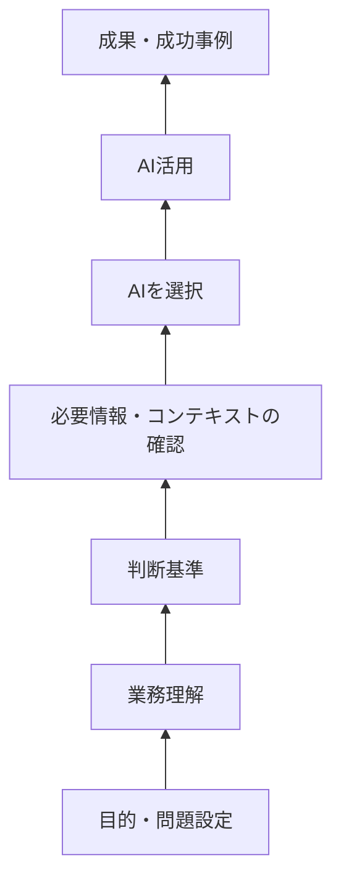

企業内で生成AIの活用事例を共有する活動が行われています。

例えば、
- GitHub Copilotで既存コードを調査した
- AIでテスト項目を作成した
- AIで問い合わせ対応を効率化した
- 生成AIで仕様駆動開発をした

といった事例です。

こうした事例共有には価値があります。

「こんなことにもAIを使えるのか」と気付くきっかけになりますし、AIを試す心理的なハードルも下がります。

ただ、私は一つ疑問を持っています。

> **全員の業務が違うのに、成功事例をそのまま共有するだけで、本当にAI活用は横展開できるのでしょうか。**

私はむしろ、AI活用もプロジェクトと同じように、業務ごとにテーラリングする必要があると考えています。

そして、テーラリングするのであれば、その前に必要なのは「事例」よりも、**自分でAI活用を組み立てるための前提知識**ではないでしょうか。

---

### 私は「使い方」ではなく「土台」を説明した

少し前に、社内で生成AI活用について1時間ほど話す機会がありました。

そのとき私は、便利なプロンプトや特定のAIツールの使い方を中心にはしませんでした。

代わりに、これまで公開してきた設計知識を、かなり簡単にして説明しました。

考え方は次のようなものです。

```text
目的は何か？
↓
必要情報は何か？
↓
情報源はどこにある？
↓
それに合わせたAIを選択
↓
AI / Human責任分界して活用
↓
人間レビュー
```

最初に考えるのは、

> 「どのAIを使うか」

ではありません。

まず、

> 「この仕事で何を達成したいのか」

を考えます。

次に、そのために必要な情報を考える。

そして、その情報がどこにあるのかを見る。

そのうえで、情報へアクセスしやすいAIを選ぶ。

さらに、AIが資料だけでは分からない、

- 目的
- 制約
- 優先順位
- 判断基準

を人間がContextとして補う。

最後に、AIに任せる範囲と、人間が確認する範囲を決める。

私は、この「土台」を教えないと意味が薄いと考えています。

---

### でも、関心は「積み木の上」に集まりやすい

実際に話してみると、関心は、

- この業務は試さなかったのか

といった部分にだけ関心が向きました。

私はそのとき、次のようなイメージを持ちました。

> **事例は積み木の一番上ではないか。**


---

### AI活用を積み木として考える

私は、AI活用を次のように整理しています。



一般的な事例共有で見えやすいのは、一番上です。

例えば、

- Copilotでコード調査ができた
- AIでテスト項目を作れた
- AIで問い合わせ対応を効率化できた

といったものです。

しかし、その成果の下には、

- 何を達成したかったのか
- どんな情報が必要だったのか
- その情報はどこにあったのか
- なぜそのAIを選んだのか
- どんなコンテキストを与えたのか
- どのように人間が確認したのか

という土台があります。

つまり、成功事例は**積み木の一番上にある完成形**です。

完成形だけを見ても、その下が分からなければ、条件が変わったときに自分では組み直せません。

---

### 全員の業務が違うなら、AI活用もテーラリングが必要になる

これは、プロジェクトと似ています。

すべてのプロジェクトに、同じ工程やルールをそのまま適用するわけではありません。

規模、リスク、技術、品質要求などに合わせてテーラリングします。

AI活用も同じではないでしょうか。

例えば、既存コードを調査する仕事なら、

```text
目的：
既存コードを理解する

必要情報：
ソースコード

情報源：
Git Repository

AI：
GitHub Copilot
```

という組み合わせが合うかもしれません。

一方、過去の意思決定を調べる仕事なら、

```text
目的：
過去の意思決定を調べる

必要情報：
メール・会議・文書

情報源：
Microsoft 365

AI：
Microsoft 365上の情報へアクセスしやすいAI
```

の方が適しているかもしれません。

同じAIを使う必要はありません。

同じプロンプトを使う必要もありません。

**業務が違えば、目的も必要情報も情報源も違うからです。**

---

### テーラリングするなら、前提知識が必要ではないか

ここが、私が一番伝えたかったことです。

「自分のこの業務でAIの活用がうまくいきました」

と言われても、

> **何を基準に自分の業務にいかせばよいのか**

が分からなければ、テーラリングできません。

プロジェクトでも、標準プロセスについて何も知らない状態では、適切なテーラリングは難しいはずです。

AI活用も同じです。

最低限、

- AIは何が得意なのか
- Contextとは何か
- Knowledgeとは何か
- 必要情報とAI選択はどう関係するのか
- AIに何を任せるのか
- 人間はどこを確認するのか

といった前提知識が必要です。

だから私は、個別事例より先に「土台」を説明しました。

事例を覚えることよりも、**自分で組み立てられるようになること**の方が重要だと考えているからです。

---

### 見えている結果だけでなく、その下を見る


成功事例を見たとき、最初に目に入るのは、

> 「このAIを使って、こういう成果が出た」

という結果です。

例えば、

```text
GitHub Copilot
+
このプロンプト
+
この手順
=
成功
```

という形です。

しかし、横展開するときに知りたいのは、その完成形だけではありません。

> **なぜ、その組み合わせで成功したのか。**

という下側です。

ここまで分解すれば、別の業務でも組み直せます。

重要なのは、

> **「何を使ったか」ではなく、「なぜその使い方が成立したのか」を見ること**

ではないでしょうか。

---

### 表面の形ではなく、原理を見る

AI活用事例も同じです。

```text
このAI
+
このプロンプト
+
この手順
```

という形だけを覚えても、条件が変われば使えなくなります。

一方で、


という考え方を理解していれば、条件が変わっても組み直せます。

私は、こちらの方が本当の意味での「横展開」に近いと考えています。

---

### 事例は入口、横展開するならその下まで見る

ここまで書くと、事例共有そのものを否定しているように見えるかもしれません。

そうではありません。

事例には、

- 分かりやすい
- 興味を持ちやすい
- AIを試すきっかけになる

という価値があります。

だから、事例は入口として使えばよいと思っています。

ただし、

> **事例共有 = 横展開**

ではない。

横展開するのであれば、その成功を下まで分解する必要があります。

つまり、

```text
事例を見る
↓
なぜ成功したのかを分解する
↓
自分の業務条件を見る
↓
自分の業務向けに組み直す
```

という流れです。

横展開すべきなのは、

> 「このAIを使った」

という結論だけではありません。

> **なぜそのAIを選び、なぜその使い方で成立したのか**

という判断構造だと思います。

---

### おわりに

全員の業務は違います。

目的も違う。

必要な情報も違う。

情報源も違う。

品質要求も違う。

だから、AI活用もプロジェクトと同じように**テーラリング**する必要があります。

そして、テーラリングするには、

> **何をどう変えるのか判断するための前提知識**

が必要です。

私は、

> **事例は積み木の一番上であり、その下にある土台を理解して初めて、自分の業務に合わせて組み直せる**

と考えています。

AI活用の横展開とは、成功事例をそのままコピーすることではなく、

> **成功を支えた原理を理解し、自分の業務に合わせてテーラリングすること**

ではないでしょうか。
