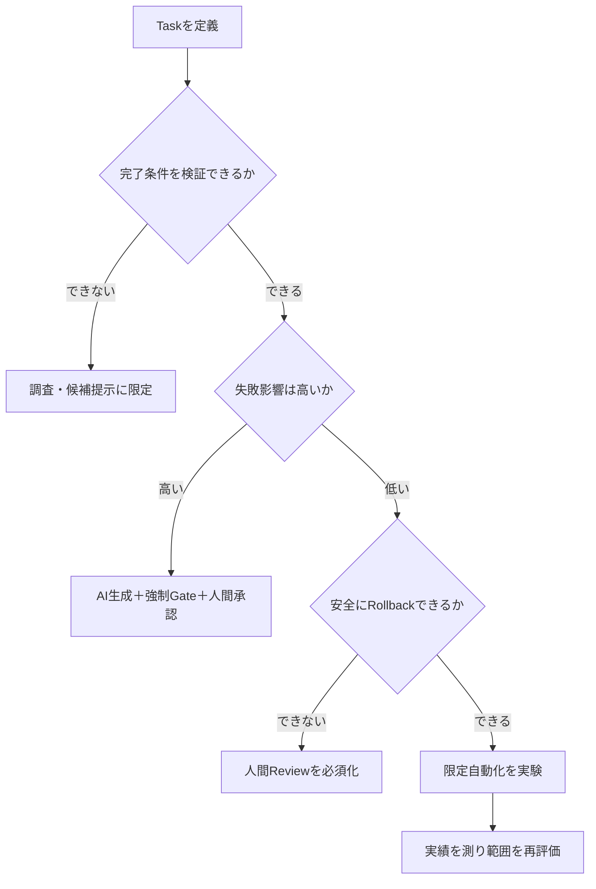
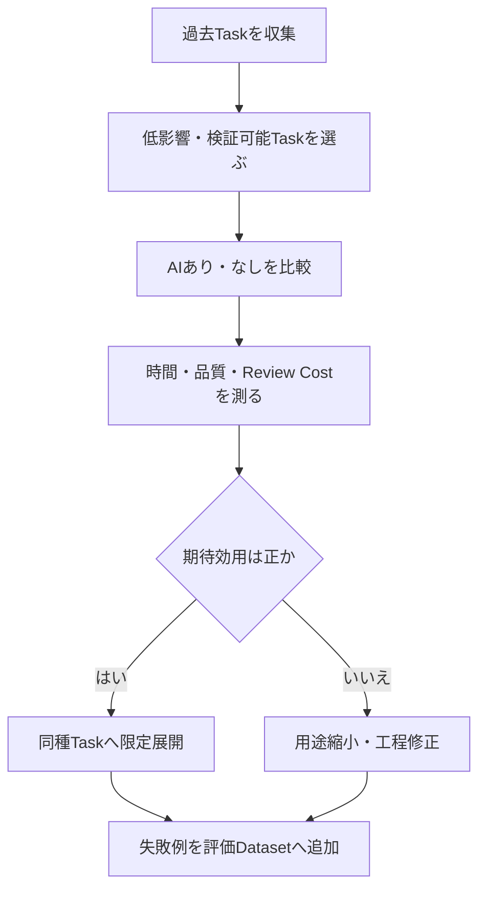

## コード生成を使うべき場所

> 種別：Task選定原則・意思決定モデル・実務指針  
> 適用対象：コード補完、Patch生成、Test生成、Coding Agent、自動修正  
> 対象工程：Task選定、要求定義、生成、検証、承認、実行、評価  
> 関連ページ：コード生成AIの評価と採用設計、コード生成AIの正体、なぜAIは新規コードよりコード保守に強いのか

---

### このページの結論

コード生成を使うべき場所は、ModelがCodeを書ける場所ではありません。

生成候補を検証でき、誤りの影響を制御でき、従来手段より期待効用が高い場所です。

$$
Use\ Coding\ AI
\iff
\mathbb{E}[U_{AI}\mid x]
>
\mathbb{E}[U_{baseline}\mid x]
$$

$x$はTaskの要求、Context、影響度、検証環境、担当者能力などの条件です。

したがって、「定型作業だから使う」「新規開発だから使う」「保守だから使う」という一つの分類だけでは決めません。

次を同時に確認します。

- 完了条件を定義できるか
- 必要なContextを取得できるか
- 出力を検証できるか
- 誤りの影響を限定できるか
- 失敗から復旧できるか
- 人間Reviewを含めても利益が残るか

> AIにCodeを書かせるかではなく、どの段階まで委任しても期待損失を管理できるかを決める。

---

### 生産性効果はTaskによって変わる

Coding AIの生産性について、異なる条件の研究を一つの結論へまとめてはいけません。

[Pengらの比較実験](https://www.microsoft.com/en-us/research/publication/the-impact-of-ai-on-developer-productivity-evidence-from-github-copilot/)では、参加者がJavaScriptのHTTP Serverを実装するTaskで、Copilot利用群の完了時間が短くなりました。

一方、[METRのRandomized Controlled Trial](https://metr.org/Early_2025_AI_Experienced_OS_Devs_Study-paper.pdf)では、熟練したOpen Source開発者が、普段扱うRepositoryで実際のTaskを行った条件において、2025年前半のAI Tool利用群は平均的に時間が増えました。

これらは矛盾というより、異なるTask分布を測っています。

| 条件 | 限定実装実験 | 熟練OSS開発者の実Repository Task |
|---|---|---|
| 対象 | 比較的限定された実装 | 実際のRepository変更 |
| Domain知識 | Task説明が中心 | 長期のRepository知識を利用 |
| Context | 小さい | 大きく暗黙依存を含む |
| 検証負荷 | 限定しやすい | 調査・Review・修正を含む |
| 観測結果 | 時間短縮 | 時間増加 |

ここから導けるのは、AIが常に速い、または常に遅いという結論ではありません。

> 生産性はModel名ではなく、Task、利用者、Repository、Tool、検証Costの組合せで測る必要がある。

---

### 「使う」を五段階へ分ける

AI利用を、使う・使わないの二値にしません。

| Level | AIへ許可すること | 人間・Systemの役割 |
|---|---|---|
| L0 | 利用しない | 従来工程で実施 |
| L1 | 説明・調査・候補提示 | 根拠を確認し、判断する |
| L2 | Patch・Testの下書き | 全差分をReviewして採用 |
| L3 | Sandbox内で編集・検証 | Gate通過後に人間が承認 |
| L4 | 定義範囲で自動反映 | Systemが強制制御し監視 |

高Risk Taskでも、L1の調査支援には利用できる場合があります。

反対に、低Risk Taskでも検証手段がなければ、L4へ進めるべきではありません。

重要なのはAIを利用するかではなく、自律性のLevelです。

---

### Task選定の七つの条件

#### 1. 仕様明確性

入力、出力、保持条件、対象外、完了条件を定義できるか。

#### 2. Context取得可能性

必要なCode、文書、Schema、設定、履歴、実行環境を取得できるか。

#### 3. 検証可能性

Build、Test、Static Analysis、Schema、実行結果、人間Reviewで判定できるか。

#### 4. 影響度

誤りが利用者、Data、Security、金銭、法令、外部Systemへ与える影響はどれほどか。

#### 5. 可逆性

失敗時にRollback、再実行、手動修正ができるか。

#### 6. 観測可能性

反映後のError、性能、Data状態、利用状況を検知できるか。

#### 7. Verification Cost

AI候補を確認するCostが、人間が最初から実装するCostを上回らないか。

---

### 期待効用で比較する

Task $x$へ適用する方法を $a$とします。

$$
a
\in
\{
human,
AI\ assist,
AI\ draft,
AI\ execute
\}
$$

方法 $a$の期待効用を、次のように単純化できます。

$$
\mathbb{E}[U(a)\mid x]
=
B(a,x)
-
C_{generation}(a,x)
-
C_{verification}(a,x)
-
P(F\mid a,x)I(F,x)
-
C_{recovery}(a,x)
$$

各項は次を表します。

| 項 | 意味 |
|---|---|
| $B$ | 時間短縮、品質向上、知識再利用などのBenefit |
| $C_{generation}$ | 指示、Context準備、生成、再試行のCost |
| $C_{verification}$ | Test、Review、解析、承認のCost |
| $P(F)$ | 誤りが採用・実行される確率 |
| $I(F)$ | 誤りが発生した場合のImpact |
| $C_{recovery}$ | Rollback、修正、障害対応のCost |

AIの生成時間だけを比較すると、Context準備、Review、修正、復旧Costを見落とします。

実際の値は、組織のTask実績から推定します。

この式は、一般的な生産性を保証する公式ではありません。

---

### 最初に見るべき二軸

一次判定では、検証可能性と失敗影響度を使えます。

|  | 影響度：低 | 影響度：高 |
|---|---|---|
| 検証可能性：高 | 自動化候補 | AI生成＋強いGate＋人間承認 |
| 検証可能性：低 | 下書き・試作に限定 | 原則として直接生成・実行しない |

この表だけでは最終判断できません。

Context、可逆性、観測可能性、Verification Costを追加します。

---

### 判断Flow



検証不能なTaskでAIを完全に禁止するとは限りません。

L1の調査・比較・確認観点の提示へ用途を下げます。

---

### 適用しやすい場所

#### Boilerplateと定型変換

- DTOやData Class
- Mapping Code
- 定型的なAPI Client
- SchemaからのCode生成補助
- 単純なFormat変換

条件は、生成後に型検査、Build、Testで確認できることです。

#### Testの下書き

- 明示された入出力のUnit Test
- 境界値候補
- 異常系候補
- Regression Test候補

AIが仕様を誤解するとTestにも誤りが複製されるため、Test Oracleは別に確認します。

#### 小さく限定されたPatch

- Null処理
- Error Handling
- Log追加
- 局所的なAPI置換
- 明確なBug修正

対象File、保持条件、不要変更禁止、完了Testを定義します。

#### 反復可能なRefactoring

- Rename
- Deprecated APIの置換
- 型の移行
- 規約への機械的適合

AST ToolやCompilerで検証できる場合に向きます。

#### PrototypeとDisposable Code

- 技術検証
- UI Mock
- 一時的なData分析
- Algorithm比較

本番Codeへ昇格する場合は、別の品質Gateを通します。

#### Sandbox内の補助Script

- 一時的な変換
- Test Data生成
- Log整形
- 開発環境の補助

実Dataや本番環境へ接続する前に、入力制限と副作用を確認します。

---

### 条件付きで使う場所

#### 既存業務Logicの修正

既存仕様、影響範囲、受入Testを確認できる場合に限定します。

#### API統合

公式仕様、Version、Error処理、Rate Limit、認証条件をContextへ含めます。

#### Database変更

生成候補には使えても、自動実行は分けます。

Migration、Backward Compatibility、Backup、Rollbackを必須にします。

#### 並行・非同期処理

Race ConditionやTiming依存は局所Testだけで検出しにくいため、専門Reviewと負荷・並行Testを追加します。

#### Security関連

認証、認可、暗号、Secret、入力検証は、一般的なPattern生成だけで採用しません。

Threat Model、Security Review、Scanner、組織基準を使います。

#### Legacy System

局所Patch生成より先に、Evidence収集、影響分析、Characterization Testへ利用します。

---

### 直接生成・自動実行を避ける場所

次のTaskでもL1の支援は可能ですが、AI候補を無承認で反映しません。

- 要求自体が未確定
- 正しさを観測できない中核業務判断
- 破壊的なData Migration
- 本番Dataの削除・上書き
- 認証・権限の中核
- 鍵・Secret管理
- 法令・契約に直結する処理
- Safety Criticalな制御
- 外部への金銭支払
- 広範囲でRollback困難な変更
- 実行環境を再現できない変更

理由はAIが必ず間違えるからではありません。

False Accept時の損失が大きく、検証と復旧が難しいためです。

---

### 生成と実行を分ける

Codeを生成できることと、Repositoryへ書き込み、本番へ反映できることは別です。

$$
Generate
\neq
Commit
\neq
Merge
\neq
Deploy
\neq
Execute
$$

| 段階 | 主なControl |
|---|---|
| Generate | Prompt、Context、出力Schema |
| Edit | Sandbox、Path Allowlist、差分上限 |
| Commit | Branch、署名、変更記録 |
| Merge | CI、Review、Approval Rule |
| Deploy | Environment権限、段階Release |
| Execute | Runtime権限、監視、停止、Rollback |

AIへ候補生成を広く許可しても、実行権限は狭くできます。

---

### 自動化範囲はSelectiveに決める

Task $x$を自動化するかどうかを判定するGate $g_{\tau}(x)$を置きます。

$$
g_{\tau}(x)
=
\mathbf{1}[RiskScore(x)\le\tau]
$$

自動化対象の割合をCoverageとします。

$$
Coverage(\tau)
=
P(g_{\tau}(x)=1)
$$

自動化対象だけの損失をSelective Riskとします。

$$
R_{selective}(\tau)
=
\mathbb{E}
[
L(\hat{y},y)
\mid
g_{\tau}(x)=1
]
$$

閾値を緩めればCoverageは増えますが、高Risk Taskも混ざる可能性があります。

目標は自動化率の最大化ではありません。

許容可能なSelective Riskの範囲でCoverageを決めることです。

Risk ScoreはModelの自己申告だけで決めず、Task属性、権限、変更範囲、検証結果を使います。

---

### 適性Scoreを固定公式にしない

仕様明確性 $S$、Context取得可能性 $C$、検証可能性 $V$、可逆性 $R$、観測可能性 $O$、影響度 $I$を使い、概念的には次のScoreを作れます。

$$
Score(x)
=
w_S S
+
w_C C
+
w_V V
+
w_R R
+
w_O O
-
w_I I
$$

しかし、重み $w$を根拠なく決めれば、数式の形をした主観になります。

実務では次の順番にします。

1. 各変数の観測方法を定義する
2. 過去Taskを採点する
3. AI適用結果と失敗を記録する
4. Scoreと実損失の関係を確認する
5. Thresholdと重みを更新する

初期段階では、Scoreより判断表と明示的なGateの方が説明しやすい場合があります。

---

### Task Contractを作る

Code生成を利用するTaskには、最低限次を定義します。

```yaml
task: エラー処理の局所修正
goal: 指定された失敗時に既定のError Codeを返す
allowed_scope:
  files:
    - src/ExampleService.cs
preserve:
  - public API signature
  - existing success-path behavior
prohibited:
  - dependency changes
  - unrelated refactoring
verification:
  - build
  - existing unit tests
  - new failure-path test
approval:
  required: true
rollback:
  method: revert commit
stop_conditions:
  - requirement ambiguity
  - change outside allowed scope
  - test environment unavailable
```

Task Contractは正しさを保証しません。

AI、自動検証、人間Reviewが同じ受入条件を共有するためのInterfaceです。

---

### 導入は小さなTask集合から始める

最初から開発工程全体へ広げません。



比較対象には、人間だけで実施したBaselineを置きます。

AI利用前後だけを比較すると、Task難易度、担当者、時期の差が混ざります。

---

### 評価指標

#### 効率

- Task完了時間
- Context準備時間
- AI待機・再試行時間
- Review時間
- 修正時間

#### 品質

- Build・Test成功率
- Review差戻し率
- 要求外差分率
- 本番流出欠陥率
- 再修正率

#### Risk

- False Accept率
- 権限逸脱件数
- Rollback率
- 復旧時間
- Security指摘件数

#### 価値

- 検証済み変更の完了数
- 調査時間短縮
- 開発者の認知負荷
- 将来保守Cost
- Task単位の期待効用

生成行数、Suggestion採用率、AI利用回数だけを最終KPIにしません。

---

### Secure Development工程は省略しない

AIがCodeを生成しても、Secure Software Developmentの責務は残ります。

[NIST SP 800-218](https://csrc.nist.gov/pubs/sp/800/218/final)は、Software Development Life CycleへSecure Development Practiceを組み込むFrameworkを示しています。

AI利用によって次を省略しません。

- 開発環境とArtifactの保護
- Software Integrityの確認
- 脆弱性の検出と修正
- 変更の追跡
- ReviewとApproval
- 根本原因の改善

AI固有のPrompt対策だけで、通常のSecure Development工程を置き換えることはできません。

---

### よくある誤解

#### 定型作業なら自動化してよい

定型でも、Data削除や権限変更のようにImpactが大きければ強いGateが必要です。

#### 高性能Modelなら適用範囲を広げてよい

Model性能は一要素です。検証、権限、可逆性、Contextが不足すれば範囲は広げられません。

#### Testがある場所なら自動化できる

Testが要求、Security、性能、互換性を十分に観測できるか確認します。

#### AIで速くなった研究があるから導入すべき

研究結果はTaskと利用者条件に依存します。自組織のBaselineと比較します。

#### AIで遅くなった研究があるから使うべきでない

Task分布が異なれば結果も変わります。調査、下書き、局所変換など別のLevelで評価します。

#### 人間Reviewを入れれば安全である

Review能力、時間、Evidence、AIとの誤り相関によって見逃しは残ります。

#### 自動化率が高いほど成功である

重要なのは許容Risk内で得られるNet Valueです。

---

### 事実・簡略モデル・設計仮説を分ける

#### 公開研究・標準から確認できること

- Coding AIの生産性効果は、Taskと利用者条件によって異なる観測結果がある
- 実RepositoryのIssue解決は、短い関数生成より広いContextと工程を必要とする
- Secure Development PracticeはSDLCへ組み込む必要がある

#### このページの簡略モデル

- AI利用とBaselineを期待効用で比較する
- 効用から生成・検証・失敗・復旧Costを差し引く
- 自動化範囲をCoverageとSelective Riskで表す
- Task適性を複数変数のScoreとして表す

これらは一般的な効果を保証する公式ではありません。

#### 設計仮説

- コード生成は、検証可能性が高く、影響が限定され、RollbackできるTaskから適用すべきである
- 高Risk Taskでも、調査・候補提示のLevelなら利用価値がある場合がある
- AIの利用可否より、委任Levelと実行権限を設計する方が重要である
- 生産性は生成速度ではなく、Verification Costと期待損失を含めて測るべきである

これらは組織固有のTask Datasetで検証します。

---

### このページの定義

コード生成を使うべき場所は、AIがCodeを生成可能な場所ではありません。

検証可能なTask集合を $\mathcal{T}_{V}$、必要Contextを取得できる集合を $\mathcal{T}_{C}$、影響を制御できる集合を $\mathcal{T}_{I}$、可逆な集合を $\mathcal{T}_{R}$、結果を観測できる集合を $\mathcal{T}_{O}$とします。

$$
\mathcal{T}_{suitable}
=
\mathcal{T}_{V}
\cap
\mathcal{T}_{C}
\cap
\mathcal{T}_{I}
\cap
\mathcal{T}_{R}
\cap
\mathcal{T}_{O}
$$

これは条件を二値化した簡略モデルです。実務では各条件に程度があり、期待効用と組織のRisk許容度を含めて判断します。

さらに、AI利用の期待効用が従来手段を上回る必要があります。

検証できない場合は、生成・実行ではなく、調査・比較・確認観点の提示へ用途を下げます。

誤りの影響が大きい場合は、決定論的Gate、権限制御、人間承認を追加します。

コード生成の価値は、生成量ではなく、安全に採用できた検証済み変更によって測ります。

---

### 参考資料

- Sida Peng et al., [The Impact of AI on Developer Productivity: Evidence from GitHub Copilot](https://www.microsoft.com/en-us/research/publication/the-impact-of-ai-on-developer-productivity-evidence-from-github-copilot/), 2023
- Joel Becker et al., [Measuring the Impact of Early-2025 AI on Experienced Open-Source Developer Productivity](https://metr.org/Early_2025_AI_Experienced_OS_Devs_Study-paper.pdf), 2025
- Carlos E. Jimenez et al., [SWE-bench: Can Language Models Resolve Real-World GitHub Issues?](https://arxiv.org/abs/2310.06770), ICLR 2024
- NIST, [SP 800-218: Secure Software Development Framework Version 1.1](https://csrc.nist.gov/pubs/sp/800/218/final), 2022
