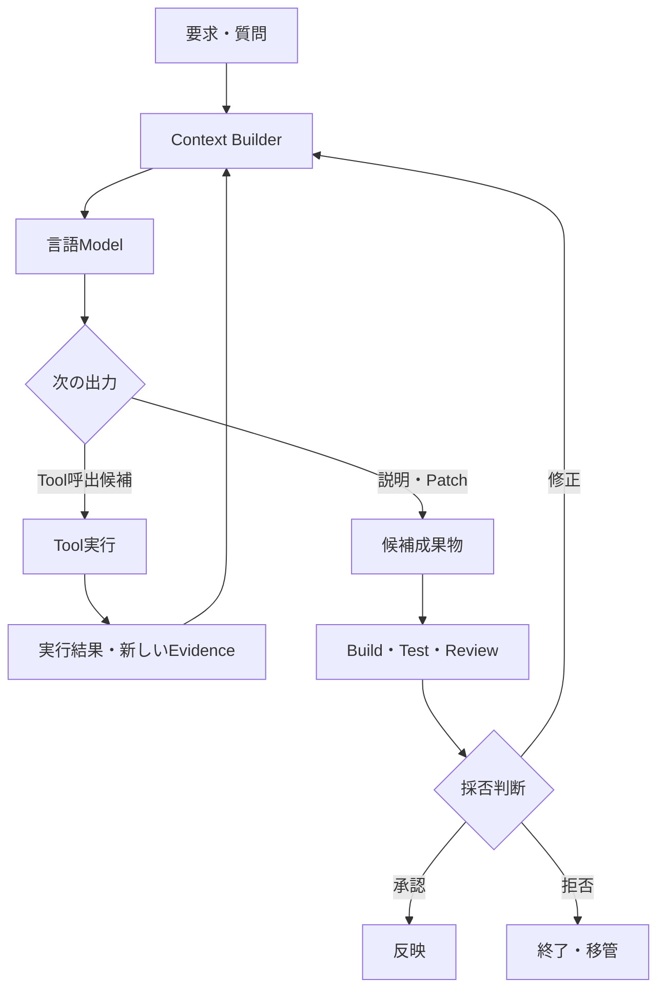

## コード生成AIの正体

> 種別：一般理論・製品構成の概念モデル・設計仮説  
> 適用対象：コード補完、コード説明、影響分析、Patch生成、Coding Agent  
> 対象工程：既存Code調査、Context構成、生成、Tool実行、検証、Review  
> 関連ページ：生成AIの条件付き確率モデル基礎、コード生成AIの評価と採用設計、AI間インターフェースとしてのプロンプト

---

### このページの結論

コード生成AIは、Codeの正しさを判定して完成品を返す装置ではありません。

中核にある言語Modelは、自然言語とSource CodeをToken列として扱い、与えられたContextに続くTokenの条件付き分布を生成します。

実際のCoding支援製品は、そのModelへ次を組み合わせたSystemです。

- Editorや利用者から要求を受け取るInterface
- 関連Codeや文書を集めるContext Builder
- Token列を生成する言語Model
- 検索、編集、Build、Testを行うTool
- 変更範囲を制限する権限
- 結果を検証し、採否を決める工程

$$
Coding\ AI\ System
=
Model
+
Context\ Builder
+
Tools
+
State
+
Permissions
+
Verification
$$

したがって、「このModelは賢いか」だけでは、実務性能を説明できません。

> コード生成AIの正体は、確率的な系列生成Modelを、Repository ContextとSoftware Engineering Toolへ接続した複合Systemである。

---

### Modelと製品を分ける

「コード生成AI」という言葉は、異なる層をまとめて指しています。

| 層 | 主な役割 | 主な失敗 |
|---|---|---|
| 言語Model | 説明、Code、Action候補を生成 | 誤った推測、不整合な生成 |
| Context Builder | 関連File、Symbol、文書を選ぶ | 取得漏れ、無関係情報の混入 |
| Orchestrator | 手順、状態、再試行を管理 | 無限Loop、古い状態の利用 |
| Tool | 検索、編集、Build、Testを実行 | 実行失敗、環境差、誤操作 |
| Permission | 読書き・通信・実行範囲を制限 | 過大権限、境界の迂回 |
| Verifier | 結果を検査する | False Accept、False Reject |
| 人間・責任主体 | 仕様、例外、Risk、採用を判断 | 見落とし、誤承認 |

Model単体のBenchmark結果から、製品全体のRepository理解、修正能力、安全性を直接推定することはできません。

反対に、同じModelを使っていても、Context取得、Tool、検証、権限が異なれば、実務上の結果は変わります。

---

### 全体構造



図のうち、言語Modelは中央の一構成要素です。

Repository検索、Build、Test、File更新、本番反映は、ModelのToken生成とは異なる処理です。

---

### 学習時に行っていること

自己回帰型言語Modelは、学習Data中のToken列について、次Tokenの予測誤差を小さくするようParameterを更新します。

Token列を $x_1,\ldots,x_T$、Model Parameterを $\theta$とすると、基本的な負の対数尤度は次で表せます。

$$
\mathcal{L}(\theta)
=
-\sum_{t=1}^{T}
\log P_{\theta}(x_t\mid x_{<t})
$$

Codeを多く含むDataで学習・調整されたModelは、次の統計的規則性を獲得できます。

- Programming言語の構文
- APIやLibraryの典型的利用法
- 命名や設計Pattern
- 自然言語の要求とCodeの対応
- Bug修正やTestの典型形
- Source Code間の長距離依存

ただし、学習目的は「今回の要求を満たすProgramであること」の直接証明ではありません。

学習Data上で次Tokenを予測する能力と、特定Repositoryの暗黙仕様を満たす能力は別です。

また、個別製品について、学習Dataの詳細や追加学習方法が公開されていない部分を推測で断定してはいけません。

[Codexの研究](https://arxiv.org/abs/2107.03374)は、公開GitHub Codeで調整したGPT系ModelとHumanEvalによる機能評価を報告しています。これはCode学習Modelの一例であり、現在の全Coding製品の内部構成を示す資料ではありません。

---

### 推論時に行っていること

要求を $R$、選択されたRepository Contextを $Z$、会話・作業履歴を $H$、Tool結果を $O$、生成系列を $Y=(y_1,\ldots,y_T)$とします。

$$
P(Y\mid R,Z,H,O)
=
\prod_{t=1}^{T}
P(y_t\mid y_{<t},R,Z,H,O)
$$

Modelは、完成済みのProgram候補一覧から一つを選んでいるわけではありません。

直前までのTokenとContextを条件に、Tokenを順次生成します。

その結果として、次のような出力ができます。

- Source Code
- Patch
- 設計説明
- 影響分析
- Test Case
- Tool呼出を表す構造化Data
- 不明点や確認要求

すべて同じ系列生成の出力形態です。

Codeだけが別の確定的推論Engineから生成される、と一般化することはできません。

---

### CodeがTokenになるとはどういうことか

Modelは、Source Codeを人間と同じ単位で読んでいるとは限りません。

Source CodeはTokenizerによって、Keyword、識別子の一部、記号、空白などを含むToken列へ変換されます。

例えば、一つの長い識別子が複数Tokenへ分割される場合があります。

Token化には次の影響があります。

- 長いFileは多くのContextを消費する
- 命名規則が類似箇所の推定に影響する
- 同じ処理でも表記差によってToken列が変わる
- 生成途中の局所的な確率が全体構造へ影響する

ただし、Token単位で動くことだけを理由に「意味を全く扱えない」と断定することもできません。

内部表現が、構文・依存・振る舞いに関する有用な規則性を捉えることはあります。

正確な表現は次です。

> ModelはToken列から有用な構造を学習できるが、生成された説明やCodeの意味的正しさは外部検証を必要とする。

---

### 「一般的なCode知識」と「このRepositoryの事実」を分ける

Modelが学習時に獲得した一般的なPatternと、作業対象Repositoryの現在状態は異なります。

| 情報 | 例 | 主な取得元 |
|---|---|---|
| 一般知識 | 言語構文、一般API、設計Pattern | Modelの学習・調整 |
| Repository事実 | Class、呼出関係、設定、Test | 現在のRepository |
| 作業要求 | 変更理由、完了条件、対象外 | Issue、仕様、利用者 |
| 実行事実 | Build結果、Test結果、Log | Tool・実行環境 |
| 組織判断 | 例外承認、Risk許容、Release判断 | 人間・責任主体 |

Modelの一般知識だけで、非公開Repositoryの現在仕様を知ることはできません。

一方、RepositoryをContextへ渡しても、文書化されていない業務理由や過去の判断まで自動的に得られるわけではありません。

---

### Repository Contextは検索結果である

大規模Repositoryでは、すべてのFileを常にModelへ渡すとは限りません。

製品や構成によっては、開いているFile、選択範囲、Symbol検索、Repository Index、意味検索などから関連箇所を選びます。

GitHubの公開資料でも、Repository Contextを付与した会話でRepositoryをIndexし、関連Codeを参照する仕組みが説明されています。

ただし、これはGitHub Copilotの公開仕様に関する説明であり、他製品も同じ実装であることを意味しません。

Repository全体を $B$、Queryを $Q$、取得Contextを $Z$とすると、検索工程を次のように表せます。

$$
Z
\sim
P(Z\mid Q,B)
$$

これは検索器が必ずRandom Samplingを行うという意味ではありません。Query、Repository、Index、検索設定に対して取得集合が決まる関係を、確率変数として一般化した概念モデルです。決定論的な検索器は、一つの取得結果へ確率が集中した特殊な場合として扱えます。

その後の生成は次です。

$$
Y
\sim
P(Y\mid Q,Z)
$$

成功確率は概念的に次の二段階に依存します。

$$
P(S\mid Q,B)
=
\sum_Z
P(Z\mid Q,B)
P(S\mid Q,Z)
$$

関連Fileを取得できなければ、Modelが渡された範囲を正確に説明しても、Repository全体としては誤った回答になります。

[RepoCoder](https://arxiv.org/abs/2303.12570)は、Repository LevelのCode補完を、検索と生成の反復として扱っています。この研究も、検索方式の一例であって、市販製品の内部実装を示すものではありません。

---

### 「Codeを理解する」の意味を限定する

Coding AIに「この処理を説明して」と依頼すると、有用な構造説明を返せます。

しかし、「理解」という言葉には複数の水準があります。

| 水準 | 例 | 検証方法 |
|---|---|---|
| 表層構造 | Class、Method、変数の役割 | Sourceとの照合 |
| 静的関係 | 呼出、継承、参照、Data Flow | IDE、AST、静的解析 |
| 実行時挙動 | 分岐結果、状態変化、副作用 | Test、Trace、実行 |
| System仕様 | 外部から見た契約、例外、互換性 | 仕様、受入Test、利用者確認 |
| 業務意味 | なぜ必要か、何を守るか | 要件、Decision Record、責任者 |

AIの説明がSource Codeと対応していれば、根拠を確認しやすくなります。

その意味で、自由回答より検証可能性が高い場合があります。

しかし、次の要素はSource Codeの局所読解だけでは確定しません。

- Reflectionや動的Dispatch
- Configurationによる分岐
- Build条件とFeature Flag
- 外部Serviceの挙動
- Data Migrationと旧Data
- Installer、Registry、Device固有処理
- 運用手順による補完
- 過去の障害回避理由

したがって、次の二つを区別します。

> AIが、取得したCodeを整合的に説明できた。

> AIが、System全体の仕様と影響範囲を完全に理解した。

前者から後者は自動的に導けません。

---

### Toolを使うと何が変わるか

言語Model単体は、通常、Textや構造化Dataを出力します。

Tool接続により、生成したAction候補を外部Systemが実行できるようになります。

- File検索
- Symbol参照検索
- Source編集
- Build
- Unit Test
- Static Analysis
- Version Control操作
- IssueやPull Request作成

Tool結果は、新しいEvidenceとして次の推論へ戻せます。

$$
O_{t+1}
=
Tool(A_t)
$$

$$
A_{t+1}
\sim
P(A\mid R,Z,H,O_{\le t+1})
$$

ここで $A_t$はModelが提案したAction、$O_{t+1}$はToolの観測結果です。

Build Errorを観測して修正するLoopは、最初の一回で正解するより強力です。

しかし、Toolを接続してもModel自体が決定論的な真偽判定器になるわけではありません。

Toolの結果を誤解する、古い結果を使う、誤った対象へActionを適用する可能性は残ります。

---

### Agentは「自律したModel」ではなく制御Loopである

Coding Agentは、Modelが単独で継続的に意思を持つ存在として説明する必要はありません。

Systemが状態を保持し、Modelへ次のAction候補を生成させ、Tool結果を戻すLoopとして捉えられます。

状態を $S_t$、Actionを $A_t$、観測結果を $O_{t+1}$とします。

$$
A_t
\sim
\pi_{\theta}(A\mid S_t)
$$

$$
S_{t+1}
=
F(S_t,A_t,O_{t+1})
$$

ここで、$F$にはSystem側の状態管理が含まれます。

実務では次を明示します。

- 何を状態として保存するか
- どのToolを許可するか
- 何回まで再試行するか
- どの失敗で停止するか
- どのActionに承認が必要か
- どの成果物を次工程へ渡すか

Agentの能力だけでなく、Loopの終了条件と権限境界が安全性を決めます。

---

### Tool呼出は提案と実行に分ける

Modelが生成したTool Callを、そのまま実行命令として扱う必要はありません。

$$
Proposed\ Action
\neq
Authorized\ Action
$$

Action実行前に、Systemが次を検査します。

| 検査 | 例 |
|---|---|
| Schema | 必須Argument、型、形式 |
| 対象 | 許可されたRepository、Path、Branch |
| 権限 | 読取、書込、削除、Deploy |
| 状態 | 最新Commit、Lock、実行中Task |
| Risk | 外部送信、Data変更、本番操作 |
| 承認 | 人間確認、複数承認 |

自然言語で「危険な操作をしない」と指示するだけでなく、実行基盤で止めます。

---

### Code領域の誤りをすべてハルシネーションと呼ばない

「AIが間違えた」を一つの言葉でまとめると、改善対象が分からなくなります。

| 失敗分類 | 例 | 主な改善先 |
|---|---|---|
| 要求不足 | 完了条件が曖昧 | 要求整理、追加質問 |
| Context取得漏れ | 影響Fileを取得できない | Index、検索、依存解析 |
| Context競合 | 古い仕様と新しいCodeが混在 | 版、優先順位、正本管理 |
| 生成誤り | 存在しないAPI、誤った分岐 | Model、Prompt、候補生成 |
| 変更範囲逸脱 | 無関係なRefactorを含む | Patch制約、Path制御 |
| Tool失敗 | Build環境不備、Command失敗 | 実行環境、Error処理 |
| 検証漏れ | Testが欠陥を検出できない | Test設計、解析、Review |
| 採用誤り | 未確認Patchを承認 | Gate、責任、権限 |

「ハルシネーションが怖い」で止まるのではなく、どの層の失敗かを特定します。

CodeはCompiler、Test、Static Analysis、実行結果など、自然言語より強い検証手段を持ちます。

だからこそ、誤りが起こらないと期待するより、検証可能性を工程へ組み込む方が合理的です。

---

### CompilerとAIは役割が違う

| 構成要素 | 得意なこと | 保証しないこと |
|---|---|---|
| 言語Model | 候補生成、説明、変換、仮説 | 今回の仕様への正しさ |
| Parser | 構文構造の検査 | 実行時の正しさ |
| Compiler・型検査 | 型・参照・Build条件の一部 | 業務仕様、安全性 |
| Unit Test | 定義した例の振る舞い | 未定義入力、全状態 |
| Static Analyzer | 定義Ruleに基づく検出 | Rule外の欠陥 |
| Runtime観測 | 実際の実行結果 | 未実行条件、将来状態 |
| 人間Review | 意図、Trade-off、暗黙条件 | 常に正しい判断 |

言語ModelをCompilerの代わりにせず、Compilerを仕様確認の代わりにしません。

異なる検証能力を重ねます。

---

### Legacy Systemで重要なのは現在のCodeだけではない

Legacy保守では、Source Codeが重要なEvidenceである一方、唯一の仕様とは限りません。

$$
Operational\ Specification
\supseteq
Source\ Code
$$

運用上の仕様には、次が含まれます。

- 設定FileとRegistry
- InstallerとUpgrade処理
- 旧版Data
- DeviceやDriverの差
- 外部Systemとの非公開契約
- 現場の運用回避策
- 過去の障害とDecision Record

AIへ渡すContextをSource Codeだけに限定すると、局所的には正しく、System全体では誤った変更を作る可能性があります。

Legacy保守では、AIの最初の役割をCode生成ではなく、Evidence収集と影響範囲の候補作成に置く方が有効な場合があります。

これは一般的な性能保証ではなく、このサイトで採用する設計仮説です。

---

### AI出力をEvidence付き成果物にする

「調べました。問題ありません」という回答では、次工程が検証できません。

調査結果を構造化します。

```yaml
task: 認証処理の影響範囲調査
observed:
  - claim: 認証入口はAuthController.Loginである
    evidence:
      file: src/Auth/AuthController.cs
      symbol: Login
retrieved:
  - src/Auth/TokenService.cs
  - tests/AuthControllerTests.cs
inferred:
  - claim: Token形式変更は既存Clientへ影響する可能性がある
    basis:
      - TokenService.CreateToken
      - docs/api-contract.md
unresolved:
  - 旧Clientの利用Version
  - 本番設定のToken有効期間
excluded:
  - 外部IdPの内部挙動
status: requires-human-review
```

重要なのは、次を区別することです。

- Sourceから直接確認した事実
- 検索によって取得した関連情報
- AIが推論した影響候補
- まだ確認できない事項
- 調査対象外

これにより、AIの説明を確定仕様へ自動昇格させません。

---

### 製品名から能力を固定しない

Coding支援製品は継続的に更新されます。

同じ製品名でも、次が異なる可能性があります。

- 選択されるModel
- Context Window
- Repository Index
- 利用可能なTool
- Agent Mode
- 権限とSandbox
- 組織Policy
- 利用Plan

したがって、このサイトでは「製品Aは常にRepository全体を理解する」「製品Bはこの方式で検索する」と固定的に断定しません。

製品固有の説明を行う場合は、対象Version、利用Surface、確認日、公式資料を示します。

変化しにくい原則は次です。

- ModelとSystemを分ける
- 一般知識と現在のRepository事実を分ける
- 検索と生成を分ける
- Tool提案と実行権限を分ける
- 候補と承認済み成果物を分ける

---

### 評価は層ごとに行う

「Coding AIの正答率」一つでは、失敗原因を特定できません。

#### Context Builder

- 関連File Recall
- 不要File率
- Symbol・依存関係の取得率
- 古い版の混入率

#### Model

- 説明とEvidenceの対応率
- Build可能候補率
- 要求適合率
- 不明時の停止・追加質問率

#### Tool・Agent

- Tool Call成功率
- 誤対象操作率
- 再試行回数
- Loop終了率
- 状態不整合率

#### Verification

- 欠陥検出率
- False Accept率
- False Reject率
- Review差戻し率

#### 業務成果

- 調査時間短縮
- Review時間
- 検証済み変更の完了率
- 本番流出欠陥
- 将来の再修正率

生成行数やAI利用回数を、最終的な価値指標にしません。

---

### よくある誤解

#### Code専用AIはCodeを実行しながら答えている

言語ModelのToken生成と、外部Toolによる実行は別です。

実行環境が接続されていなければ、BuildやTestを実際に行ったとは限りません。

#### Repositoryを指定すれば全Fileを同時に読んでいる

製品と処理によります。Indexや検索によって関連箇所を選ぶ場合、取得漏れが起こり得ます。

#### Source Codeが根拠だから誤答しない

取得範囲内の説明は検証しやすくなりますが、検索漏れ、解釈誤り、動的挙動、外部依存は残ります。

#### Toolを使えるAIは自動的に安全である

Toolは能力と影響範囲を増やします。権限、承認、停止、監査が必要です。

#### AgentはModelより本質的に別の知能である

実装によりますが、設計上はModel、状態管理、Tool、制御Loopの組合せとして分解できます。

#### Compilerが通ればAIは正しく理解した

Build成功は、要求・互換性・Security・運用上の正しさを保証しません。

---

### 事実・概念モデル・設計仮説を分ける

#### 一般理論・公開資料で確認できる事実

- TransformerはAttentionを中心とする系列Model Architectureである
- 自己回帰型言語Modelは条件付きToken分布から系列を生成する
- Code向けに学習・調整された言語ModelはCode生成へ利用できる
- Repository LevelのCode生成では、関連Codeの検索を組み合わせる研究がある
- Coding製品にはRepository Context、Tool、Agent機能を持つものがある

#### このページの概念モデル

- Coding AIをModel、Context Builder、Tool、State、Permission、Verificationへ分解する
- Repository Contextを確率変数 $Z$として検索と生成を分ける
- Agentを状態、Action、観測の制御Loopとして表す
- Operational SpecificationをSource Codeより広い集合として表す

これらは個別製品の内部実装図ではありません。

#### 設計仮説

- 実務価値はCode生成量より、検証済み変更と調査Evidenceで測るべきである
- Legacy保守では、生成より先にEvidence収集と影響分析へAIを使う価値が高い場合がある
- 「ハルシネーション」という総称より、失敗層を分解した方が改善可能性が高い
- Model性能差よりContext取得と検証工程の差が結果を左右するTaskがある

これらは実務Datasetと運用記録によって検証します。

---

### このページの定義

コード生成AIの中核は、Codeの意味を証明するEngineではなく、Contextに条件付けられたToken系列生成Modelです。

Coding支援Systemは、そのModelへRepository検索、Tool、状態管理、権限、検証を接続したものです。

単純化した一方向の処理として書けば、次のように表せます。

$$
Verified\ Output
=
Verification
\circ
Tool\ Execution
\circ
Generation
\circ
Context\ Construction
(Request)
$$

実際のAgentでは、Tool結果をContextへ戻す反復Loopが加わります。

この構造を分解すれば、失敗を「AIが嘘をついた」で終わらせず、検索、生成、実行、検証、採用のどこを直すべきか判断できます。

---

### 参考資料

- Ashish Vaswani et al., [Attention Is All You Need](https://arxiv.org/abs/1706.03762), NeurIPS 2017
- Mark Chen et al., [Evaluating Large Language Models Trained on Code](https://arxiv.org/abs/2107.03374), 2021
- Fengji Zhang et al., [RepoCoder: Repository-Level Code Completion Through Iterative Retrieval and Generation](https://arxiv.org/abs/2303.12570), EMNLP 2023
- Carlos E. Jimenez et al., [SWE-bench: Can Language Models Resolve Real-World GitHub Issues?](https://arxiv.org/abs/2310.06770), ICLR 2024
- GitHub Docs, [Indexing repositories for GitHub Copilot](https://docs.github.com/copilot/concepts/indexing-repositories-for-copilot-chat)
- GitHub Docs, [About GitHub Copilot cloud agent](https://docs.github.com/copilot/concepts/agents/cloud-agent/about-cloud-agent)
