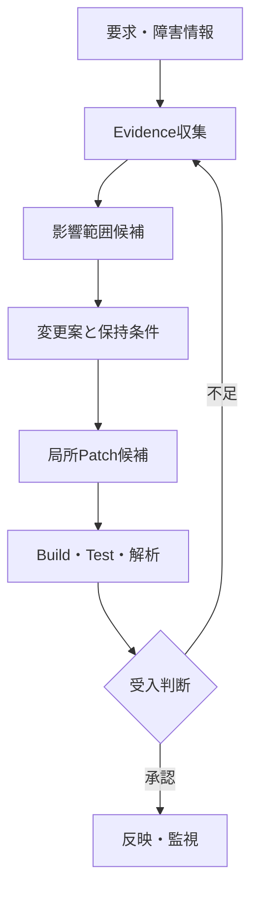

## なぜAIは新規コードよりコード保守に強いのか

> 種別：設計仮説・情報理論による簡略モデル・実務指針  
> 適用対象：既存Code調査、影響分析、局所修正、Regression Test、Legacy保守  
> 対象工程：要求整理、調査、変更設計、実装、検証、Review  
> 関連ページ：コード生成AIの正体、コード生成AIの評価と採用設計、AI間インターフェースとしてのプロンプト

---

### 最初に結論

「AIは新規コードよりコード保守に強い」は、一般的に証明された性能法則ではありません。

実Repositoryの保守は、複数File、暗黙仕様、実行環境、長い履歴を扱うため、短い新規関数の生成より難しい場合があります。

[SWE-bench](https://arxiv.org/abs/2310.06770)も、実際のGitHub Issue解決には複数の関数・Class・Fileをまたぐ理解と実行環境が必要であり、単純なCode生成を超えるTaskであると示しています。

このページで述べる「強い」は、次の限定された意味です。

> 既存Code、Test、仕様、履歴が正しく取得できる場合、AIが自由に推測する範囲を狭め、出力をEvidenceへ照合しやすくできる。

したがって、本質は保守Taskそのものが簡単であることではありません。

既存成果物が、生成条件と検証基準を与えることです。

---

### 「強い」を四つへ分解する

AIが保守に強いかどうかは、何を比較するかで変わります。

| 比較軸 | 保守で有利になり得る理由 | 保守で不利になり得る理由 |
|---|---|---|
| 候補生成 | 既存Patternを模倣・変換できる | 局所Patternが全体仕様と一致しない |
| Code理解 | 根拠となるSourceを参照できる | 関連箇所を取得できない |
| 検証可能性 | Diff、既存Test、旧挙動と比較できる | Test不足、実行環境を再現できない |
| 自動化可能性 | 小さな変更へ限定しやすい | 横断変更、移行、運用判断が必要 |

「生成精度が高い」と「検証しやすい」を混同してはいけません。

このページが主に扱うのは、後者です。

---

### 新規開発と保守では不確実性の位置が違う

新規開発では、要求から設計・構造・Interfaceを決める自由度があります。

保守では、既存Systemが設計自由度を制限します。

| 観点 | 新規開発 | 既存保守 |
|---|---|---|
| Architecture | 選択余地が大きい | 既存構造へ適合する必要がある |
| Interface | 新しく定義できる | 互換性を守る必要がある |
| Data | 新規Schemaを設計できる | 旧Dataと移行条件がある |
| Test | 新しく作る必要がある | 既存Regression Testを利用できる場合がある |
| Evidence | 要求と設計案が中心 | Code、履歴、Log、Testが存在する |
| Risk | 未確立の設計Risk | 既存利用者を壊すRisk |

新規開発は自由度が高い一方、正解条件が未確定になりやすいTaskです。

保守は制約が多い一方、比較対象が存在するTaskです。

---

### 既存Codeが条件付きEntropyを下げる

要求を $R$、採用すべき変更を $Y$、既存Systemから得られる有効な情報を $B$とします。

情報理論では、追加情報で条件付けしたEntropyは平均的には増えません。

$$
H(Y\mid R,B)
\le
H(Y\mid R)
$$

既存情報 $B$が変更 $Y$について持つ条件付き相互情報量は次です。

$$
I(Y;B\mid R)
=
H(Y\mid R)
-
H(Y\mid R,B)
\ge 0
$$

これは、関連する既存情報があれば、要求だけから変更を推定するより不確実性を減らせることを表します。

例えば、次の情報が変更候補を絞ります。

- 既存Interface
- 呼出元と呼出先
- 型とSchema
- Coding規約
- Regression Test
- 過去の類似修正
- 実行Log
- 互換性条件

ただし、この式から「Repositoryを長くPromptへ入れればModel性能が必ず上がる」とは導けません。

この不等式は、真の確率分布における情報関係を表します。

実際のAI Systemでは、次の失敗があります。

- 関連情報を検索できない
- 無関係な情報を混ぜる
- 古い版を使う
- 長いContext中の重要箇所を利用できない
- 正しいEvidenceを誤解する

既存情報が存在することと、AIがその情報を取得・利用できることは別です。

---

### 探索空間が狭くなる条件

新規実装で許される候補集合を $\Omega_{new}$とします。

既存Systemの制約集合を $C_1,\ldots,C_m$とすると、保守で受け入れられる変更集合は概念的に次です。

$$
\Omega_{maint}
=
\Omega_{new}
\cap
\bigcap_{i=1}^{m} C_i
$$

制約例は次です。

- Public APIを変えない
- 既存Dataを読める
- 指定OSで動く
- Error Codeを維持する
- 既存Testを壊さない
- 指定Module以外を変更しない

適切な制約が利用できれば、次が期待できます。

$$
|\Omega_{maint}|
\le
|\Omega_{new}|
$$

ただし、これは有限集合として単純化した説明モデルです。

実際のProgram候補空間は巨大であり、保守性や設計品質は単純な集合要素数だけでは表せません。

また、制約が不足または矛盾していれば、狭くなった集合自体が誤っています。

---

### 「既存Codeがある」だけでは足りない

AIが利用できるのは、存在する情報ではなく、取得された情報です。

Repositoryを $B$、要求を $R$、検索結果を $Z$、変更候補を $Y$とします。

$$
Z
\sim
P(Z\mid R,B)
$$

これは検索器が必ずRandom Samplingを行うという意味ではありません。検索条件とRepositoryから取得集合が決まる関係を一般化した概念モデルであり、決定論的検索も含みます。

$$
Y
\sim
P(Y\mid R,Z)
$$

成功には少なくとも二つの条件があります。

1. 必要なEvidenceを取得する
2. 取得したEvidenceから妥当な候補を作る

関連情報の取得を $G$、候補生成の成功を $C$とすると、Chain Ruleにより次のように分解できます。

$$
P(G\cap C)
=
P(G)
P(C\mid G)
$$

生成Modelだけを改善しても、$P(G)$が低ければRepository保守は成功しません。

[RepoCoder](https://arxiv.org/abs/2303.12570)が検索と生成を反復する構成を採ることも、Repository Levelでは関連Contextの取得が独立した課題であることを示す一例です。

---

### 既存Codeは正本ではなくEvidenceである

Legacy Systemでは、Source Codeが現在動作の重要なEvidenceになります。

しかし、Source Codeだけで業務仕様全体が確定するとは限りません。

$$
\mathcal{E}_{operational}
=
\mathcal{E}_{code}
\cup
\mathcal{E}_{configuration}
\cup
\mathcal{E}_{data}
\cup
\mathcal{E}_{contract}
\cup
\mathcal{E}_{history}
$$

ここで $\mathcal{E}$は、運用仕様を判断するためのEvidence集合を表します。

Source Code以外に次を確認します。

- 要求仕様と設計書
- ConfigurationとFeature Flag
- Databaseと旧Data
- InstallerとMigration
- 外部Systemとの契約
- Device、Driver、OS差
- Logと障害履歴
- 運用手順
- Decision Record

AIが局所Codeを正しく説明しても、運用上の仕様を見落とす場合があります。

したがって、既存Codeを「唯一の正解」ではなく、検証可能なEvidenceの一つとして扱います。

---

### 保守でAIを使いやすい作業

AIが比較的使いやすいのは、入力・出力・対象範囲・検証方法を定義できる作業です。

#### 処理説明

対象Method、呼出関係、状態変化を説明させ、Sourceと照合します。

#### 関連Code探索

Symbol、Interface、設定Key、Error Codeから候補箇所を探します。

#### 差分比較

旧版と新版、類似Module、正常系と異常系を比較します。

#### 影響範囲候補

呼出元、呼出先、Test、設定、Data、外部Interfaceを列挙します。

#### 局所修正

対象Fileと保持条件を限定してPatch候補を作ります。

#### Test候補

既存挙動、境界値、異常系からTest Caseを提案します。

#### Review支援

不要差分、互換性Risk、未確認事項を抽出します。

これらは、AIが最終判断するTaskではありません。

人間や既存Toolが確認できる中間成果物を作るTaskです。

---

### 保守でもAIが苦手になりやすい作業

#### 暗黙仕様の復元

Codeに残っていない業務理由や、失われた設計意図は確定できません。

#### 動的な影響分析

Reflection、Plugin、Dependency Injection、Configuration、Runtime Dataで関係が変わる場合があります。

#### 横断的変更

複数Module、Data Migration、外部System、運用手順を同時に変えるTaskは複雑です。

#### 非機能判断

性能、Security、可用性、保守性のTrade-offは、組織の基準と責任判断を必要とします。

#### 長期的な設計判断

現在の局所最適が、将来のArchitectureに適するとは限りません。

#### 実行環境を再現できない変更

特殊Device、古いOS、本番Data、外部契約が必要なら、自動検証が難しくなります。

---

### 実Repository修正が難しいという反証

短い関数生成Benchmarkの成績だけを見ると、AIはCode作成に強く見えます。

[HumanEvalを用いたCodex研究](https://arxiv.org/abs/2107.03374)は、Docstringから独立したPython関数を生成し、Unit Testで機能的正しさを評価しました。

一方、SWE-benchは既存RepositoryとIssueを入力し、実際のPatchを作るTaskです。

両者はTaskのScope、Context、検証条件が異なります。

したがって、異なるBenchmarkのScoreを直接比較して、次を結論づけることはできません。

- 新規生成より保守が得意
- 保守より新規生成が得意
- Function生成能力がRepository修正能力を代表する

事実としていえるのは、Repository修正には局所生成以外の能力が必要であることです。

- Issue理解
- 関連箇所の特定
- 複数Fileの整合
- 実行環境の利用
- Testと修正の反復
- Patchの選別

このため、「AIは保守に強い」はModelの一般能力ではなく、工程の設計仮説として扱います。

---

### 新規開発の方がAIに向く場合もある

新規開発が常に不利なわけではありません。

次の条件では、新規Codeの方が容易な場合があります。

- 小さく独立した関数
- 完了条件が明確
- 外部依存が少ない
- 標準的な技術構成
- Test Oracleを作りやすい
- 互換性制約がない
- Architectureを単純化できる

反対に、保守が難しくなる条件は次です。

- 巨大で密結合なRepository
- Testがない
- 仕様とCodeが不一致
- 古い依存関係
- 動作環境を再現できない
- 変更理由が不明
- 複数製品が非公開挙動へ依存

Taskの新規・保守という分類だけで、自動化可能性を決めてはいけません。

---

### 「保守優位」を決める簡略モデル

既存成果物から得られる情報利得を $IG$、検索・整理Costを $C_r$、依存関係の複雑性を $C_d$、情報の古さによるRiskを $R_s$、検証可能性によるBenefitを $V$とします。

保守で既存成果物を使う利得を、概念的に次のように置けます。

$$
Advantage_{maint}
=
IG
+
V
-
C_r
-
C_d
-
R_s
$$

$$
IG
=
I(Y;B\mid R)
$$

この値が正であるTaskでは、既存SystemをContextと検証基準に利用する価値があります。

負になるTaskでは、大量のLegacy Contextが推論と検証の負担になる可能性があります。

これは実測公式ではありません。

Task選定時に、情報利得だけでなくContext取得Costと依存複雑性も考えるための設計補助線です。

---

### AIへ任せる単位は「保守」ではなく検証可能なSubtask

「この製品を保守して」という単位では広すぎます。

工程を分けます。

各Subtaskに入力、出力、検証者、停止条件を定義します。

| Subtask | AI出力 | 検証 |
|---|---|---|
| Evidence収集 | 関連File・Symbol・Log | Source・検索結果との照合 |
| 影響分析 | 影響候補と根拠 | 依存解析・担当者確認 |
| 変更設計 | 選択肢・Trade-off | 設計Review |
| Patch生成 | 最小差分 | Diff・Build・Test |
| Review支援 | Risk・未確認事項 | 人間の採否判断 |

---

### 最小変更を基本にする

保守では、要求外の変更を混ぜるほど検証範囲が増えます。

変更集合を $\Delta$、要求達成に必要な最小変更集合を $\Delta^*$とします。

設計目標を単純化すると次です。

$$
\min |\Delta|
\quad
subject\ to
\quad
\Delta\models R,
\quad
\Delta\supseteq\Delta^*
$$

これは、行数を最小化すれば常に良いという意味ではありません。

要求を満たし、必要な品質を保ちながら、不要な差分を入れないという設計原則です。

AIには次を要求します。

- 変更対象を限定する
- Refactorを別提案へ分ける
- 変更理由をFile・Symbol単位で示す
- 保持すべき挙動を列挙する
- 不明な影響を未確認事項として残す

---

### 既存Testは強いが十分ではない

既存Testには二つの価値があります。

1. 現在の期待挙動を部分的に表す
2. 変更によるRegressionを検出する

しかし、Testが過去の誤仕様を固定している場合もあります。

また、Testされていない挙動は保護されません。

したがって、次を区別します。

| Test | 目的 |
|---|---|
| 既存Regression Test | 現在保護されている挙動を維持 |
| 新規受入Test | 今回の要求を確認 |
| 異常系Test | 失敗時の状態と復旧を確認 |
| Characterization Test | 文書化されていない現行挙動を記録 |
| Integration Test | Module・外部System間の整合を確認 |

AIにTestを生成させる場合も、AIの仕様誤解をTestへ複製しないよう、人間または独立Evidenceで確認します。

---

### 人間が保持する責任

AIが保守候補を作っても、次の責任は自動移転しません。

- 何を直すべきか
- 何を変えてはいけないか
- どのRiskを許容するか
- どのEvidenceで十分とするか
- 例外を認めるか
- Releaseするか
- 障害時にどう復旧するか

AIは調査・比較・候補生成を担当できます。

Compiler、Test、Analyzerは観測可能な条件を確認します。

人間と組織は、仕様、Trade-off、承認、品質責任を持ちます。

---

### 評価指標

保守支援AIは、生成行数ではなく工程別に測ります。

#### 調査

- 関連File Recall
- 影響箇所Precision
- 根拠の追跡可能率
- 未確認事項の検出率

#### 変更

- 要求外差分率
- 最小差分率
- Build成功率
- 既存Test通過率
- 新規受入Test通過率

#### Review

- Review差戻し率
- 人間による修正量
- 影響範囲の見落とし率
- 誤った根拠の採用率

#### 運用

- 本番流出欠陥率
- Regression率
- Rollback率
- 復旧時間
- 再修正率

#### 効率

- 調査時間
- Review時間
- Task完了時間
- 一つの検証済み変更を得るCost

---

### 判断表

| 条件 | AI活用適性 | 主な使い方 |
|---|---:|---|
| 局所変更・Test充実・仕様明確 | 高 | 調査からPatch候補まで |
| 局所変更・Test不足 | 中 | 調査、Characterization Test候補 |
| 横断変更・依存明確 | 中 | 影響分析と設計Review支援 |
| 横断変更・暗黙仕様多数 | 低 | Evidence収集に限定 |
| Data移行・高Risk | 低 | 選択肢整理、独立検証を必須化 |
| 実行環境を再現不能 | 低 | Code説明と確認観点の提示 |

この表は固定的な業界基準ではありません。

対象Systemの影響度、組織能力、検証環境によって調整します。

---

### よくある誤解

#### 既存CodeがあるからAIは正解できる

既存CodeはEvidenceを増やしますが、取得・解釈・検証に失敗する可能性があります。

#### 保守なら新規開発より簡単である

実Repository修正は、暗黙仕様と依存関係により難しくなる場合があります。

#### Codeを参照しているからハルシネーションはない

存在しないAPIの生成だけでなく、関連箇所の取得漏れ、影響の見落とし、仕様誤解が残ります。

#### AIにRepository全体を渡せばよい

情報量と有効Contextは同じではありません。必要箇所の選択と版管理が必要です。

#### 既存Testが通れば変更は正しい

既存Testが今回の要求、Security、性能、未観測条件を確認するとは限りません。

#### AIは保守担当者を置き換える

AIは候補作成と検証支援を行えますが、暗黙仕様の確定、Trade-off、承認、責任主体までは置き換えません。

---

### 事実・簡略モデル・設計仮説を分ける

#### 一般理論・研究から確認できること

- 条件付けによってEntropyは平均的には増えない
- Repository LevelのCode生成では関連Contextの取得が課題になる
- 実RepositoryのIssue解決は、複数File、実行環境、長いContextを必要とし得る
- Function Level生成とRepository修正は異なるTaskである

#### このページの簡略モデル

- 既存情報による不確実性低下を条件付きEntropyで表す
- 保守の候補集合を複数制約の共通部分で表す
- 成功をEvidence取得と候補生成へ分解する
- 保守優位を情報利得、検証Benefit、取得Cost、依存複雑性、陳腐化Riskで表す

これらは個別Modelの性能保証ではありません。

#### 設計仮説

- AIは保守そのものに本質的に強いのではなく、既存成果物が探索範囲と検証基準を与えるTaskで使いやすい
- Legacy保守では、Code生成よりEvidence収集、比較、影響分析へ先に適用する価値が高い場合がある
- 自動化単位を「保守」ではなく、検証可能なSubtaskへ分解すべきである
- 最終価値は生成量ではなく、検証済み変更と調査時間短縮で測るべきである

これらはRepository、変更種別、検証環境ごとに評価します。

---

### このページの定義

「AIは新規コードよりコード保守に強い」とは、Modelが保守業務を本質的に理解しているという意味ではありません。

既存Code、Test、仕様、履歴を適切に取得できる場合、それらが制約とEvidenceになり、候補の不確実性を下げ、検証しやすくできるという設計仮説です。

$$
Maintenance\ Advantage
\approx
Constraint\ Value
+
Evidence\ Value
+
Verification\ Value
-
Retrieval\ Cost
-
Dependency\ Complexity
$$

保守Taskが複雑すぎる場合、この優位は失われます。

したがって、AIへ保守を丸ごと任せるのではなく、調査、影響分析、局所変更、検証支援へ分解して利用します。

---

### 参考資料

- Mark Chen et al., [Evaluating Large Language Models Trained on Code](https://arxiv.org/abs/2107.03374), 2021
- Fengji Zhang et al., [RepoCoder: Repository-Level Code Completion Through Iterative Retrieval and Generation](https://arxiv.org/abs/2303.12570), EMNLP 2023
- Carlos E. Jimenez et al., [SWE-bench: Can Language Models Resolve Real-World GitHub Issues?](https://arxiv.org/abs/2310.06770), ICLR 2024
- Di Wu et al., [Repoformer: Selective Retrieval for Repository-Level Code Completion](https://arxiv.org/abs/2403.10059), ICML 2024
