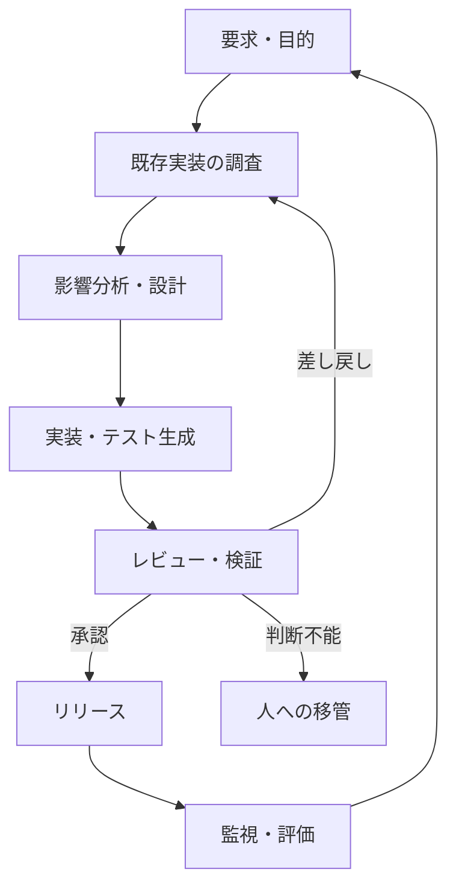

## AIを開発工程に組み込む

> 種別：設計原則 / 実務上の仮説 / 運用設計  
> 適用対象：ソフトウェア開発、保守、改修、コード生成AI、AIエージェント  
> 対象工程：要求整理 / 調査 / 設計 / 実装 / レビュー / テスト / リリース / 運用  
> 関連ページ：[QAチャット運用思想](/knowledge-context/qa-operations/)、[QAチャット評価設計思想](/evaluation-hitl/qa-evaluation/)、[人向け資料とAI向け資料の分離設計](/knowledge-context/human-and-ai-documentation/)

### 結論

AIを開発工程に組み込むとは、開発者へチャット画面を配ることではない。

AIが受け取る入力、生成する成果物、参照した根拠、検証方法、停止条件、承認者を工程として定義し、**検証済みの成果物だけを次工程へ渡せる状態を作ること**である。

本ページでは、この状態を次のように表す。

$$
\text{AI-Integrated Development}
=
(W,C,O,G,R,L,F)
$$

- $W$：Workflow ― 工程と状態遷移
- $C$：Contract ― 各工程の入出力契約
- $O$：Output Artifact ― 保存可能な成果物
- $G$：Gate ― 検証と承認
- $R$：Responsibility ― 責任主体
- $L$：Logging / Lineage ― 記録と由来
- $F$：Fallback ― 停止、移管、手動経路

モデルの性能は重要だが、モデル単体の性能だけでは開発工程の安全性も生産性も決まらない。

---

### 1. 「AIを使う」と「工程へ組み込む」は異なる

AIの利用には、少なくとも二つの段階がある。

| 観点 | 個人によるAI利用 | 開発工程への組み込み |
|---|---|---|
| 入力 | 利用者が都度判断 | 入力条件と必要情報を定義 |
| 出力 | 会話内の文章 | 版管理可能な成果物 |
| 根拠 | 利用者が確認 | 参照元と対応関係を記録 |
| 検証 | 個人の裁量 | 工程ごとの検証ゲート |
| 失敗時 | 利用者が修正 | 停止・差し戻し・移管 |
| 責任 | 暗黙的 | 作成者・検証者・承認者を明示 |
| 改善 | 個人の習熟 | ログと評価データによる改善 |

個人利用では、AI出力を読み捨てたり、利用者の頭の中で補正したりできる。

一方、工程へ組み込まれた出力は、設計、コード、テスト、リリース判断などの後工程へ影響する。したがって、会話として自然であることより、**検証可能な中間成果物として扱えること**が重要になる。

---

### 2. 開発工程を成果物とゲートで接続する

開発工程は、AIが自由に移動する一つの長い会話ではない。各工程が成果物を作り、ゲートを通過した成果物だけが次工程へ進む状態機械として設計する。

実際には工程をさらに細分化してよい。重要なのは、工程数ではなく、次の問いに答えられることである。

1. 何を入力として受け取ったか
2. 何を根拠として利用したか
3. 何を成果物として生成したか
4. 誰または何が検証したか
5. 何を満たせば次へ進めるか
6. 満たせない場合にどこで止まるか

---

### 3. AI出力を「成果物」として定義する

AIの回答本文だけを後工程へ渡すと、前提、根拠、不明点が失われる。工程 $i$ の成果物を、次の組として扱う。

$$
O_i=
(c_i,e_i,a_i,u_i,p_i,v_i,s_i)
$$

- $c_i$：content ― 調査結果、設計、パッチなどの本文
- $e_i$：evidence ― コード、仕様、ログ、テスト結果などの根拠
- $a_i$：assumptions ― 推定や仮定
- $u_i$：unresolved issues ― 未解決事項
- $p_i$：provenance ― 生成モデル、入力、参照元、実行ツール
- $v_i$：version ― 対象コード、仕様、モデル、プロンプトの版
- $s_i$：status ― 下書き、検証済み、承認済みなどの状態

この式はソフトウェアの実装形式を規定するものではない。AI出力を後工程へ渡す際に、本文以外に必要な情報を明示するための設計モデルである。

成果物の状態は、少なくとも次のように区別する。

| 状態 | 意味 | 次工程への利用 |
|---|---|---|
| Draft | AIまたは人が作成した未検証案 | 不可 |
| Evidence Collected | 根拠が関連付けられた | 原則不可 |
| Verified | 定義した検証を通過した | 条件付きで可 |
| Approved | 権限を持つ主体が承認した | 可 |
| Rejected | 欠陥または条件不成立 | 不可 |
| Escalated | 自動判断できず人へ移管 | 人の判断待ち |

AIが生成できたことと、組織が利用を確定したことを同じ状態にしてはいけない。

---

### 4. 工程ゲートを定義する

工程 $i$ のゲート通過を $Q_i$ とする。簡略化すると、次のように表せる。

$$
Q_i=S_i \land E_i \land V_i \land A_i
$$

- $S_i$：必要な形式・項目を満たす
- $E_i$：必要な根拠が存在する
- $V_i$：定義した検証に合格する
- $A_i$：必要な承認を得る

各変数は真偽値である。承認が不要な低リスク工程では、ポリシー上 $A_i=\mathrm{true}$ と定義してよい。

ただし、すべての検証をAIへ任せると、生成側と検証側が同じ誤りを共有する可能性がある。高影響の変更では、コンパイラ、静的解析、テスト、セキュリティスキャン、人間レビューなど、異なる失敗特性を持つ検証器を組み合わせる。

---

### 5. 工程全体の成功確率

開発工程の成功は、個々のAI呼び出しの正答率だけでは表せない。

工程 $i$ が正しく完了する事象を $S_i$ とすると、全工程が正しく完了する確率は連鎖律により次のように表せる。

$$
P\left(\bigcap_{i=1}^{n}S_i\right)
=
\prod_{i=1}^{n}
P\left(S_i\mid S_1,\ldots,S_{i-1}\right)
$$

実際の開発工程では、工程間の誤りは独立ではない。要求の誤解は、設計、実装、テストへ共通して伝播する。そのため、各工程の成功率を単純に掛けるだけでは不十分である。

もし便宜上、各工程が独立で成功率も同じ $p$ と仮定すれば、全工程の成功率は $p^n$ になる。しかしこれは誤りの累積を理解するための簡略モデルであり、実測値の予測式ではない。

したがって、重要なのはAIに一度で正解させることではなく、**誤りを早い工程で発見し、後工程へ流さないこと**である。

---

### 6. 各工程におけるAIと人間の役割

| 工程 | AIが支援できること | 必須成果物 | 主な検証 | 人間が保持する責任 |
|---|---|---|---|---|
| 要求整理 | 論点抽出、曖昧さの列挙、受入条件案 | 目的、範囲、制約、未決事項 | 利害関係者との確認 | 目的と優先順位の決定 |
| 既存実装調査 | 検索、依存関係の候補抽出、要約 | 対象箇所、根拠行、呼出関係 | 実コードと実行結果の確認 | 現状認識の確定 |
| 影響分析 | 変更候補、影響先、リスクの列挙 | 影響範囲、仮定、未確認点 | 所有者・利用箇所・データフロー確認 | 許容リスクの判断 |
| 設計 | 選択肢、比較軸、設計案の生成 | 採用案、棄却案、判断理由 | 要求・制約・非機能との整合 | トレードオフの決定 |
| 仕様化 | インターフェース、状態遷移、例外の整理 | 実装可能な仕様、受入条件 | 曖昧性・矛盾・欠落のレビュー | 仕様承認 |
| 実装 | コード、変更案、テスト案の生成 | 差分、説明、対象版 | ビルド、静的解析、レビュー | 変更内容の理解と採用判断 |
| テスト | ケース生成、境界値候補、失敗分析 | テストコード、結果、未検証領域 | 独立した実行環境、期待値確認 | 十分性の判断 |
| レビュー | 欠陥候補、規約違反、影響の指摘 | 指摘、根拠、重要度 | 人間レビュー、別方式の検証 | 承認・差し戻し |
| リリース | チェックリスト、変更要約、ロールバック案 | 承認記録、配布物、復旧手順 | CI/CD、権限、承認ゲート | リリース責任 |
| 運用 | ログ分類、異常候補、改善案 | 事象、証拠、対応履歴 | 監視指標、インシデント手順 | 対応方針と再発防止 |

この表の目的は、AIが担当できる作業を制限することではない。**生成できる範囲と、責任を移譲できる範囲を分けること**にある。

---

### 7. 要求整理：最初に不確実性を可視化する

AIへ実装を依頼する前に、要求を次の要素へ分解する。

- 解決したい問題
- 対象利用者
- 対象範囲と対象外
- 機能要件
- 非機能要件
- 制約
- 受入条件
- 未決事項
- 決定権者

AIは曖昧さを指摘できるが、事業上の目的や優先順位を確定できるとは限らない。要求が不足した状態で生成を続けると、AIは不足部分を推定で補う可能性がある。

したがって、要求工程の終了条件は「自然な仕様書ができたこと」ではなく、次である。

$$
\text{Requirement Ready}
=
\text{Scope Defined}
\land
\text{Acceptance Criteria Defined}
\land
\text{Critical Unknowns Resolved}
$$

重要な未決事項が残る場合は、実装へ進まず人へ質問する。

---

### 8. 既存実装調査：要約より根拠を残す

既存システムの改修では、AIがコードを生成できることより、現状を正しく理解できていることが先に必要である。

調査成果物には少なくとも次を含める。

- 対象リポジトリとコミット
- 関連ファイルと識別子
- 呼出元と呼出先
- データの入力元と出力先
- 実際に確認した挙動
- 推定に留まる箇所
- 調査できなかった領域

「この関数が原因です」という文章だけでは、検証可能な成果物にならない。根拠となるコード、ログ、テスト結果を対応付ける。

コード検索、依存関係解析、型検査、実行トレースなど、構造化された手段を優先し、AIの文章要約だけを現状認識の根拠にしない。

---

### 9. 影響分析：変更箇所と影響範囲を分ける

変更するファイルが一つでも、影響が一つとは限らない。

影響範囲は、例えば次の集合として整理できる。

$$
I=
I_{code}
\cup I_{data}
\cup I_{interface}
\cup I_{operation}
\cup I_{security}
\cup I_{user}
$$

- $I_{code}$：呼出関係、共有ライブラリ、設定
- $I_{data}$：スキーマ、移行、保持、互換性
- $I_{interface}$：API、イベント、外部連携
- $I_{operation}$：監視、障害対応、デプロイ
- $I_{security}$：権限、秘密情報、攻撃面
- $I_{user}$：画面、挙動、業務手順

これは網羅性を自動保証する式ではない。影響分析の観点を固定し、見落としをレビューできるようにする分類である。

AIには影響候補を広く探索させ、人間はその影響が許容できるか、どの互換性を維持するかを判断する。

---

### 10. 設計と仕様：選択肢と判断を分離する

AIは複数の設計案を生成できる。しかし、選択肢を生成することと、組織として採用することは異なる。

設計成果物には次を残す。

1. 解決対象
2. 前提と制約
3. 比較した選択肢
4. 評価軸
5. 採用案
6. 棄却理由
7. 既知のリスク
8. 見直し条件

設計案 $d$ の評価を簡略化すると、次のように表現できる。

$$
U(d)=
\sum_{j=1}^{m}w_j u_j(d)
-
\lambda R(d)
$$

- $u_j(d)$：性能、保守性、費用など評価軸 $j$ の効用
- $w_j$：評価軸の重み
- $R(d)$：リスク
- $\lambda$：リスクをどれだけ重視するか

ただし、重みや効用は客観的事実ではなく、組織の価値判断である。AIが式を計算しても、重み付けの責任までAIへ移るわけではない。

---

### 11. 実装：生成速度ではなく検証可能性を最適化する

コード生成の価値は、入力速度を上げることだけではない。価値が生じるのは、要求を満たす変更が、理解され、検証され、保守可能な形で統合されたときである。

実装成果物には次を含める。

- 対象コミットに対する差分
- 変更理由
- 要求・仕様との対応
- 変更していない範囲
- 仮定
- 実行した検証
- 失敗した検証
- 残存リスク

大きな変更を一度に生成するより、独立して理解・検証できる小さな差分へ分割する。

変更集合 $\Delta$ のレビュー費用を $C_{review}(\Delta)$、欠陥の見逃し確率を $P_{miss}(\Delta)$ とすると、差分が大きく複雑になるほど、いずれも増える可能性がある。

$$
\text{Expected Review Loss}(\Delta)
=
C_{review}(\Delta)
+
P_{miss}(\Delta)\times Impact(\Delta)
$$

これは一般的な単調増加を保証する法則ではない。差分サイズ、結合度、変更の性質を含めてレビュー単位を決めるための損失モデルである。

---

### 12. レビュー：AIの指摘を承認とみなさない

AIレビューは、欠陥候補の探索、規約確認、説明補助に利用できる。しかし、AIがレビューしたという事実だけでは、独立した承認にならない。

生成器と検証器が同じモデル、同じContext、同じ誤った前提を共有している場合、誤りには相関がある。

二つの検証器の見逃し事象を $M_1,M_2$ とすると、両方が見逃す確率は次である。

$$
P(M_1\cap M_2)
=
P(M_1)P(M_2\mid M_1)
$$

独立なら $P(M_2\mid M_1)=P(M_2)$ だが、同系統のAIを使う場合は独立とは限らない。

したがって、重要な変更では次を組み合わせる。

- 人間による意味と影響のレビュー
- コンパイラ、型検査、リンタ
- 単体・結合・回帰テスト
- 静的解析、依存関係・秘密情報スキャン
- 実環境に近い検証
- 権限を持つ主体による承認

GitHubの公式ドキュメントでも、Copilotによるコードレビューはコメントを残す機能であり、必須レビューの承認を代替しないと説明されている。

---

### 13. テスト：生成した期待値をそのまま正解にしない

AIが実装とテストの両方を同じ誤解に基づいて生成すると、誤った実装を誤ったテストが承認する可能性がある。

テスト設計では、次を分離する。

- 要求から導いた受入テスト
- 実装詳細を検証する単体テスト
- 既存挙動を守る回帰テスト
- 障害、境界値、権限、競合などの異常系
- 観測できていない領域

特に受入条件は、実装コードの生成後にAIが推測して作るのではなく、要求・仕様工程で先に確定する。

テスト通過率だけで品質を判断しない。必要な振る舞いがテスト集合に含まれているかというCoverageと、テスト自体の期待値が正しいかを別に確認する。

---

### 14. リリース：自然言語の指示を権限制御にしない

「本番へ勝手に反映しないでください」というプロンプトは、権限制御ではない。

本番変更に対しては、次のような決定論的制御を使う。

- 最小権限
- 短時間・用途限定の資格情報
- 分離された実行環境
- 保護ブランチ
- 必須CI
- 承認ゲート
- デプロイ対象の制限
- ロールバック手順
- 監査ログ

AIが生成・提案できる範囲と、実際に実行できる範囲を分ける。

$$
\text{Executable Actions}
\subseteq
\text{Authorized Actions}
\subseteq
\text{Technically Possible Actions}
$$

AIの能力を下げる必要はないが、業務上不要な権限まで与える必要もない。

---

### 15. リスクに応じてHuman in the Loopを配置する

すべての変更を同じ強度でレビューすると、高リスク変更へ十分な注意を配分できない。

工程 $i$ のリスクを簡略化すると、次のように表せる。

$$
Risk_i
=
P(E_i)\times P(M_i\mid E_i)\times Impact_i
$$

- $E_i$：工程 $i$ で誤りが生じる
- $M_i$：誤りがゲートで見逃される
- $Impact_i$：見逃された場合の影響

人間承認の強度は、AIの自信ではなく、少なくとも次で決める。

- 変更の可逆性
- 利用者・金銭・安全への影響
- 秘密情報や権限への接触
- データ損失の可能性
- 法令・契約上の義務
- 検証可能性
- 障害の検出可能性

低影響で自動検証できる変更は自動化しやすい。高影響で検証困難な判断は、人間承認や二者承認を維持する。

---

### 16. 追跡可能性を設計する

問題が起きたときに、最終コードだけを見ても、なぜその変更が選ばれたかは分からない。

最低限、次の連鎖を追跡できるようにする。

$$
\text{Requirement}
\rightarrow
\text{Evidence}
\rightarrow
\text{Decision}
\rightarrow
\text{Change}
\rightarrow
\text{Test}
\rightarrow
\text{Approval}
\rightarrow
\text{Release}
$$

記録対象の例：

- 要求・チケットの識別子
- 対象リポジトリとコミット
- 使用したモデル・設定
- 参照したContextとツール
- 生成した成果物と差分
- 検証結果
- 人間の修正内容
- 承認者と時刻
- 配布版

ただし、ログへ秘密情報、個人情報、認証情報を無制限に保存してはならない。追跡可能性と情報最小化を両立させる。

---

### 17. AIが停止しても開発工程を停止させない

AIを工程へ組み込むと、モデル障害、レート制限、仕様変更、品質劣化が開発へ影響する。

したがって、次を事前に定義する。

- AIを使わない手動経路
- 別モデルまたは限定機能への切替条件
- 出力品質が低下した場合の停止条件
- 処理途中の成果物を回収する方法
- 再実行時の重複防止
- ベンダー障害時の責任者

AIを重要工程の単一障害点にしない。

また、モデル、プロンプト、検索構成、権限、ツールが変われば、同じ工程名でも性能とリスクは変わる。変更後は、既存の評価データで再評価する。

---

### 18. 開発工程の評価指標

AI導入の評価を、生成行数や利用回数だけで行わない。

#### 18.1 効率

- 要求からリリースまでのCycle Time
- 各工程の待ち時間
- レビュー時間
- 手戻り回数
- 人間による修正量

#### 18.2 品質

- リリース前に発見された欠陥
- リリース後へ流出した欠陥
- 回帰率
- ロールバック率
- セキュリティ上の指摘

#### 18.3 制御

- 根拠が追跡できる成果物の割合
- 必須ゲートの通過率
- 未承認実行の件数
- 適切に停止・移管できた割合
- ログ欠損率

#### 18.4 人間との協働

- AI提案の採用率
- 採用後の修正率
- 誤った提案の発見工程
- レビュー負荷
- 利用者が変更を説明できる割合

総合的な期待損失を、次のように置くこともできる。

$$
L
=
C_{development}
+C_{review}
+C_{rework}
+C_{operation}
+P_{escape}\times Impact
$$

AI導入前後で、同じ種類・難易度の作業を基準に比較する。速度が上がっても、レビュー費用や流出欠陥が増えれば、工程全体では改善していない可能性がある。

---

### 19. 段階的な導入方法

#### Step 1：工程を一つ選ぶ

低影響で、成果物と正解条件を定義しやすい工程から始める。

例：

- 既存コードの調査補助
- テストケース候補の生成
- 変更要約
- 静的解析結果の分類

#### Step 2：現行基準を測る

AI導入前の時間、欠陥、レビュー負荷、手戻りを測る。

#### Step 3：入出力契約と停止条件を定義する

AIが必要情報を取得できない場合、推定で進めず停止または質問する条件を決める。

#### Step 4：Shadow Modeで評価する

AI出力を本番工程へ反映せず、人間の通常判断と比較する。

#### Step 5：限定された権限で導入する

作成は許可しても、承認・マージ・リリースは別ゲートにする。

#### Step 6：評価データから範囲を拡大する

成功例だけでなく、誤り、拒否、移管、手戻りを含めて判断する。

---

### 20. よくある失敗

#### 20.1 AIへタスク名だけを渡す

目的、制約、既存実装、受入条件が不足し、AIが前提を補完する。

#### 20.2 AIの文章要約を根拠にする

引用元、コード位置、実行結果がなく、現状認識を再検証できない。

#### 20.3 実装と受入条件を同時に作らせる

同じ誤解がコードとテストへ反映される。

#### 20.4 AIレビューを独立承認とみなす

生成器と検証器が同じ誤りを共有する可能性を無視する。

#### 20.5 プロンプトを権限制御として使う

自然言語による禁止を、認可、承認、環境分離の代替にする。

#### 20.6 生成量だけを成果として測る

レビュー、手戻り、欠陥、保守費用を含む工程全体を評価しない。

#### 20.7 AIが利用できない場合を設計しない

外部サービスの障害や変更によって、開発工程全体が停止する。

---

### 21. 事実・簡略モデル・設計仮説の区別

#### 一般的な事実・標準に基づく部分

- 生成AIの出力は、入力と構成に依存し、常に正しいとは限らない
- ソフトウェア開発には、設計、実装、検証、リリースを横断する統制が必要である
- 最小権限、変更レビュー、テスト、監査記録は安全な開発の基本的な構成要素である
- AIレビューのコメントは、組織上必要な承認と同一ではない

#### 本ページで用いた簡略モデル

- $O_i=(c_i,e_i,a_i,u_i,p_i,v_i,s_i)$
- $Q_i=S_i\land E_i\land V_i\land A_i$
- 工程成功確率の連鎖律
- $Risk=P(\text{error})\times P(\text{miss}\mid\text{error})\times Impact$
- 開発・レビュー・手戻り・運用・流出欠陥を含む損失関数

これらは関係を明示するためのモデルであり、特定の組織に対する性能保証ではない。

#### 本ページの設計仮説

> AIの生成能力を工程へ直接接続するより、検証可能な中間成果物と工程ゲートを介して接続した方が、誤りの伝播を抑え、責任と改善点を特定しやすい。

この仮説は、対象業務、チーム、モデル、権限、評価データによって検証する必要がある。

---

### 22. 最終定義

AIを開発工程へ組み込むとは、AIに多くのコードを書かせることではない。

> AIが探索・整理・生成した成果物を、根拠、仮定、版、未解決事項とともに保存し、工程ごとの検証と承認を通過したものだけ次へ渡す。判断不能時には停止または人へ移管し、最終的な責任主体と実行権限を明示する。

この構造があって初めて、AIは個人の便利な道具から、管理可能な開発システムの構成要素になる。

---

### 参考資料

- [NIST SP 800-218: Secure Software Development Framework (SSDF) Version 1.1](https://csrc.nist.gov/pubs/sp/800/218/final)
- [NIST AI Risk Management Framework 1.0](https://www.nist.gov/itl/ai-risk-management-framework)
- [NIST AI RMF Playbook](https://airc.nist.gov/airmf-resources/playbook/)
- [GitHub Docs: About Copilot coding agent](https://docs.github.com/copilot/concepts/agents/cloud-agent/about-cloud-agent)
- [GitHub Docs: Using GitHub Copilot code review](https://docs.github.com/copilot/using-github-copilot/code-review/using-copilot-code-review)
- [GitHub Docs: Responsible use of Copilot coding agent](https://docs.github.com/en/copilot/responsible-use/agents)
- [GitHub Docs: Reviewing Copilot coding agent output](https://docs.github.com/en/enterprise-cloud%40latest/copilot/how-tos/copilot-on-github/use-copilot-agents/review-copilot-output)
- [SWE-bench: Can Language Models Resolve Real-World GitHub Issues?](https://arxiv.org/abs/2310.06770)

