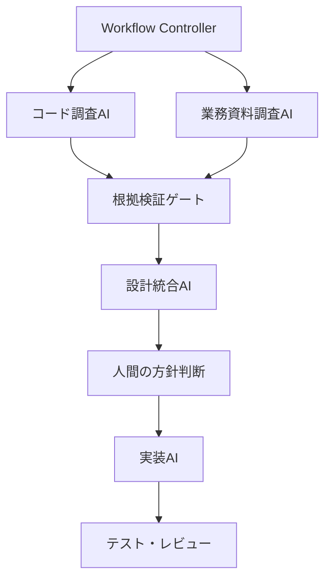
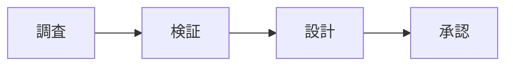
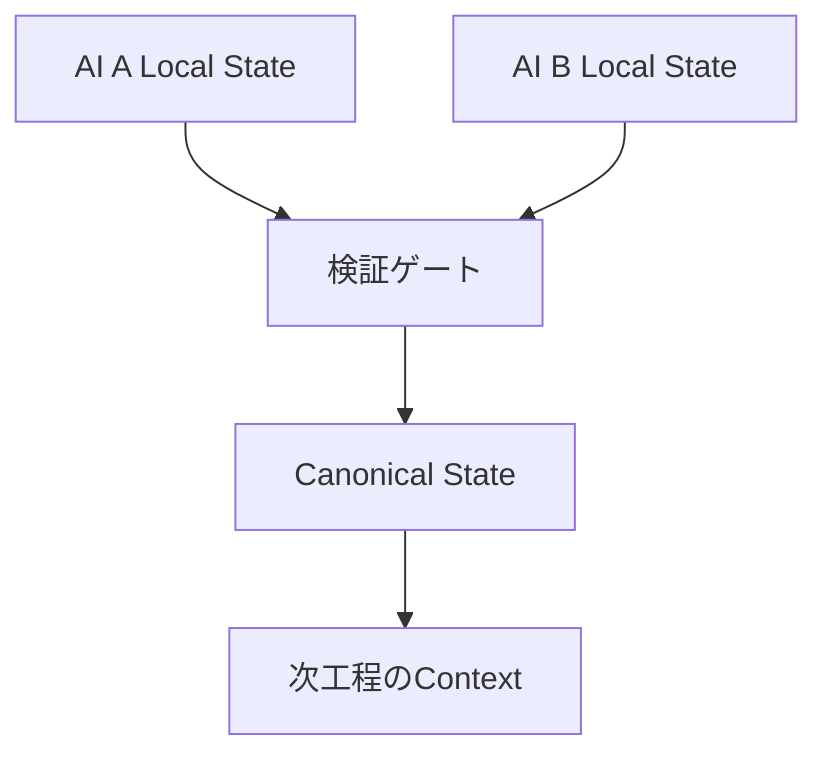

## 複数AIの役割分担と工程設計

> 種別：設計原則 / 実務上の仮説 / オーケストレーション設計  
> 適用対象：複数AI、AIエージェント、コード生成、調査、RAG、業務支援  
> 対象工程：分解 / 配置 / 実行 / 受渡し / 検証 / 統合 / 停止  
> 関連ページ：[AI間インターフェースとしてのプロンプト](/architecture/prompts-as-interfaces/)、[AIを開発工程に組み込む](/software-engineering/development-workflow/)、[AI出力の責任境界とHITL](/evaluation-hitl/responsibility-and-hitl/)

### 結論

複数AIを使う目的は、同じ質問へ回答するAIを増やすことではない。

一つのAIへ集めると競合するContext、権限、道具、評価基準を分離し、各工程を検証可能な成果物で接続することにある。

本ページでは、AI $a$ の役割を次の組として扱う。

$$
R_a=(T_a,C_a,K_a,U_a,P_a,O_a,V_a)
$$

- $T_a$：担当Task
- $C_a$：利用できるContext
- $K_a$：利用できるKnowledge
- $U_a$：利用できるTool
- $P_a$：Permission
- $O_a$：出力するArtifact
- $V_a$：出力を検証するVerifier

役割とは人格や肩書ではない。**情報環境、処理範囲、権限、出力契約、検証地点の組**である。

したがって、複数AI構成を採用するかどうかは、AIの数ではなく、単一AI構成に対して工程全体の期待損失を下げられるかで決める。

---

### 1. 複数AIは目的ではない

複数AI構成には、次の追加費用が生じる。

- Taskを分解する費用
- Contextを切り分ける費用
- AI間で成果物を受け渡す費用
- 状態を同期する費用
- 複数出力を検証・統合する費用
- 実行回数、Token、待ち時間
- 失敗箇所を特定するための観測費用

単一AIの期待損失を $L_1$、複数AI構成の期待損失を $L_m$ とする。複数AIが合理的なのは、少なくとも次を満たす場合である。

$$
\mathbb{E}[L_1]-\mathbb{E}[L_m]
>
C_{coord}+C_{handoff}+C_{operation}
$$

- $C_{coord}$：分解、ルーティング、統合の費用
- $C_{handoff}$：Context変換、検証、情報損失への対処費用
- $C_{operation}$：実行、監視、保守の追加費用

左辺は複数AI化による損失削減、右辺は複数AI化そのものが生む費用である。

これは実測せずに値を決められる公式ではない。複数AIを採用する理由を、見栄えや流行ではなく比較可能な仮説にするための判断式である。

---

### 2. 単一AIから始める

Taskが一つのContextと一つのTool集合で処理でき、出力も一つの基準で検証できるなら、単一AIの方が単純である。

複数AIを検討するのは、例えば次の場合である。

1. 必要なContextが大きく、互いに干渉する
2. 独立に探索できるTaskを並列化できる
3. 工程ごとに必要なToolや権限が異なる
4. 出力形式や評価基準が大きく異なる
5. 生成と検証の失敗特性を分離したい
6. 担当範囲ごとに停止・再実行・監査したい

反対に、次の理由だけでは複数AI化の根拠として弱い。

- AI同士を会話させると賢く見える
- 専門家らしい名前を付けたい
- 多数決にすれば正しくなると思う
- 一つのPromptが長くなった
- Frameworkが複数Agentを作成できる

一つのPromptが長い原因が、単なる重複や未整理な仕様であれば、先に入力とKnowledgeを整理する。

---

### 3. Taskを有向グラフとして設計する

複数AI工程を、Taskの有向グラフとして表す。

$$
G=(V,E)
$$

- $V$：調査、設計、生成、検証、承認などのTask
- $E$：成果物、状態、制御の受渡し

各Task $v\in V$ を、AI、人間、決定論的システムのいずれかへ割り当てる関数を置く。

$$
\alpha:V\rightarrow A\cup H\cup S
$$

- $A$：AIの集合
- $H$：人間の役割集合
- $S$：既存システム、検証器、Workflow Engineの集合

すべてをAIへ割り当てる必要はない。

この図で中心にあるのはAI同士の会話ではなく、Workflow Controller、成果物、検証ゲートである。

---

### 4. 役割は「情報環境」で分ける

同じモデルでも、利用できるContextとToolが異なれば、実務上の能力は異なる。

Task $t$ の処理に必要なContext、Tool、Permissionをそれぞれ $C_t,U_t,P_t$ とする。AI $a$ を配置できるための必要条件を、次のように置ける。

$$
C_t\subseteq C_a,
\qquad
U_t\subseteq U_a,
\qquad
P_t\subseteq P_a
$$

ただし、必要条件を満たすことは、正しい処理を保証しない。Task遂行に必要な情報と操作能力が存在することを表すだけである。

実務では、例えば次のように分けられる。

| 役割 | 主なContext | 主なTool | 典型的な成果物 |
|---|---|---|---|
| コード調査AI | リポジトリ、履歴、依存関係 | 検索、静的解析、ビルド | 関連箇所とコード根拠 |
| 業務資料調査AI | 仕様書、議事録、規定 | 文書検索、表抽出 | 業務要件と資料根拠 |
| 設計統合AI | 検証済み調査成果物 | 比較、構造化 | 選択肢、影響、未決事項 |
| 実装AI | 承認済み仕様、対象コード | 編集、テスト実行 | 差分と検証結果 |
| 評価AI | 評価基準、成果物、根拠 | Rubric評価、比較 | 指摘候補と証拠 |
| 人間 | 目的、利害、責任、例外 | 判断、承認 | 採用方針、承認、差戻し |
| 決定論的検証器 | コード、設定、期待値 | コンパイラ、CI、Scanner | 合否と機械的証拠 |

特定製品を役割として固定しない。製品は変わっても、必要な情報環境と成果物の責務は残る。

---

### 5. 「専門家AI」は名前では成立しない

AIへ「セキュリティ専門家」「設計専門家」と役名を与えるだけでは、専門化したとはいえない。

専門化には少なくとも次が必要である。

- 専門Taskの範囲
- 専門Knowledge
- 利用できるTool
- 専門領域の評価基準
- 出力Schema
- 禁止される判断
- 検証方法

役名だけを変えて同じContext、同じTool、同じ評価基準を与えた場合、AI間の差は主にPrompt表現とSamplingによる揺らぎになる。

したがって、役割分担は次の差分として確認する。

$$
\Delta R_{a,b}
=
\Delta T+\Delta C+\Delta K+\Delta U+\Delta P+\Delta O+\Delta V
$$

差分がほとんどないなら、二つの役割を分ける実質的な理由も弱い。

---

### 6. Taskへの配置を期待効用で考える

Task $t$ をAI $a$へ割り当てた場合の効用を、簡略化して次のように置く。

$$
U(a,t)
=
\mathbb{E}[Q_{a,t}]
-\lambda C_{a,t}
-\mu T_{a,t}
-\nu R_{a,t}
$$

- $Q_{a,t}$：成果物品質
- $C_{a,t}$：計算、Token、運用費用
- $T_{a,t}$：所要時間
- $R_{a,t}$：誤り、権限、情報漏えいなどのRisk
- $\lambda,\mu,\nu$：組織が置く重み

配置は次の制約下で選ぶ。

$$
\max_a U(a,t)
\quad
\text{subject to}
\quad
C_t\subseteq C_a,
U_t\subseteq U_a,
P_t\subseteq P_a
$$

高性能モデルをすべてのTaskへ配置するのが最適とは限らない。単純な分類には低費用のモデル、機密情報を扱う工程には限定された環境、決定的検証には通常プログラムを使う方が合理的な場合がある。

重みは客観的な定数ではない。品質、速度、費用、Riskの優先順位を明示するための設計変数である。

---

### 7. オーケストレーション方式を選ぶ

#### 7.1 決定論的Pipeline

工程順と分岐をプログラムで定義する。

適する場合：

- 工程が既知
- 入出力Schemaを定義できる
- 監査と再現性が重要
- 権限制御を厳格にしたい

主な弱点：

- 未知のTaskへ柔軟に対応しにくい
- Workflow変更に実装が必要

業務工程が既知なら、まずこの方式を検討する。

#### 7.2 Manager–Worker

Manager AIがTaskを分解し、専門Workerへ依頼し、結果を統合する。

適する場合：

- Taskの分解方法を事前に固定しにくい
- 複数の独立探索が必要
- 最終出力の責任を一つのManagerへ集約したい

主な弱点：

- Managerの分解ミスが全Workerへ伝播する
- Managerが知らない領域を割り当てられない
- 統合時に根拠や少数意見を失う可能性がある

ManagerはTruthを保証する存在ではない。Task分解と制御を担当する一工程であり、Managerの出力にも検証が必要である。

#### 7.3 Router / Handoff

入力を分類し、適切な専門AIへ制御を移す。

適する場合：

- 問い合わせ領域が明確に分かれる
- 専門AIが利用者との処理を継続すべき
- 領域ごとにInstructionや権限が異なる

主な弱点：

- 誤Routing
- 境界領域の取りこぼし
- Handoff時のContext損失

Routerの評価では、専門AIの回答品質とは別にRouting精度を測る。

#### 7.4 Parallel Worker

独立したTaskを複数AIへ並列に割り当て、結果を統合する。

適する場合：

- 調査領域を独立に分割できる
- 網羅性が重要
- 待ち時間を短縮できる

Worker $i$ の処理時間を $T_i$ とすると、並列処理時間は簡略化して次になる。

$$
T_{parallel}
=
T_{plan}+\max_i T_i+T_{merge}
$$

逐次処理の $\sum_i T_i$ より小さくなる可能性があるが、分解と統合の費用は残る。

依存関係の強いTaskを無理に並列化すると、重複調査、矛盾、再作業が増える。

#### 7.5 Generator–Reviewer

生成AIとReview AIを分ける。

適する場合：

- 評価基準を明示できる
- 指摘を機械的または人間が再検証できる
- 生成と検証で異なるContextやToolを使える

主な弱点：

- 同じモデル・同じ根拠による相関誤り
- Reviewerのもっともらしい誤指摘
- 修正Loopの非停止

Review AIの判定を自動的にApprovedへ変換しない。

---

### 8. WorkflowとAgentを区別する

Workflowは経路をシステムが決める。Agentは状況に応じて経路やToolを選ぶ。

| 観点 | Workflow | Agent |
|---|---|---|
| 経路 | 事前定義 | 動的選択を含む |
| 再現性 | 比較的高い | 状態と選択に依存 |
| 監査 | 追跡しやすい | 判断理由の記録が必要 |
| 柔軟性 | 定義済みTaskに強い | 未知・探索Taskに強い場合がある |
| Risk | 既知の経路へ限定しやすい | 行動範囲が広がりやすい |

定義できる部分までAgentへ委ねる必要はない。

例えば、CIの実行、Schema検証、承認待ち、権限確認、最大再試行回数はWorkflow Engineで制御できる。調査方針や検索語の選択など、事前に列挙しにくい部分だけAIへ委ねる。

> 動的判断が必要な地点にAgentを置き、既知の制御は通常プログラムへ戻す。

---

### 9. 多数決の数学的な限界

複数AIへ同じ質問を行い、多数決を取る方法を考える。

各AIの正解事象が独立で、正解確率が同じ $p$、AI数が奇数 $m$ なら、多数決が正解する確率は次になる。

$$
P_{majority}
=
\sum_{k=(m+1)/2}^{m}
\binom{m}{k}p^k(1-p)^{m-k}
$$

$p>0.5$ かつ独立という条件では、AI数を増やすことで多数決精度が上がる。

しかし、実際のAIは次を共有しやすい。

- 学習データの傾向
- 同じ検索結果
- 同じ誤った要求
- 同じPrompt
- 同じ評価基準
- 同じ上流成果物

したがって、正解事象は独立とは限らない。

AI $i$ の正解を $X_i\in\{0,1\}$ とし、各AIの正解確率が $p$、任意の組の相関係数が同じ $\rho$ と仮定すると、平均正解率 $\bar X$ の分散は次になる。

$$
\operatorname{Var}(\bar X)
=
\frac{p(1-p)}{m}
\left[1+(m-1)\rho\right]
$$

このとき、平均の分散が独立なAI何個分に相当するかという意味で、有効数を次のように表せる。

$$
m_{eff}
=
\frac{m}{1+(m-1)\rho}
$$

$\rho=0$ なら $m_{eff}=m$ だが、$\rho\rightarrow1$ なら $m_{eff}\rightarrow1$ である。

これは多数決の正答率を直接与える式ではない。同じ誤りを共有するAIを増やしても、独立な証拠が同数だけ増えたことにはならないと示す簡略モデルである。実際のAI間相関は一定とは限らないため、評価データから測る必要がある。

---

### 10. 役割分担と独立検証を混同しない

複数AIには、少なくとも三つの異なる目的がある。

| 目的 | 分けるもの | 必要な評価 |
|---|---|---|
| 専門化 | Context、Tool、出力 | Task別品質 |
| 並列化 | 探索領域、処理対象 | Coverage、時間、重複 |
| 独立検証 | Evidence、方法、失敗特性 | 見逃し相関、False Accept |

役割を分けたことは、検証が独立したことを意味しない。

例えば、コード生成AIとコードレビューAIが別の名前でも、同じ誤った仕様を根拠にしていれば、要求誤りを共有する。

独立性を高めるには、次のように検証経路を変える。

- 仕様から導く受入テスト
- コードを実行して得る結果
- コンパイラや型検査
- 静的・動的なSecurity検査
- 実利用者または責任者の確認
- 別情報源との照合

モデルを変えることは一つの手段だが、それだけで独立性は保証されない。

---

### 11. Contextの重複と汚染を制御する

すべてのAIへすべての情報を渡すと、次の問題が起きる。

- Token費用の増加
- 重要情報の埋没
- 不要な機密情報への接触
- 他工程の仮説を事実として利用
- 役割境界の消失

AI $a$ へ渡すContextは、Taskに必要な集合へ限定する。

$$
C_a
=
C_{required}(T_a)
\cup
C_{shared}^{verified}
$$

ただし、共有するのは原則として検証済みの成果物である。未検証の仮説や途中思考を共有する場合は、状態を明示する。

Context最小化は、単なるToken削減ではない。権限最小化と同じく、誤利用と情報漏えいの範囲を小さくする設計である。

---

### 12. Canonical Stateを一つにする

各AIが独自の会話履歴だけを状態として持つと、工程の事実が分岐する。

したがって、次を区別する。

- Local State：各AIの一時的な作業状態
- Shared State：工程が共有する状態
- Canonical State：正式に確定した唯一の状態

Canonical Stateへ昇格できるのは、定義した検証・承認を通過した情報だけである。

AIの会話履歴を正本にしない。成果物、版、Evidence、状態を外部の保存領域で管理する。

---

### 13. AI間インターフェースを明示する

受渡しの詳細は[AI間インターフェースとしてのプロンプト](/architecture/prompts-as-interfaces/)で扱う。本ページでは、工程設計上の最低条件だけ整理する。

AI $i$ からAI $j$ への受渡しを、次のMessageとして表す。

$$
M_{i\rightarrow j}
=
(task,artifact,evidence,assumptions,unresolved,status,version)
$$

受理条件は、Producerが出力したことではなく、Consumer側の開始条件を満たすことである。

$$
Accept_j(M)=1
\iff
Schema_j(M)\land Evidence_j(M)\land State_j(M)
$$

意味的な正しさはSchema適合だけでは保証されない。必要に応じて、AI以外の検証器または人間を受理ゲートへ置く。

自然言語は柔軟だが、状態、識別子、版、合否、権限などは構造化形式で渡す方が検証しやすい。

---

### 14. Orchestratorの責務を限定する

Orchestratorには、次の責務を与えられる。

- Task分解
- Worker選択
- 入力Contextの組立て
- 実行順序と並列性の制御
- 結果の収集
- 検証ゲートへの移送
- 再試行、停止、移管
- 状態とログの管理

一方、Orchestratorが自動的に持つとは限らない責務は次である。

- 業務上の正しさの保証
- 根拠の真偽判定
- 高影響判断の承認
- 責任主体の代替

Orchestrator AIがWorkerの結果を自然な文章へ統合しても、矛盾が解消されたとは限らない。

統合時には、少なくとも次を保持する。

- 採用した主張とEvidence
- 棄却した主張と理由
- Worker間の矛盾
- 未解決事項
- 統合処理で追加した推論

---

### 15. Loopには終了条件を置く

GeneratorとReviewerが修正を繰り返す構成は、収束するとは限らない。

状態 $x_k$ を第 $k$ 回の成果物、修正写像を $F$ とすると、反復は次である。

$$
x_{k+1}=F(x_k)
$$

$F$ が収束写像である保証はない。指摘が振動したり、修正によって別の欠陥が生じたりする。

そのため、次の終了条件を定義する。

- 最大反復回数
- 最大費用・Token
- 改善量が閾値未満
- 同一指摘の反復
- 重大な未解決事項
- 検証器間の矛盾
- 人間承認が必要な状態

停止は失敗ではない。自動処理可能範囲の境界を正しく検出した結果である。

---

### 16. 権限はAIごとに分離する

役割分担しても、すべてのAIへ同じ権限を与えれば、攻撃面と誤操作範囲は分離されない。

AI $a$ の権限集合を $P_a$ とする。

$$
P_a
\subseteq
P_{required}(T_a)
$$

原則として、Taskに必要な最小権限だけを与える。

例：

- 調査AI：読取のみ
- 実装AI：作業Branchへの変更のみ
- Review AI：Commentのみ
- Release Workflow：承認後の配布のみ
- 文書調査AI：許可された資料領域のみ

Prompt上で「削除しない」「本番へ反映しない」と指示するだけでは権限制御にならない。実行環境、認可、Branch保護、承認フローで強制する。

---

### 17. 失敗を工程別に分類する

複数AIシステムの失敗を「AIが間違えた」でまとめると、改善地点を特定できない。

| 失敗分類 | 例 | 主な対策 |
|---|---|---|
| Decomposition Failure | Task分解の欠落・重複 | 分解Schema、Coverage確認 |
| Routing Failure | 不適切な専門AIへ割当て | Routing評価、Fallback |
| Context Failure | 必要情報の欠落・過剰共有 | Context Contract、最小化 |
| Handoff Failure | 根拠・状態・版の消失 | Schema、受理ゲート |
| Worker Failure | 誤生成、Tool誤用 | Task別評価、権限制限 |
| Integration Failure | 矛盾の隠蔽、少数意見の消失 | Evidence付き統合 |
| Verification Failure | 相関した見逃し | 異なる検証方式 |
| Control Failure | 無限Loop、重複実行 | 上限、冪等性、状態管理 |
| Governance Failure | 未承認実行、責任不明 | 承認、監査、責任表 |

工程ごとに発生率、検出率、影響度を測る。

$$
Risk_k
=
P(F_k)
\times
P(\neg D_k\mid F_k)
\times
Impact_k
$$

- $F_k$：分類 $k$ の失敗
- $D_k$：失敗を検出する事象

---

### 18. 全体の費用を測る

複数AIは並列化によって時間を短縮できる一方、Tokenと統合費用を増やす場合がある。

総費用を次のように分ける。

$$
C_{total}
=
\sum_{a\in A}C_{execute}(a)
+C_{coord}
+C_{handoff}
+C_{verify}
+C_{human}
+C_{failure}
$$

評価指標：

#### 品質

- Task別の正確性
- Evidence付き主張の割合
- 未解決事項の検出率
- 後工程へ流出した誤り
- 人間による修正率

#### Routing・分解

- Routing Accuracy
- Task Coverage
- 重複Task率
- 分解漏れ率

#### 受渡し

- Schema不適合率
- Evidence欠損率
- Version不一致率
- Handoff後の再質問率

#### 制御

- 平均反復回数
- 上限停止率
- 重複実行率
- 不適切なTool実行件数
- 人間移管の適合率

#### 費用・速度

- Task当たりToken
- 全体Latency
- 並列化による短縮時間
- 統合・検証費用
- 単一AI基準との差

最終出力の品質だけでなく、どの構成要素が価値または損失を生んだか測れるようにする。

---

### 19. コード保守工程の例

既存機能を変更する工程を考える。

#### Phase 1：決定論的ControllerがTaskを開始する

- 対象リポジトリとCommitを固定
- 要求、制約、受入条件を登録
- AIごとのContextと権限を設定

#### Phase 2：調査を並列化する

コード調査AI：

- 実装箇所
- 呼出関係
- 依存関係
- 既存テスト
- コード上のEvidence

業務資料調査AI：

- 仕様上の要求
- 運用制約
- 過去の判断
- 資料上のEvidence

両者は同じ結論を競うのではなく、異なる情報環境を担当する。

#### Phase 3：Evidence Gate

- Evidenceが実在する
- 対象版が一致する
- 仮定と事実が分かれている
- 矛盾と未確認点が明示されている

#### Phase 4：設計統合AI

検証済み調査成果物から、変更案、影響、選択肢、未決事項を構造化する。

統合AIが新たに推論した内容は、調査済み事実へ混ぜず推論として記録する。

#### Phase 5：人間が方針を決める

- 互換性
- Risk許容度
- 優先順位
- 実装範囲
- 例外処理

#### Phase 6：実装AI

承認済み仕様だけを入力とし、作業Branchへ変更する。

#### Phase 7：異なる方式で検証する

- コンパイル
- 静的解析
- 要求から独立して作った受入テスト
- 人間による差分・影響レビュー

この工程の価値はAIの数ではない。コード、業務資料、判断、実装、検証を異なる責務として接続できる点にある。

---

### 20. 導入手順

#### Step 1：単一AIの限界を測る

どのTaskでContext不足、Tool不足、Latency、品質低下が起きているか確認する。

#### Step 2：Task Graphを作る

Task、依存関係、成果物、検証地点を定義する。

#### Step 3：AI以外を含めて配置する

AI、人間、既存システム、決定論的検証器をTaskへ割り当てる。

#### Step 4：役割差分を確認する

Context、Tool、Permission、出力、Verifierのどれが異なるか説明できない役割は統合を検討する。

#### Step 5：決定論的制御から実装する

既知の順序、Schema検証、権限、上限、承認をWorkflowとして実装する。

#### Step 6：動的判断が必要な箇所だけAgent化する

探索、Task分解、Routingなど、固定しにくい判断へ限定する。

#### Step 7：単一AI構成と比較する

品質、費用、Latency、流出誤り、人間負荷を同じ評価データで比較する。

---

### 21. よくある失敗

#### 21.1 同じTaskを複数AIへ投げれば安全だと考える

誤りの相関と共通原因を無視している。

#### 21.2 役名だけで専門化する

Context、Tool、評価基準、出力契約が同じままである。

#### 21.3 Manager AIを責任者とみなす

統合能力と、業務上の承認権限を混同している。

#### 21.4 AI同士の自由会話をWorkflowにする

状態、版、受理条件、停止条件を管理できない。

#### 21.5 すべてのContextを全AIへ共有する

費用、情報漏えい、仮説汚染、責務重複を増やす。

#### 21.6 既知の制御までAIへ委ねる

通常プログラムで強制できる権限、順序、回数、Schemaを確率的判断へ変えている。

#### 21.7 Workerの成功例だけを評価する

Task分解、Routing、Handoff、統合、検証の失敗を見落とす。

---

### 22. 事実・簡略モデル・設計仮説の区別

#### 一般的な事実・既存技術に基づく部分

- 複数Agent Frameworkは、会話、Handoff、Manager–Workerなど複数の協調方式を実装できる
- 並列処理には分解・統合のOverheadがある
- 同じ情報源と処理方法を共有する判定は、統計的に独立とは限らない
- Workflowによる事前定義経路と、Agentによる動的経路選択は異なる
- 権限、状態、停止条件、監視はモデル外のシステム設計を必要とする

#### 本ページで用いた簡略モデル

- $R_a=(T_a,C_a,K_a,U_a,P_a,O_a,V_a)$
- Task Graph $G=(V,E)$ と配置関数 $\alpha$
- 複数AI化の損失削減と調整費用の比較
- Task配置の期待効用
- 独立仮定下の多数決確率
- 等しい相関を仮定した $m_{eff}$
- 工程別の失敗Riskと総費用

これらは設計変数の関係を説明するモデルであり、複数AIの性能保証ではない。

#### 本ページの設計仮説

> 複数AIの価値はAIの人数ではなく、一つのAIへ混在させると競合するContext、Tool、Permission、出力形式、検証責任を分離し、検証済み成果物で再接続できることにある。

適否は単一AI構成を基準に、品質、費用、Latency、Risk、人間負荷を測って判断する。

---

### 23. 最終定義

複数AIの役割分担と工程設計を、次のように定義する。

> Taskを依存関係のあるGraphへ分解し、必要なContext、Knowledge、Tool、Permission、出力、Verifierに基づいてAI・人間・既存システムへ配置する。各工程を検証可能な成果物と明示的な状態で接続し、再試行、停止、移管、承認をWorkflowとして制御すること。

最適化対象はAI数ではない。

$$
\min_{G,\alpha}
\left(
C_{total}
+\lambda\,Risk
+\mu\,Latency
-\nu\,Quality
\right)
$$

制約は、必要なContext、Tool、Permission、検証、責任境界を満たすことである。

AIを増やすのは、分けるべき責務が存在し、分けた後も検証可能に接続できる場合だけでよい。

---

### 参考資料

- [OpenAI Agents SDK: Agent orchestration](https://openai.github.io/openai-agents-python/multi_agent/)
- [OpenAI API: Orchestration and handoffs](https://developers.openai.com/api/docs/guides/agents/orchestration)
- [AutoGen: Enabling Next-Gen LLM Applications via Multi-Agent Conversation](https://arxiv.org/abs/2308.08155)
- [Anthropic: How we built our multi-agent research system](https://www.anthropic.com/engineering/multi-agent-research-system)
- [Anthropic: Building multi-agent systems—when and how to use them](https://claude.com/blog/building-multi-agent-systems-when-and-how-to-use-them)
- [LangGraph: Workflows and agents](https://docs.langchain.com/oss/python/langgraph/workflows-agents)
- [LangChain: Multi-agent systems](https://docs.langchain.com/oss/python/langchain/multi-agent)
